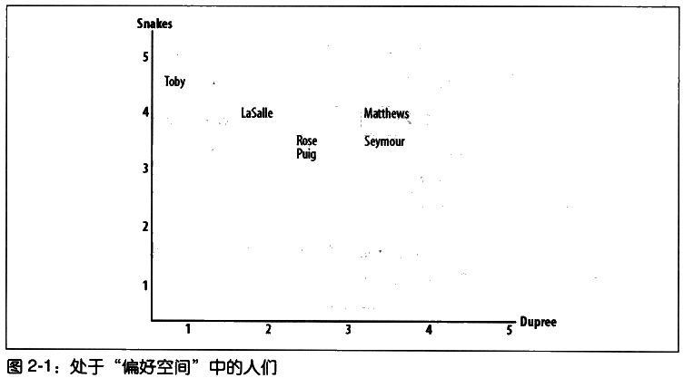
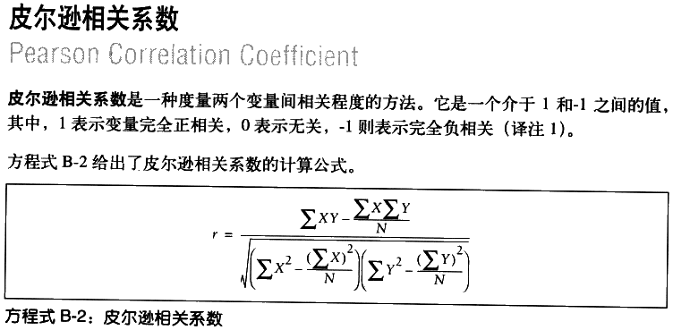
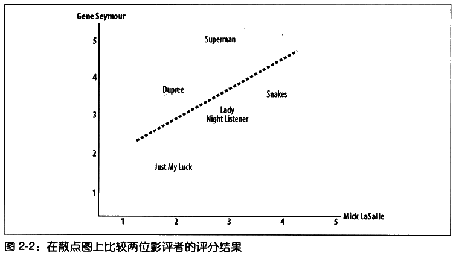
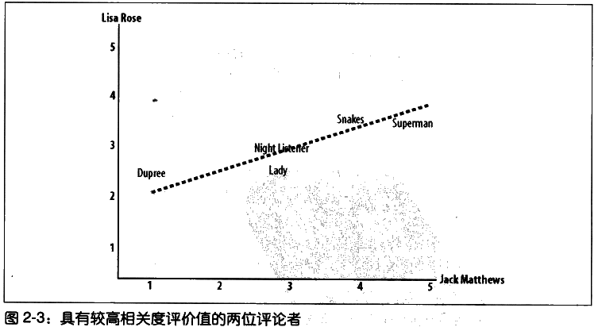
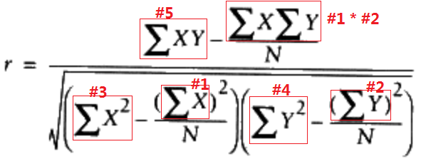
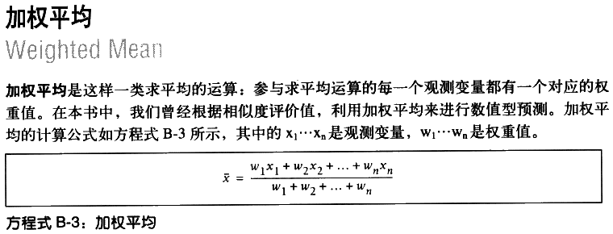
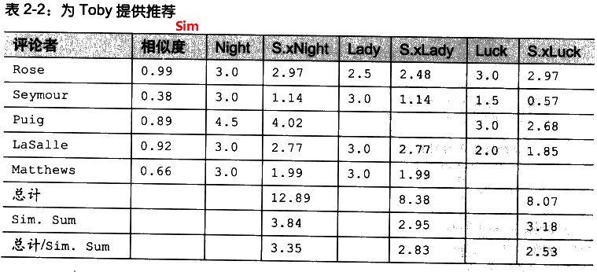
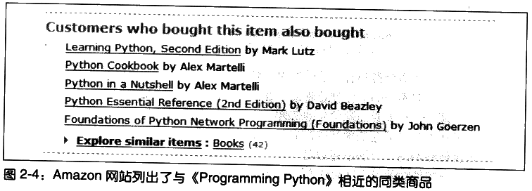
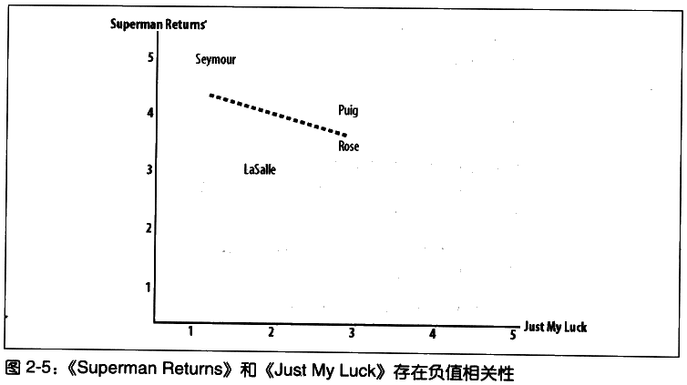
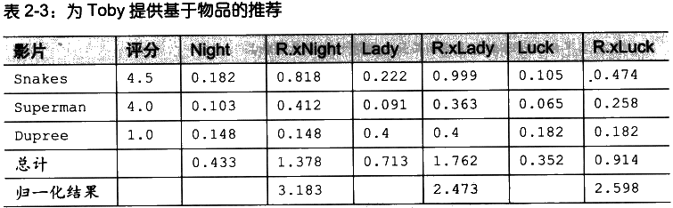

# 提供推荐 #

Making Recommendations

如何根据群体偏好来为人们提供推荐。

[1.协作型过滤](#协作型过滤)

[2.搜集偏好](#搜集偏好)

[3.寻找相近的用户](#寻找相近的用户)

[3.1.欧几里得距离评价](#欧几里得距离评价)

[3.2.皮尔逊相关度评价](#皮尔逊相关度评价)

[3.3.应该选用哪一种相似性度量方法](#应该选用哪一种相似性度量方法)

[3.4.为评分者打分](#为评分者打分)

[4.推荐物品](#推荐物品)

[5.匹配相似商品](#匹配相似商品)

[6.构建一个基于某数据平台的链接推荐系统](#构建一个基于某数据平台的链接推荐系统)

[6.1.数据平台API](#数据平台api)

[6.2.构造数据集](#构造数据集)

[6.3.推荐近邻与链接](#推荐近邻与链接)

[7.基于物品的过滤](#基于物品的过滤)

[7.1.构造物品比较数据集](#构造物品比较数据集)

[7.2.获得推荐](#获得推荐)

[8.使用MovieLens数据集](#使用movielens数据集)

[9.基于用户进行过滤还是基于物品进行过滤](#基于用户进行过滤还是基于物品进行过滤)

[10.小结](#小结)

## 协作型过滤 ##

Collaborative Filtering

一个**协作型过滤算法**通常的做法是对一大群人进行搜索，并从中找出与我们品味相近的一群人。

算法会对这些人所偏爱的其他内容考察，并将它们组合起来构造出一个经过排名的推荐列表。有许多不同的方法可以帮助我们确定哪些人与自己品味相近，并将他们的选择组合成列表。

## 搜集偏好 ##

Collecting Preferences

这里使用Python**嵌套字典**保存影迷对电影的评价。

数据结构：

	评分={
		人a:{
			电影A:(1~5评分),
			电影B:(1~5评分),
			...},
		人b:...
		...
	}

---

	# A dictionary of movie critics and their ratings of a small
	# set of movies
	critics={'Lisa Rose': {'Lady in the Water': 2.5, 'Snakes on a Plane': 3.5,
	 'Just My Luck': 3.0, 'Superman Returns': 3.5, 'You, Me and Dupree': 2.5, 
	 'The Night Listener': 3.0},
	'Gene Seymour': {'Lady in the Water': 3.0, 'Snakes on a Plane': 3.5, 
	 'Just My Luck': 1.5, 'Superman Returns': 5.0, 'The Night Listener': 3.0, 
	 'You, Me and Dupree': 3.5}, 
	'Michael Phillips': {'Lady in the Water': 2.5, 'Snakes on a Plane': 3.0,
	 'Superman Returns': 3.5, 'The Night Listener': 4.0},
	'Claudia Puig': {'Snakes on a Plane': 3.5, 'Just My Luck': 3.0,
	 'The Night Listener': 4.5, 'Superman Returns': 4.0, 
	 'You, Me and Dupree': 2.5},
	'Mick LaSalle': {'Lady in the Water': 3.0, 'Snakes on a Plane': 4.0, 
	 'Just My Luck': 2.0, 'Superman Returns': 3.0, 'The Night Listener': 3.0,
	 'You, Me and Dupree': 2.0}, 
	'Jack Matthews': {'Lady in the Water': 3.0, 'Snakes on a Plane': 4.0,
	 'The Night Listener': 3.0, 'Superman Returns': 5.0, 'You, Me and Dupree': 3.5},
	'Toby': {'Snakes on a Plane':4.5,'You, Me and Dupree':1.0,'Superman Returns':4.0}}

[recommendations.py](recommendations.py)

	>>> import os
	>>> os.getcwd()

	>>> os.chdir('.')

	>>> from recommendations import critics
	>>> critics['Lisa Rose']['Lady in the Water']
	2.5
	>>> critics['Toby']['Snakes on a Plane']=4.5
	>>> critics['Toby']
	{'Snakes on a Plane': 4.5, 'Superman Returns': 4.0, 'You, Me and Dupree': 1.0}
	>>> 

## 寻找相近的用户 ##

Finding Similar Users

我们需要方法来确定人们品味的相似程度。

为此，我们可将每个人与所有其他人进行对比，并计算他们的**相似度评价值**。

有两种方法：

1. 欧几里得距离；
2. 皮尔逊相关度。

### 欧几里得距离评价 ###

Euclidean Distance Score

若两人在“偏好空间”中的距离越近，他们的兴趣偏好就越相似。

多数量的评分项同样适用这距离公式。

计算两人间距离

	>>> from math import sqrt
	>>> sqrt(pow(4.5-4,2)+pow(1-2,2))
	1.118033988749895
	>>> 

通常要对这数进行处理，来对偏好越相近的情况给出越大的值。

因此，可计算得到距离值加1（这可避免遇到被零整除的错误），并取其倒数：

	>>> 
	>>> 1/(1+sqrt(pow(4.5-4,2)+pow(1-2,2)))
	0.4721359549995794
	>>> 

这样就返回0与1之间的值，值越大，偏好更相似。

构造出用来计算相似度的函数。

	from math import sqrt
	
	# Returns a distance-based similarity score for person1 and person2
	def sim_distance(prefs,person1,person2):
	  # Get the list of shared_items
	  si={}
	  for item in prefs[person1]: 
	    if item in prefs[person2]: si[item]=1
	
	  # if they have no ratings in common, return 0
	  if len(si)==0: return 0
	
	  # Add up the squares of all the differences
	  sum_of_squares=sum([pow(prefs[person1][item]-prefs[person2][item],2) 
	                      for item in prefs[person1] if item in prefs[person2]])
	
	  return 1/(1+sum_of_squares)

使用示例

	>>> import recommendations
	>>> recommendations.sim_distance(recommendations.critics,'Lisa Rose', 'Gene Seymour')
	0.14814814814814814
	>>> 

### 皮尔逊相关度评价 ###

Pearson Correlation Score

皮尔逊相关系数是判断两组数据与某一直线拟合程度的一种度量。

对应的公式比欧式距离公式要复杂，但是它在数据不是很规范normalized的时候（譬如，影评人对影片的评价总是相对于平均水平偏离很大时），会倾向于给出更好的结果。

上图，可看出一条直线。因其绘制原则是尽可能地靠近图上的所有坐标点，故而被称作**最佳拟合线best-fit line**。

若两位评论者对所有影片的评分情况都相同，那么这条直线将成为对角线，并且会与图上所有的坐标点都相交，从而得到一个结果为1的理想相关度评价。

比上图有更佳拟合度的图。

皮尔逊方法能修正“**夸大分值grade inflation**”。若某人总是倾向于给出比另一个人更高的分值，而二者的分值之差又始终保持一致，则他们依然可能会存在很好的相关性。

换成欧式距离公式评价方法，会因为一个人的评价始终比另一个人的更为“严格”（从而导致评价始终相对偏低），得出两者不相近的结论，即使他们品味很相似也是如此。

构造出用来计算相似度的函数。

	# Returns the Pearson correlation coefficient for p1 and p2
	def sim_pearson(prefs,p1,p2):
	  # Get the list of mutually rated items
	  si={}
	  for item in prefs[p1]: 
	    if item in prefs[p2]: si[item]=1
	
	  # if they are no ratings in common, return 0
	  if len(si)==0: return 0
	
	  # Sum calculations
	  n=len(si)
	  
	  # Sums of all the preferences
	  #1
	  sum1=sum([prefs[p1][it] for it in si])
	  #2
	  sum2=sum([prefs[p2][it] for it in si])
	  
	  # Sums of the squares
	  #3
	  sum1Sq=sum([pow(prefs[p1][it],2) for it in si])
	  #4
	  sum2Sq=sum([pow(prefs[p2][it],2) for it in si])	
	  
	  # Sum of the products
	  #5
	  pSum=sum([prefs[p1][it]*prefs[p2][it] for it in si])
	  
	  # Calculate r (Pearson score)
	  num=pSum-(sum1*sum2/n)
	  den=sqrt((sum1Sq-pow(sum1,2)/n)*(sum2Sq-pow(sum2,2)/n))
	  if den==0: return 0
	
	  r=num/den
	
	  return r

该函数将返回一个介于-1与1之间的数值。值为1则表明两个人对每一样物品均有则完全一致的评价。

	>>> recommendations.sim_pearson(recommendations.critics,'Lisa Rose', 'Gene Seymour')
	0.39605901719066977
	>>> 

### 应该选用哪一种相似性度量方法 ###

哪一种方法最优，完全取决于具体的应用。

### 为评分者打分 ###

给出前几名相似度高的评论者。

	# Returns the best matches for person from the prefs dictionary. 
	# Number of results and similarity function are optional params.
	def topMatches(prefs,person,n=5,similarity=sim_pearson):
	  scores=[(similarity(prefs,person,other),other) 
	                  for other in prefs if other!=person]
	  scores.sort()
	  scores.reverse()
	  return scores[0:n]

使用示例

	>>> recommendations.topMatches(recommendations.critics,'Toby',n=3)
	[(0.9912407071619299, 'Lisa Rose'), (0.9244734516419049, 'Mick LaSalle'), (0.8934051474415647, 'Claudia Puig')]
	>>> 

## 推荐物品 ##

先前程序是找趣味相近的人。

我们希望一个影片的推荐。

---

当然可以找出趣味相近的人喜欢的影片中找出一部自己还未看过的影片。

这做法有点随意permissive

这是因为：

1. 有可能该评论者未对某些影片作出评论，而这些影片恰恰是你中意的。
2. 有可能该评论者对某影片情有独钟，其他评论者却对此影片嗤之以鼻。

因此，需要通过一个**经过加权的评价值**来为影片打分，评论者的评分结果因此而形成了先后排名的。

	# Gets recommendations for a person by using a weighted average
	# of every other user's rankings
	def getRecommendations(prefs,person,similarity=sim_pearson):
	  totals={}
	  simSums={}
	  for other in prefs:
	    # don't compare me to myself
	    if other==person: continue
	    sim=similarity(prefs,person,other)
	
	    # ignore scores of zero or lower
	    if sim<=0: continue
	    for item in prefs[other]:
		    
	      # only score movies I haven't seen yet
	      if item not in prefs[person] or prefs[person][item]==0:
	        # Similarity * Score
	        totals.setdefault(item,0)
	        totals[item]+=prefs[other][item]*sim
	        # Sum of similarities
	        simSums.setdefault(item,0)
	        simSums[item]+=sim
	
	  # Create the normalized list
	  rankings=[(total/simSums[item],item) for item,total in totals.items()]
	
	  # Return the sorted list
	  rankings.sort()
	  rankings.reverse()
	  return rankings

接下来便可以得到适合的影片推荐

	>>> import recommendations
	>>> recommendations.getRecommendations(recommendations.critics,'Toby')
	[(3.3477895267131013, 'The Night Listener'), (2.8325499182641614, 'Lady in the Water'), (2.5309807037655645, 'Just My Luck')]
	>>> recommendations.getRecommendations(recommendations.critics,'Toby',similarity=recommendations.sim_distance)
	[(3.5002478401415877, 'The Night Listener'), (2.7561242939959363, 'Lady in the Water'), (2.461988486074374, 'Just My Luck')]
	>>> 

到此，我们已经建立起了一个完整的推荐系统，它适用于任何类型的商品或网路链接。

我们所要做的全部事情就是：建立一个涉及人员、物品和评价值的字典，然后就可以借此来为任何人提供建议。

## 匹配相似商品 ##

Matching Products

**我们想了解哪些商品是彼此相近。**

在这种情况下，我们可以通过查看某一特定物品被哪些人喜欢，以及哪些其他物品被这些人喜欢来决定相似程度。

事实上，和先前来决定人与人之间相似度的方法是一样的——只需将**人员与物品对换**即可。

先前的数据结构

	评分={
		人a:{
			电影A:(1~5评分),
			电影B:(1~5评分),
			...},
		人b:...
		...
	}

换成

	评分={
		电影A:{
			人a:(1~5评分),
			人b:(1~5评分),
			...},
		电影B:...
		...
	}

定义一个函数来进行对换

	def transformPrefs(prefs):
	  result={}
	  for person in prefs:
	    for item in prefs[person]:
	      result.setdefault(item,{})
	      
	      # Flip item and person
	      result[item][person]=prefs[person][item]
	  return result

然后，调用topMatche函数，得到一组与《Superman Returns》最为相近的影片：

	>>> movies = recommendations.transformPrefs(recommendations.critics)
	>>> recommendations.topMatches(movies,"Superman Returns")
	[(0.6579516949597695, 'You, Me and Dupree'), (0.4879500364742689, 'Lady in the Water'), (0.11180339887498941, 'Snakes on a Plane'), (-0.1798471947990544, 'The Night Listener'), (-0.42289003161103106, 'Just My Luck')]
	>>> 

'Just My Luck'与"Superman Returns"呈负相关关系

我们还可以为影片推荐评论者，例如，我们正在考虑邀请谁和自己一起参加某部影片的重映。

	>>> 
	>>> recommendations.getRecommendations(movies, 'Just My Luck')
	[(4.0, 'Michael Phillips'), (3.0, 'Jack Matthews')]
	>>> 

更多案例

1. 为了向不同的个体推荐商品，在线零售商可能会收集人们的购买历史，然后找到购买商品的潜在客户。
2. 在专门推荐链接的网站上，这样做可以确保新出的链接，能够被那些最有可能对它产生兴趣的网站用户找到。

## 构建一个基于某数据平台的链接推荐系统 ##

这数据平台是del.icio.us在线书签网站。

目标：利用平台的数据查找相近的用户，并向他们推荐以前未曾看过的链接。

### 数据平台API ###

[pydelicious.py](pydelicious.py)未知原因不能使用

下面两节置空。

### 构造数据集 ###

### 推荐近邻与链接 ###

## 基于物品的过滤 ##

Item-Based Filtering

**考虑到性能上的问题**。

试想对于Amazon有这海量客户，将一个客户 和 所有其他客户进行比较，然后再对 每位客户评分过的商品进行比较，工作量何其巨大。

同样，一商品销售量百万的网站，或许客户在偏好方面彼此间很少有重叠，这可能令客户的相似性判断变得十分困难。

---

先前才用到的技术成为**基于用户的协作型过滤user-based collaborative filtering**。

接下来介绍**基于物品的协作型过滤item-based collaborative filtering**。

**基于物品的协作型过滤**的优点

在拥有大量数据集的情况下，基于基于物品的协作型过滤能够得出更好的结论，而且它允许将大量计算任务预先执行（空间换时间），从而需要给予推荐的用户能够**更快地**得到他们所要的结果。

---

**基于物品的协作型过滤**的总体思路是

1. 为每件物品预先计算好最为相近的其它物品。
2. 然后，当为某位客户提供推荐，就可以查看它曾经评分过得的物品，从中选出排位靠前者，
3. 再构造出一个加权列表，其中包含看了与这些选中物品最为相近的其他物品。

---

这里最为显著的区别在于，尽管第一步要求我们检查所有的数据，但是**物品间的比较不会像用户间的比较那么频繁**。

这就意味着，无需不停计算与每样物品最为相近的其他物品，可将这样的运算任务安排在网络流量不是很大的时候进行，或者在独立于主应用之外的另一台计算机上独立进行（空间换时间）。

### 构造物品比较数据集 ###

	def calculateSimilarItems(prefs,n=10):

	  # Create a dictionary of items showing which other items they
	  # are most similar to.
	  result={}

	  # Invert the preference matrix to be item-centric
	  itemPrefs=transformPrefs(prefs)
	  c=0
	  for item in itemPrefs:

	    # Status updates for large datasets
	    c+=1
	    if c%100==0: print "%d / %d" % (c,len(itemPrefs))

	    # Find the most similar items to this one
		#物-人 数据集 得出 最相似的 物
	    scores=topMatches(itemPrefs,item,n=n,similarity=sim_distance)
	    result[item]=scores
	  return result

运用示例

	>>> import recommendations
	>>> itemsim = recommendations.calculateSimilarItems(recommendations.critics)
	>>> itemsim
	{'Lady in the Water': [(0.4, 'You, Me and Dupree'), (0.2857142857142857, 'The Night Listener'), (0.2222222222222222, 'Snakes on a Plane'), (0.2222222222222222, 'Just My Luck'), (0.09090909090909091, 'Superman Returns')], 
	'Snakes on a Plane': [(0.2222222222222222, 'Lady in the Water'), (0.18181818181818182, 'The Night Listener'), (0.16666666666666666, 'Superman Returns'), (0.10526315789473684, 'Just My Luck'), (0.05128205128205128, 'You, Me and Dupree')], 
	'Just My Luck': [(0.2222222222222222, 'Lady in the Water'), (0.18181818181818182, 'You, Me and Dupree'), (0.15384615384615385, 'The Night Listener'), (0.10526315789473684, 'Snakes on a Plane'), (0.06451612903225806, 'Superman Returns')], 
	'Superman Returns': [(0.16666666666666666, 'Snakes on a Plane'), (0.10256410256410256, 'The Night Listener'), (0.09090909090909091, 'Lady in the Water'), (0.06451612903225806, 'Just My Luck'), (0.05333333333333334, 'You, Me and Dupree')], 
	'You, Me and Dupree': [(0.4, 'Lady in the Water'), (0.18181818181818182, 'Just My Luck'), (0.14814814814814814, 'The Night Listener'), (0.05333333333333334, 'Superman Returns'), (0.05128205128205128, 'Snakes on a Plane')], 
	'The Night Listener': [(0.2857142857142857, 'Lady in the Water'), (0.18181818181818182, 'Snakes on a Plane'), (0.15384615384615385, 'Just My Luck'), (0.14814814814814814, 'You, Me and Dupree'), (0.10256410256410256, 'Superman Returns')]}
	>>> 

### 获得推荐 ###

现在，已经可以在不遍历整个数据集的情况下，利用反映**物品相似度的字典**（上一节给出的）来给出推荐。

可以取到用户评价过的所有物品，找出其相似物品，并根据相似度对其进行**加权**。

可以容易地根据物品字典来得到相似度。

**利用基于物品的方法寻找推荐过程**

---

先前[推荐物品](#推荐物品)用到的表

本节用到表 与 [推荐物品](#推荐物品)表 不同之处是**没有涉及所有评论者**

	def getRecommendedItems(prefs,itemMatch,user):
	  userRatings=prefs[user]
	  scores={}
	  totalSim={}
	  # Loop over items rated by this user
	  for (item,rating) in userRatings.items( ):
	
	    # Loop over items similar to this one
	    for (similarity,item2) in itemMatch[item]:
	
	      # Ignore if this user has already rated this item
	      if item2 in userRatings: continue
	      # Weighted sum of rating times similarity
	      scores.setdefault(item2,0)
	      scores[item2]+=similarity*rating
	      # Sum of all the similarities
	      totalSim.setdefault(item2,0)
	      totalSim[item2]+=similarity
	
	  # Divide each total score by total weighting to get an average
	  rankings=[(score/totalSim[item],item) for item,score in scores.items( )]
	
	  # Return the rankings from highest to lowest
	  rankings.sort( )
	  rankings.reverse( )
	  return rankings

运行示例

	>>> 
	>>> recommendations.getRecommendedItems(recommendations.critics,itemsim,'Toby')
	[(3.182634730538922, 'The Night Listener'), (2.5983318700614575, 'Just My Luck'), (2.4730878186968837, 'Lady in the Water')]
	>>> 

## 使用MovieLens数据集 ##

[涉及电影评价的真实数据集](https://grouplens.org/datasets/movielens/)

[网站提供很多有关电影数据集，最后选择大小最小的文件ml-100k.zip](http://files.grouplens.org/datasets/movielens/ml-100k.zip)

该网站还有图书，笑话等数据，等待你的发掘。

---

[只需关注的文件之一u.item](data/movielen/u.item)

文件的前5行

一组有关影片ID和片名的列表

	1|Toy Story (1995)|01-Jan-1995||http://us.imdb.com/M/title-exact?Toy%20Story%20(1995)|0|0|0|1|1|1|0|0|0|0|0|0|0|0|0|0|0|0|0
	2|GoldenEye (1995)|01-Jan-1995||http://us.imdb.com/M/title-exact?GoldenEye%20(1995)|0|1|1|0|0|0|0|0|0|0|0|0|0|0|0|0|1|0|0
	3|Four Rooms (1995)|01-Jan-1995||http://us.imdb.com/M/title-exact?Four%20Rooms%20(1995)|0|0|0|0|0|0|0|0|0|0|0|0|0|0|0|0|1|0|0
	4|Get Shorty (1995)|01-Jan-1995||http://us.imdb.com/M/title-exact?Get%20Shorty%20(1995)|0|1|0|0|0|1|0|0|1|0|0|0|0|0|0|0|0|0|0
	5|Copycat (1995)|01-Jan-1995||http://us.imdb.com/M/title-exact?Copycat%20(1995)|0|0|0|0|0|0|1|0|1|0|0|0|0|0|0|0|1|0|0

---

[只需关注的文件之二u.data](data/movielen/u.data)

文件的前5行

	用户id	影片id	用户对影片的评分	用户的评价时间
	
	196	242	3	881250949
	186	302	3	891717742
	22	377	1	878887116
	244	51	2	880606923
	166	346	1	886397596

---

加载文件的函数

	def loadMovieLens(path='/data/movielens'):
	  # Get movie titles
	  movies={}
	  for line in open(path+'/u.item'):
	    (id,title)=line.split('|')[0:2]
	    movies[id]=title
	  
	  # Load data
	  prefs={}
	  for line in open(path+'/u.data'):
	    (user,movieid,rating,ts)=line.split('\t')
	    prefs.setdefault(user,{})
	    prefs[user][movies[movieid]]=float(rating)
	  return prefs

运用示例

	>>> 
	>>> prefs['20']
	{'Return of the Jedi (1983)': 4.0, 'Jungle2Jungle (1997)': 4.0, 'Back to the Future (1985)': 3.0, 'Jurassic Park (1993)': 4.0, 'Sting, The (1973)': 3.0, 'Sabrina (1995)': 4.0, 'Island of Dr. Moreau, The (1996)': 1.0, 'Mission: Impossible (1996)': 3.0,
	'Twister (1996)': 4.0, 'Toy Story (1995)': 3.0, 'Willy Wonka and the Chocolate Factory (1971)': 3.0, 'Sound of Music, The (1965)': 3.0, 'Home Alone (1990)': 2.0, 'Scream (1996)': 1.0, 'Braveheart (1995)': 5.0, 'Indiana Jones and the Last Crusade (1989)': 4.0,
	'Young Frankenstein (1974)': 2.0, 'Raiders of the Lost Ark (1981)': 4.0, "Dante's Peak (1997)": 4.0, "Mr. Holland's Opus (1995)": 4.0, 'Die Hard (1988)': 2.0, 'Speed (1994)': 4.0, 'Michael (1996)': 1.0, 'Christmas Carol, A (1938)': 4.0, 'Lost World: Jurassic Park, The (1997)': 4.0,
	'Ghost and the Darkness, The (1996)': 5.0,'African Queen, The (1951)': 3.0, 'Space Jam (1996)': 2.0, 'Ransom (1996)': 4.0, 'Silence of the Lambs, The (1991)': 3.0, 'Searching for Bobby Fischer (1993)': 5.0, "Preacher's Wife, The (1996)": 4.0, 'Blues Brothers, The (1980)': 3.0, 'Happy Gilmore (1996)': 1.0, 'Volcano (1997)': 4.0,
	'Aliens (1986)': 2.0, 'Independence Day (ID4) (1996)': 3.0, 'E.T. the Extra-Terrestrial (1982)': 2.0, 'Seven (Se7en) (1995)': 2.0, 'Forrest Gump (1994)': 1.0, 'Aladdin (1992)': 3.0, 'Miracle on 34th Street (1994)': 3.0, 'Empire Strikes Back, The (1980)': 3.0, 'Eraser (1996)': 3.0,
	"It's a Wonderful Life (1946)": 5.0, 'Star Wars (1977)': 3.0, 'Beauty and the Beast (1991)': 4.0, "One Flew Over the Cuckoo's Nest (1975)": 1.0}
	>>> 

基于用户的推荐

	>>> recommendations.getRecommendations(prefs,'20')[0:10]
	[(5.0, 'World of Apu, The (Apur Sansar) (1959)'), (5.0, 'Whole Wide World, The (1996)'), (5.0, 'Thieves (Voleurs, Les) (1996)'), (5.0, 'Strawberry and Chocolate (Fresa y chocolate) (1993)'),
	(5.0, 'Star Kid (1997)'), (5.0, "Someone Else's America (1995)"), (5.0, 'Sliding Doors (1998)'), (5.0, 'Santa with Muscles (1996)'), (5.0, 'Saint of Fort Washington, The (1993)'), (5.0, 'Quiet Room, The (1996)')]
	>>> 

基于物品的推荐

	>>> 
	>>> itemsim = recommendations.calculateSimilarItems(prefs,n=50)
	100 / 1664
	200 / 1664
	300 / 1664
	400 / 1664
	500 / 1664
	600 / 1664
	700 / 1664
	800 / 1664
	900 / 1664
	1000 / 1664
	1100 / 1664
	1200 / 1664
	1300 / 1664
	1400 / 1664
	1500 / 1664
	1600 / 1664

	>>> recommendations.getRecommendedItems(prefs,itemsim,'87')[0:30]
	[(5.0, "What's Eating Gilbert Grape (1993)"), (5.0, 'Vertigo (1958)'), (5.0, 'Usual Suspects, The (1995)'), (5.0, 'Toy Story (1995)'), (5.0, 'Titanic (1997)'), (5.0, 'Sword in the Stone, The (1963)'), (5.0, 'Stand by Me (1986)'), (5.0, 'Sling Blade (1996)'), (5.0, 'Silence of the Lambs, The (1991)'),
	(5.0, 'Shining, The (1980)'), (5.0, 'Shine (1996)'), (5.0, 'Sense and Sensibility (1995)'), (5.0, 'Scream (1996)'), (5.0, 'Rumble in the Bronx (1995)'), (5.0, 'Rock, The (1996)'), (5.0, 'Robin Hood: Prince of Thieves (1991)'), (5.0, 'Reservoir Dogs (1992)'), (5.0, 'Police Story 4: Project S (Chao ji ji hua) (1993)'), (5.0, 'House of the Spirits, The (1993)'),
	(5.0, 'Fresh (1994)'), (5.0, 'Denise Calls Up (1995)'), (5.0, 'Day the Sun Turned Cold, The (Tianguo niezi) (1994)'), (5.0, 'Before the Rain (Pred dozhdot) (1994)'), (5.0, 'Assignment, The (1997)'), (5.0, '1-900 (1994)'), (4.875, "Ed's Next Move (1996)"), (4.833333333333333, 'Anna (1996)'),
	(4.8, 'Dark City (1998)'), (4.75, 'Flower of My Secret, The (Flor de mi secreto, La) (1995)'), (4.75, 'Broken English (1996)')]

## 基于用户进行过滤还是基于物品进行过滤 ##

在针对大数据集成生成推荐列表时，**基于物品进行过滤**的方式明显要比**基于用户的过滤更快**，不过他的确有维护物品相似度表的**额外开销**。

对于稀疏数据集（如大多数书签都是为小众所收藏），基于物品的过滤方法通常要优于基于用户的过滤方法，而对于密集数据集（电影评价）而言，两者效果几乎一致。

基于用户的过滤方法更加易于实现，而且无需额外步骤，因此它通常更适用于规模较小的变化非常频繁的内存数据集。

在应用方面，告诉用户还有哪些人与自己有着相近偏好是有一定价值的，如有交友业务相关的。但对于一个购物网站而言，并不想这么做。

## 小结 ##

- 相似度评价值两方法
	1. 欧几里得距离公式
	2. 皮尔逊相关度公式

- 协作型过滤
	1. 基于用户的协作型过滤user-based collaborative filtering
	2. 基于物品的协作型过滤item-based collaborative filtering

---

基本原数据结构：

- 人-物

		评分={
			人a:{
				电影A:(1~5评分),
				电影B:(1~5评分),
				...},
			人b:...
			...
		}

- 物-人

		评分={
			人a:{
				电影A:(1~5评分),
				电影B:(1~5评分),
				...},
			人b:...
			...
		}

---

本文用到的重要函数

函数或变量|作用|备注
---|---|---
critics|人-物数据集|prefs参数 [Link](#搜集偏好)
sim_distance( prefs,person1,person2)|欧几里得距离公式计算相似度|recommendations.sim_distance( recommendations.critics,'Lisa Rose', 'Gene Seymour') [Link](#欧几里得距离评价)
sim_pearson( prefs,p1,p2)|皮尔逊相关度公式计算相似度|recommendations.sim_pearson( recommendations.critics,'Lisa Rose', 'Gene Seymour') [Link](#皮尔逊相关度评价)
topMatches(prefs,person, n=5,similarity=sim_pearson)|根据给出 人-物 / 物-人数据集，相关度计算算法（欧氏，皮氏） 得出前n最相似个人 / 物|recommendations.topMatches( recommendations.critics,'Toby',n=3) [Link1](#为评分者打分)，[Link2](#匹配相似商品)
getRecommendations(prefs, person,similarity=sim_pearson)|根据人-物数据集， 相似度计算后再**加权平均**，得出推荐物|recommendations.getRecommendations( recommendations.critics,'Toby')  recommendations.getRecommendations( movies, 'Just My Luck') [Link](#推荐物品)
transformPrefs(prefs)|人-物数据集转换成物-人数据集|recommendations.transformPrefs( recommendations.critics) [Link](#匹配相似商品)
calculateSimilarItems(prefs,n=10)|物-人 数据集 得出 各物的相似度，记作物-物|recommendations.calculateSimilarItems( recommendations.critics) [Link](#构造物品比较数据集)
getRecommendedItems(prefs, itemMatch,user)|（一个）人-物，物-物数据集**加权平均** 得出推荐物|recommendations.getRecommendedItems( recommendations.critics,itemsim,'Toby') [Link](#获得推荐)

