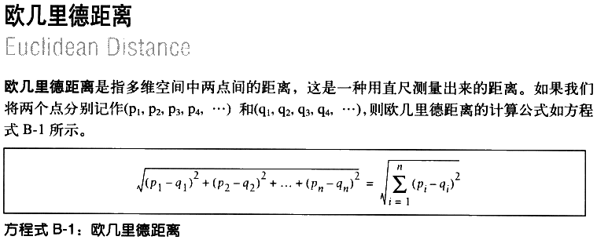

# 提供推荐 #

Making Recommendations

如何根据群体偏好来为人们提供推荐。

## 协作型过滤 ##

Collaborative Filtering

一个**协作型过滤算法**通常的做法是对一大群人进行搜索，并从中找出与我们品味相近的一群人。

算法会对这些人所偏爱的其他内容考察，并将它们组合起来构造出一个经过排名的推荐列表。有许多不同的方法可以帮助我们确定哪些人与自己品味相近，并将他们的选择组合成列表。

## 搜集偏好 ##

Collecting Preferences

这里使用Python**嵌套字典**保存影迷对电影的评价。

数据结构：

	评分={
		人a:{
			电影a:(1~5评分),
			电影b:(1~5评分),
			...},
		人b:...
		...
	}

---

	# A dictionary of movie critics and their ratings of a small
	# set of movies
	critics={'Lisa Rose': {'Lady in the Water': 2.5, 'Snakes on a Plane': 3.5,
	 'Just My Luck': 3.0, 'Superman Returns': 3.5, 'You, Me and Dupree': 2.5, 
	 'The Night Listener': 3.0},
	'Gene Seymour': {'Lady in the Water': 3.0, 'Snakes on a Plane': 3.5, 
	 'Just My Luck': 1.5, 'Superman Returns': 5.0, 'The Night Listener': 3.0, 
	 'You, Me and Dupree': 3.5}, 
	'Michael Phillips': {'Lady in the Water': 2.5, 'Snakes on a Plane': 3.0,
	 'Superman Returns': 3.5, 'The Night Listener': 4.0},
	'Claudia Puig': {'Snakes on a Plane': 3.5, 'Just My Luck': 3.0,
	 'The Night Listener': 4.5, 'Superman Returns': 4.0, 
	 'You, Me and Dupree': 2.5},
	'Mick LaSalle': {'Lady in the Water': 3.0, 'Snakes on a Plane': 4.0, 
	 'Just My Luck': 2.0, 'Superman Returns': 3.0, 'The Night Listener': 3.0,
	 'You, Me and Dupree': 2.0}, 
	'Jack Matthews': {'Lady in the Water': 3.0, 'Snakes on a Plane': 4.0,
	 'The Night Listener': 3.0, 'Superman Returns': 5.0, 'You, Me and Dupree': 3.5},
	'Toby': {'Snakes on a Plane':4.5,'You, Me and Dupree':1.0,'Superman Returns':4.0}}

[recommendations.py](recommendations.py)

	>>> import os
	>>> os.getcwd()

	>>> os.chdir('.')

	>>> from recommendations import critics
	>>> critics['Lisa Rose']['Lady in the Water']
	2.5
	>>> critics['Toby']['Snakes on a Plane']=4.5
	>>> critics['Toby']
	{'Snakes on a Plane': 4.5, 'Superman Returns': 4.0, 'You, Me and Dupree': 1.0}
	>>> 

## 寻找相近的用户 ##

Finding Similar Users

我们需要方法来确定人们品味的相似程度。

为此，我们可将每个人与所有其他人进行对比，并计算他们的**相似度评价值**。

有两种方法：

1. 欧几里得距离；
2. 皮尔逊相关度。

### 欧几里得距离评价 ###

Euclidean Distance Score

若两人在“偏好空间”中的距离越近，他们的兴趣偏好就越相似。

多数量的评分项同样适用这距离公式。

计算两人间距离

	>>> from math import sqrt
	>>> sqrt(pow(4.5-4,2)+pow(1-2,2))
	1.118033988749895
	>>> 

通常要对这数进行处理，来对偏好越相近的情况给出越大的值。

因此，可计算得到距离值加1（这可避免遇到被零整除的错误），并取其倒数：

	>>> 
	>>> 1/(1+sqrt(pow(4.5-4,2)+pow(1-2,2)))
	0.4721359549995794
	>>> 

这样就返回0与1之间的值，值越大，偏好更相似。

构造出用来计算相似度的函数。

	from math import sqrt
	
	# Returns a distance-based similarity score for person1 and person2
	def sim_distance(prefs,person1,person2):
	  # Get the list of shared_items
	  si={}
	  for item in prefs[person1]: 
	    if item in prefs[person2]: si[item]=1
	
	  # if they have no ratings in common, return 0
	  if len(si)==0: return 0
	
	  # Add up the squares of all the differences
	  sum_of_squares=sum([pow(prefs[person1][item]-prefs[person2][item],2) 
	                      for item in prefs[person1] if item in prefs[person2]])
	
	  return 1/(1+sum_of_squares)

使用示例

	>>> import recommendations
	>>> recommendations.sim_distance(recommendations.critics,'Lisa Rose', 'Gene Seymour')
	0.14814814814814814
	>>> 

### 皮尔逊相关度评价 ###

Pearson Correlation Score

皮尔逊相关系数是判断两组数据与某一直线拟合程度的一种度量。

对应的公式比欧式距离公式要复杂，但是它在数据不是很规范normalized的时候（譬如，影评人对影片的评价总是相对于平均水平偏离很大时），会倾向于给出更好的结果。

上图，可看出一条直线。因其绘制原则是尽可能地靠近图上的所有坐标点，故而被称作**最佳拟合线best-fit line**。

若两位评论者对所有影片的评分情况都相同，那么这条直线将成为对角线，并且会与图上所有的坐标点都相交，从而得到一个结果为1的理想相关度评价。

比上图有更佳拟合度的图。

皮尔逊方法能修正“**夸大分值grade inflation**”。若某人总是倾向于给出比另一个人更高的分值，而二者的分值之差又始终保持一致，则他们依然可能会存在很好的相关性。

换成欧式距离公式评价方法，会因为一个人的评价始终比另一个人的更为“严格”（从而导致评价始终相对偏低），得出两者不相近的结论，即使他们品味很相似也是如此。

构造出用来计算相似度的函数。

	# Returns the Pearson correlation coefficient for p1 and p2
	def sim_pearson(prefs,p1,p2):
	  # Get the list of mutually rated items
	  si={}
	  for item in prefs[p1]: 
	    if item in prefs[p2]: si[item]=1
	
	  # if they are no ratings in common, return 0
	  if len(si)==0: return 0
	
	  # Sum calculations
	  n=len(si)
	  
	  # Sums of all the preferences
	  #1
	  sum1=sum([prefs[p1][it] for it in si])
	  #2
	  sum2=sum([prefs[p2][it] for it in si])
	  
	  # Sums of the squares
	  #3
	  sum1Sq=sum([pow(prefs[p1][it],2) for it in si])
	  #4
	  sum2Sq=sum([pow(prefs[p2][it],2) for it in si])	
	  
	  # Sum of the products
	  #5
	  pSum=sum([prefs[p1][it]*prefs[p2][it] for it in si])
	  
	  # Calculate r (Pearson score)
	  num=pSum-(sum1*sum2/n)
	  den=sqrt((sum1Sq-pow(sum1,2)/n)*(sum2Sq-pow(sum2,2)/n))
	  if den==0: return 0
	
	  r=num/den
	
	  return r

该函数将返回一个介于-1与1之间的数值。值为1则表明两个人对每一样物品均有则完全一致的评价。

	>>> recommendations.sim_pearson(recommendations.critics,'Lisa Rose', 'Gene Seymour')
	0.39605901719066977
	>>> 

### 应该选用哪一种相似性度量方法 ###

哪一种方法最优，完全取决于具体的应用。

### 为评分者打分 ###

给出前几名相似度高的人

	# Returns the best matches for person from the prefs dictionary. 
	# Number of results and similarity function are optional params.
	def topMatches(prefs,person,n=5,similarity=sim_pearson):
	  scores=[(similarity(prefs,person,other),other) 
	                  for other in prefs if other!=person]
	  scores.sort()
	  scores.reverse()
	  return scores[0:n]

使用示例

	>>> recommendations.topMatches(recommendations.critics,'Toby',n=3)
	[(0.9912407071619299, 'Lisa Rose'), (0.9244734516419049, 'Mick LaSalle'), (0.8934051474415647, 'Claudia Puig')]
	>>> 

## 推荐物品 ##

