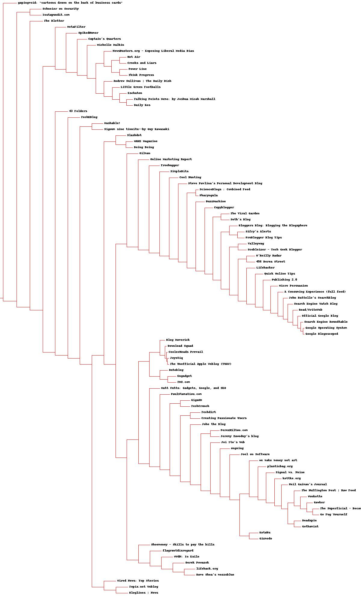

# 发现群组 #

Discovering Groups

**数据聚类data clustering**是一种用以寻找紧密相关的事、人或观点，并将其可视化的方法。

聚类时常被用于有很大数据量的应用。

1. 跟踪消费者购买行为的零售商们，除了利用常规的消费者统计信息外，还可以利用这些信息自动检测出具有相似购买模式的消费者群体。年龄和收入都有相仿的人也许会有迥然不同的着装风格，但是通过使用聚类算法，找到**时装岛屿fashion islands**，据此开发出相应的零售或市场策略。
2. 在计量生物学领域上，用聚类来寻找具有相似行为的基因组，相应的研究结果可以表明，这些基因组中的基因会以同样的方式响应外界的活动，或者表明他们是相同**生化通路biological pathway**中的一部分。

## 监督学习和无监督学习 ##

Supervised versus Unsupervised Learning

### 监督学习 ###

利用样品输入和期望输出来学习如何预测的技术被称为**监督学习法supervised learning methods**。

监督学习法包括：

1. 神经网络
2. 决策树
3. 向量支持机
4. 贝叶斯过滤

采用这些方法的应用程序，会通过检查一组输入和期望的输出来进行学习。

当想利用这些方法中的任何一种来提取信息时，可以传入一组输入，然后期望应用程序能够根据其此前学到的知识来产生输出。

### 无监督学习 ###

**无监督学习unsupervised learing**包括：

1. 聚类 clustering
2. 非负矩阵因式分解 non-negative matrix factorization
3. 自组织映射 self-organizing maps

与监督学习不同，无监督学习算法不是利用带有正确答案的样本数据进行“训练”。

**它们的目的是要在一组数据中找寻某种结构**，这些数据本身并不是我们要找的答案。

譬如，聚类结果不会告诉零售商每一位顾客可能会买什么，也不会预测新来的顾客适合哪种时尚.

聚类算法的目标是采集数据，找出不同的群组。

## 单词向量 ##

为聚类算法准备数据的常见做法是定义一组公共的**数值型属性**。利用这些属性对数据项进行比较。

### 对博客用户进行分类 ###

为了对这些博客进行聚类，需要的是一组指定的词汇在每个博客订阅源中出现的次数。如：

根据单词出现的频度对博客进行聚类，或许可帮助我们分析出是否存在这样一类博客用户，这些人经常撰写相似的主题，或写作风格上十分类似。

这样的分析结果对于搜索、分类和挖掘当前大量的在线博客而言，价值颇高。

[预先准备好的数据集](blogdata.txt)

### 对订阅源中的单词进行计数 ###

[博客订阅源地址列表](feedlist.txt)大部分链接已经失效。

[下载并处理博客源的脚本](generatefeedvector.py)

	#用来解析RSS订阅源的
	import feedparser
	
	import re

	# Returns title and dictionary of word counts for an RSS feed
	def getwordcounts(url):
	  # Parse the feed
	  d=feedparser.parse(url)
	  wc={}
	
	  # Loop over all the entries
	  for e in d.entries:
	    if 'summary' in e: summary=e.summary
	    else: summary=e.description
	
	    # Extract a list of words
	    words=getwords(e.title+' '+summary)
	    for word in words:
	      wc.setdefault(word,0)
	      wc[word]+=1
	
	  #博客名，单词To频数字典
	  return d.feed.title,wc
	
	def getwords(html):
	  # Remove all the HTML tags
	  txt=re.compile(r'<[^>]+>').sub('',html)
	
	  # Split words by all non-alpha characters
	  words=re.compile(r'[^A-Z^a-z]+').split(txt)
	
	  # Convert to lowercase
	  return [word.lower() for word in words if word!='']

---

	#单词To单词出现博客数
	apcount={}

	#博客名To(单词To频数字典)字典
	wordcounts={}
	feedlist=[line for line in file('feedlist.txt')]
	for feedurl in feedlist:
	  try:
	    title,wc=getwordcounts(feedurl)
	    wordcounts[title]=wc

	    for word,count in wc.items():
	      apcount.setdefault(word,0)
	      if count>1:
	        apcount[word]+=1
	  except:
	    print 'Failed to parse feed %s' % feedurl

---

	#过滤掉过少出现和过多出现的单词
	wordlist=[]
	for w,bc in apcount.items():
	  frac=float(bc)/len(feedlist)
	  if frac>0.1 and frac<0.5:
	    wordlist.append(w)

---

	#输出结果，内容参考[blogdata.txt]

	out=file('blogdata1.txt','w')

	#输出列名
	out.write('Blog')
	for word in wordlist:
		out.write('\t%s' % word)
	out.write('\n')

	for blog,wc in wordcounts.items():
	  print blog

	  #输出一行，表示一博客
	  out.write(blog)
	
	  #输出对应的单词频数
	  for word in wordlist:
	    if word in wc:
			out.write('\t%d' % wc[word])
	    else:
			out.write('\t0')
	  out.write('\n')

[运行结果](result.txt) 可见大部分连接已经失效

## 分级聚类 ##

Hierarchical Clustering

分级聚类通过连续不断地将最为相似的群组两两合并，来构造出一个群组的层级结构。

其中的每个群组都是从单一元素（博客）开始的。

在每次迭代过程当中，分级聚类算法会计算每两个群组间的**距离**，并将距离最近的两个群组合并成一个新的群组。

这个过程会一直重复下去，直到只剩下一个群组为止。

通常用**树状图dendrogram**展现所得结果

树状图不仅可以利用连线来表达每个聚类的构成情况，而且还可以利用**距离**来体现构成聚类的各元素间相隔的远近。

上图，聚类AB与A和B之间的距离要比聚类DE与D和E之间的距离更加接近。

这种图形绘制方式能够帮助我们有效地确定一个聚类中各元素间的相似程度，并以此来指示聚类的**紧密程度**。

---

目标：如何对博客数据集进行聚类，以构造博客的层级结构。若构造成功，我们将实现按主题对博客进行分组。

[clusters.py](clusters.py)

首先加载文件

	def readfile(filename):
	  lines=[line for line in file(filename)]
	  
	  # First line is the column titles
	  colnames=lines[0].strip().split('\t')[1:]
	  rownames=[]
	  data=[]
	  for line in lines[1:]:
	    p=line.strip().split('\t')
	    # First column in each row is the rowname
	    rownames.append(p[0])
	    # The data for this row is the remainder of the row
	    data.append([float(x) for x in p[1:]])

	        #博客行，单词列名，博客对应单词数
	  return rownames,colnames,data

---

**紧密度closeness**

在本例子中，一些博客比其他博客包含更多的文章条目，或者文章条目的长度比其他博客的更长，这样会导致这些博客在总体上比其他博客包含更多的词汇。

皮尔逊相关度可以纠正这一问题，因为它判断的其实是两组数据与某条指向的拟合程度。

	from math import sqrt
	
	#接受两个数字列表作参数
	def pearson(v1,v2):
	  # Simple sums
	  sum1=sum(v1)
	  sum2=sum(v2)
	  
	  # Sums of the squares
	  sum1Sq=sum([pow(v,2) for v in v1])
	  sum2Sq=sum([pow(v,2) for v in v2])	
	  
	  # Sum of the products
	  pSum=sum([v1[i]*v2[i] for i in range(len(v1))])
	  
	  # Calculate r (Pearson score)
	  num=pSum-(sum1*sum2/len(v1))
	  den=sqrt((sum1Sq-pow(sum1,2)/len(v1))*(sum2Sq-pow(sum2,2)/len(v1)))
	  if den==0: return 0
	
	  #1.0-皮尔逊相关度，这样做的目的是为了让相似度越大的两个元素之间的距离变得更小
	  return 1.0-num/den

皮尔逊相关度的计算结果在两者完全匹配的情况下为1.0，而在两者毫无关系的情况下则为0.0。

---

分级聚类算法中的每一个聚类，可以是树中的枝节点，也可以是与数据集中实际数据行相对应的叶节点（如博客）。

每一个聚类还包含了指示其位置的信息，这一信息可以是来自叶节点的行数据，也可以来自枝节点经合并后的数据。

	#聚类节点结构
	class bicluster:
	  def __init__(self,vec,left=None,right=None,distance=0.0,id=None):
	    self.left=left
	    self.right=right
	    self.vec=vec
	    self.id=id
	    self.distance=distance

---

分级聚类算法以一组对应于原始数据项的聚类开始。函数的主循环部分会尝试每一组可能的配对并计算他们的相关度，以此来找出最佳配对。最佳配对的两个聚类会被合并成一个新的聚类。

新生成的聚类中所包含的数据，等于将两个旧聚类的数据求均值之后得到的结果。这一过程一直重复下去，直到只剩下一个聚类为止。

	def hcluster(rows,distance=pearson):
	  distances={}
	  currentclustid=-1
	
	  # Clusters are initially just the rows
	  # 最初的数据
	  clust=[bicluster(rows[i],id=i) for i in range(len(rows))]
	
	  while len(clust)>1:
	    lowestpair=(0,1)
	    closest=distance(clust[0].vec,clust[1].vec)
	
	    # loop through every pair looking for the smallest distance
	    for i in range(len(clust)):
	      for j in range(i+1,len(clust)):

	        # distances is the cache of distance calculations
			#缓存距离计算
	        if (clust[i].id,clust[j].id) not in distances: 
	          distances[(clust[i].id,clust[j].id)]=distance(clust[i].vec,clust[j].vec)
	
	        d=distances[(clust[i].id,clust[j].id)]

			#与目前最小距离的进行比较
	        if d<closest:
	          closest=d
	          lowestpair=(i,j)
	
	    # calculate the average of the two clusters
	    mergevec=[
	    (clust[lowestpair[0]].vec[i]+clust[lowestpair[1]].vec[i])/2.0 
	    for i in range(len(clust[0].vec))]
	
	    # create the new cluster
	    newcluster=bicluster(mergevec,left=clust[lowestpair[0]],
	                         right=clust[lowestpair[1]],
	                         distance=closest,id=currentclustid)
	
	    # cluster ids that weren't in the original set are negative
	    currentclustid-=1

		# 移除最近一对
	    del clust[lowestpair[1]]
	    del clust[lowestpair[0]]
	    clust.append(newcluster)
		#这里结束while一次循环
	
	  return clust[0]

---

用先序遍历二叉树方式遍历这聚类树，打印结果

	def printclust(clust,labels=None,n=0):
	  # indent to make a hierarchy layout
	  for i in range(n): print ' ',
	  if clust.id<0:
	    # negative id means that this is branch
	    print '-'
	  else:
	    # positive id means that this is an endpoint
	    if labels==None: print clust.id
	    else: print labels[clust.id]
	
	  # now print the right and left branches
	  if clust.left!=None: printclust(clust.left,labels=labels,n=n+1)
	  if clust.right!=None: printclust(clust.right,labels=labels,n=n+1)

---

运行程序：

	>>> import clusters
	>>> blognames,words,data=clusters.readfile('blogdata.txt')
	>>> clust=clusters.hcluster(data)
	>>> clusters.printclust(clust, labels=blognames)
	-
	  gapingvoid: "cartoons drawn on the back of business cards"
	  -
	    -
	      Schneier on Security
	      Instapundit.com
	    -
	      The Blotter
	      -
	        -
	          MetaFilter
	          -

[更详尽的输出结果](result2.txt)

通过仔细观察，应该能够从中找到政治博客的聚类、技术类博客，以及与撰写博客相关的聚类。

**另外**，从上述结果中我们可能也会注意到一些例外的情况。

一些博客的作者也许并没有撰写过相同主题的文章，但是聚类算法却会判断他们的单词频度具有相关性。

这有可能是博客作者们写作风格的一种反应，当然也可能只是基于数据下载当天的一个巧合而得出的结论。

## 绘制树状图 ##

Draw the dendrogram

用更清晰的图代替文字结果输出。

需要安装PIL库

---

首先，计算出给定聚类树的总体高度（我理解为输出图片的高度）

**二叉树先序遍历方式计算**

	def getheight(clust):
	  # Is this an endpoint? Then the height is just 1
	  if clust.left==None and clust.right==None: return 1
	
	  # Otherwise the height is the same of the heights of
	  # each branch
	  return getheight(clust.left)+getheight(clust.right)

---

需要知道跟节点的总体误差。因为线条的长度会根据每个节点的误差进行相应的调整，所以需要根据总的误差值生成一个缩放因子。

	def getdepth(clust):
	  # The distance of an endpoint is 0.0
	  if clust.left==None and clust.right==None: return 0
	
	  # The distance of a branch is the greater of its two sides
	  # plus its own distance
	  return max(getdepth(clust.left),getdepth(clust.right))+clust.distance

---

画图的主要函数

	def drawdendrogram(clust,labels,jpeg='clusters.jpg'):
	  # height and width
	  h=getheight(clust)*20
	  w=1200
	  depth=getdepth(clust)
	
	  # width is fixed, so scale distances accordingly
	  scaling=float(w-150)/depth
	
	  # Create a new image with a white background
	  img=Image.new('RGB',(w,h),(255,255,255))
	  draw=ImageDraw.Draw(img)
	
	  draw.line((0,h/2,10,h/2),fill=(255,0,0))    
	
	  # Draw the first node
	  drawnode(draw,clust,10,(h/2),scaling,labels)
	  img.save(jpeg,'JPEG')

---

画聚类节点的函数

水平线长度是由聚类中的误差情况决定。

线条越长就越表明，合并在一起的两个聚类差别很大，而线条越短则越表明，两个聚类相似度很高。

	def drawnode(draw,clust,x,y,scaling,labels):
	  if clust.id<0:
	    h1=getheight(clust.left)*20
	    h2=getheight(clust.right)*20
	    top=y-(h1+h2)/2
	    bottom=y+(h1+h2)/2

	    # Line length
	    ll=clust.distance*scaling

	    # Vertical line from this cluster to children    
	    draw.line((x,top+h1/2,x,bottom-h2/2),fill=(255,0,0))    
	    
	    # Horizontal line to left item
	    draw.line((x,top+h1/2,x+ll,top+h1/2),fill=(255,0,0))    
	
	    # Horizontal line to right item
	    draw.line((x,bottom-h2/2,x+ll,bottom-h2/2),fill=(255,0,0))        
	
	    # Call the function to draw the left and right nodes    
	    drawnode(draw,clust.left,x+ll,top+h1/2,scaling,labels)
	    drawnode(draw,clust.right,x+ll,bottom-h2/2,scaling,labels)
	  else:   
	    # If this is an endpoint, draw the item label
	    draw.text((x+5,y-7),labels[clust.id],(0,0,0))

---

运行程序

	>>> clusters.drawdendrogram(clust,blognames,jpeg='blogclust.jpg')

## 列聚类 ##

Column Clustering

## K-均值聚类 ##

## 针对偏好的聚类 ##

## 以二维形式展现数据 ##

## 有关聚类的其他事宜 ##

