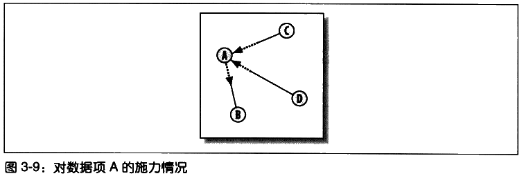

# 发现群组 #

Discovering Groups

[1.监督学习和无监督学习](#监督学习和无监督学习)

[1.1.监督学习](#监督学习)

[1.2.无监督学习](#无监督学习)

[2.单词向量](#单词向量)

[2.1.对博客用户进行分类](#对博客用户进行分类)

[2.2.对订阅源中的单词进行计数](#对订阅源中的单词进行计数)

[3.分级聚类](#分级聚类)

[4.绘制树状图](#绘制树状图)

[5.列聚类](#列聚类)

[6.K-均值聚类](#k-均值聚类)

[7.针对偏好的聚类](#针对偏好的聚类)

[7.1.获取数据和准备数据](#获取数据和准备数据)

[7.2.BeautifulSoup](#beautifulsoup)

[7.3.收集来自Zebo的结果](#收集来自zebo的结果)

[7.4.定义距离度量标准](#定义距离度量标准)

[7.5.对结果进行聚类](#对结果进行聚类)

[8.以二维形式展现数据](#以二维形式展现数据)

[9.有关聚类的其他事宜](#有关聚类的其他事宜)

[10.小结](#小结)

**数据聚类data clustering**是一种用以寻找紧密相关的事、人或观点，并将其可视化的方法。

聚类时常被用于有很大数据量的应用。

1. 跟踪消费者购买行为的零售商们，除了利用常规的消费者统计信息外，还可以利用这些信息自动检测出具有相似购买模式的消费者群体。年龄和收入都有相仿的人也许会有迥然不同的着装风格，但是通过使用聚类算法，找到**时装岛屿fashion islands**，据此开发出相应的零售或市场策略。
2. 在计量生物学领域上，用聚类来寻找具有相似行为的基因组，相应的研究结果可以表明，这些基因组中的基因会以同样的方式响应外界的活动，或者表明他们是相同**生化通路biological pathway**中的一部分。

## 监督学习和无监督学习 ##

Supervised versus Unsupervised Learning

### 监督学习 ###

利用样品输入和期望输出来学习如何预测的技术被称为**监督学习法supervised learning methods**。

监督学习法包括：

1. 神经网络
2. 决策树
3. 向量支持机
4. 贝叶斯过滤

采用这些方法的应用程序，会通过检查一组输入和期望的输出来进行学习。

当想利用这些方法中的任何一种来提取信息时，可以传入一组输入，然后期望应用程序能够根据其此前学到的知识来产生输出。

### 无监督学习 ###

**无监督学习unsupervised learing**包括：

1. 聚类 clustering
2. 非负矩阵因式分解 non-negative matrix factorization
3. 自组织映射 self-organizing maps

与监督学习不同，无监督学习算法不是利用带有正确答案的样本数据进行“训练”。

**它们的目的是要在一组数据中找寻某种结构**，这些数据本身并不是我们要找的答案。

譬如，聚类结果不会告诉零售商每一位顾客可能会买什么，也不会预测新来的顾客适合哪种时尚.

聚类算法的目标是采集数据，找出不同的群组。

## 单词向量 ##

为聚类算法准备数据的常见做法是定义一组公共的**数值型属性**。利用这些属性对数据项进行比较。

### 对博客用户进行分类 ###

为了对这些博客进行聚类，需要的是一组指定的词汇在每个博客订阅源中出现的次数。如：

根据单词出现的频度对博客进行聚类，或许可帮助我们分析出是否存在这样一类博客用户，这些人经常撰写相似的主题，或写作风格上十分类似。

这样的分析结果对于搜索、分类和挖掘当前大量的在线博客而言，价值颇高。

[预先准备好的数据集](blogdata.txt)

### 对订阅源中的单词进行计数 ###

[博客订阅源地址列表](feedlist.txt)大部分链接已经失效。

[下载并处理博客源的脚本](generatefeedvector.py)

	#用来解析RSS订阅源的
	import feedparser
	
	import re

	# Returns title and dictionary of word counts for an RSS feed
	def getwordcounts(url):
	  # Parse the feed
	  d=feedparser.parse(url)
	  wc={}
	
	  # Loop over all the entries
	  for e in d.entries:
	    if 'summary' in e: summary=e.summary
	    else: summary=e.description
	
	    # Extract a list of words
	    words=getwords(e.title+' '+summary)
	    for word in words:
	      wc.setdefault(word,0)
	      wc[word]+=1
	
	  #博客名，单词To频数字典
	  return d.feed.title,wc
	
	def getwords(html):
	  # Remove all the HTML tags
	  txt=re.compile(r'<[^>]+>').sub('',html)
	
	  # Split words by all non-alpha characters
	  words=re.compile(r'[^A-Z^a-z]+').split(txt)
	
	  # Convert to lowercase
	  return [word.lower() for word in words if word!='']

---

	#单词To单词出现博客数
	apcount={}

	#博客名To(单词To频数字典)字典
	wordcounts={}
	feedlist=[line for line in file('feedlist.txt')]
	for feedurl in feedlist:
	  try:
	    title,wc=getwordcounts(feedurl)
	    wordcounts[title]=wc

	    for word,count in wc.items():
	      apcount.setdefault(word,0)
	      if count>1:
	        apcount[word]+=1
	  except:
	    print 'Failed to parse feed %s' % feedurl

---

	#过滤掉过少出现和过多出现的单词
	wordlist=[]
	for w,bc in apcount.items():
	  frac=float(bc)/len(feedlist)
	  if frac>0.1 and frac<0.5:
	    wordlist.append(w)

---

	#输出结果，内容参考[blogdata.txt]

	out=file('blogdata1.txt','w')

	#输出列名
	out.write('Blog')
	for word in wordlist:
		out.write('\t%s' % word)
	out.write('\n')

	for blog,wc in wordcounts.items():
	  print blog

	  #输出一行，表示一博客
	  out.write(blog)
	
	  #输出对应的单词频数
	  for word in wordlist:
	    if word in wc:
			out.write('\t%d' % wc[word])
	    else:
			out.write('\t0')
	  out.write('\n')

[运行结果](result.txt) 可见大部分连接已经失效

## 分级聚类 ##

Hierarchical Clustering

分级聚类通过连续不断地将最为相似的群组两两合并，来构造出一个群组的层级结构。

其中的每个群组都是从单一元素（博客）开始的。

在每次迭代过程当中，分级聚类算法会计算每两个群组间的**距离**，并将距离最近的两个群组合并成一个新的群组。

这个过程会一直重复下去，直到只剩下一个群组为止。

通常用**树状图dendrogram**展现所得结果

树状图不仅可以利用连线来表达每个聚类的构成情况，而且还可以利用**距离**来体现构成聚类的各元素间相隔的远近。

上图，聚类AB与A和B之间的距离要比聚类DE与D和E之间的距离更加接近。

这种图形绘制方式能够帮助我们有效地确定一个聚类中各元素间的相似程度，并以此来指示聚类的**紧密程度**。

---

目标：如何对博客数据集进行聚类，以构造博客的层级结构。若构造成功，我们将实现按主题对博客进行分组。

[clusters.py](clusters.py)

首先加载文件

	def readfile(filename):
	  lines=[line for line in file(filename)]
	  
	  # First line is the column titles
	  colnames=lines[0].strip().split('\t')[1:]
	  rownames=[]
	  data=[]
	  for line in lines[1:]:
	    p=line.strip().split('\t')
	    # First column in each row is the rowname
	    rownames.append(p[0])
	    # The data for this row is the remainder of the row
	    data.append([float(x) for x in p[1:]])

	        #博客行，单词列名，博客对应单词数
	  return rownames,colnames,data

---

**紧密度closeness**

在本例子中，一些博客比其他博客包含更多的文章条目，或者文章条目的长度比其他博客的更长，这样会导致这些博客在总体上比其他博客包含更多的词汇。

皮尔逊相关度可以纠正这一问题，因为它判断的其实是两组数据与某条指向的拟合程度。

	from math import sqrt
	
	#接受两个数字列表作参数
	def pearson(v1,v2):
	  # Simple sums
	  sum1=sum(v1)
	  sum2=sum(v2)
	  
	  # Sums of the squares
	  sum1Sq=sum([pow(v,2) for v in v1])
	  sum2Sq=sum([pow(v,2) for v in v2])	
	  
	  # Sum of the products
	  pSum=sum([v1[i]*v2[i] for i in range(len(v1))])
	  
	  # Calculate r (Pearson score)
	  num=pSum-(sum1*sum2/len(v1))
	  den=sqrt((sum1Sq-pow(sum1,2)/len(v1))*(sum2Sq-pow(sum2,2)/len(v1)))
	  if den==0: return 0
	
	  #1.0-皮尔逊相关度，这样做的目的是为了让相似度越大的两个元素之间的距离变得更小
	  return 1.0-num/den

皮尔逊相关度的计算结果在两者完全匹配的情况下为1.0，而在两者毫无关系的情况下则为0.0。

---

分级聚类算法中的每一个聚类，可以是树中的枝节点，也可以是与数据集中实际数据行相对应的叶节点（如博客）。

每一个聚类还包含了指示其位置的信息，这一信息可以是来自叶节点的行数据，也可以来自枝节点经合并后的数据。

	#聚类节点结构
	class bicluster:
	  def __init__(self,vec,left=None,right=None,distance=0.0,id=None):
	    self.left=left
	    self.right=right
	    self.vec=vec
	    self.id=id
	    self.distance=distance

---

分级聚类算法以一组对应于原始数据项的聚类开始。函数的主循环部分会尝试每一组可能的配对并计算他们的相关度，以此来找出最佳配对。最佳配对的两个聚类会被合并成一个新的聚类。

新生成的聚类中所包含的数据，等于将两个旧聚类的数据求均值之后得到的结果。这一过程一直重复下去，直到只剩下一个聚类为止。

	def hcluster(rows,distance=pearson):
	  distances={}
	  currentclustid=-1
	
	  # Clusters are initially just the rows
	  # 最初的数据
	  clust=[bicluster(rows[i],id=i) for i in range(len(rows))]
	
	  while len(clust)>1:
	    lowestpair=(0,1)
	    closest=distance(clust[0].vec,clust[1].vec)
	
	    # loop through every pair looking for the smallest distance
	    for i in range(len(clust)):
	      for j in range(i+1,len(clust)):

	        # distances is the cache of distance calculations
			#缓存距离计算
	        if (clust[i].id,clust[j].id) not in distances: 
	          distances[(clust[i].id,clust[j].id)]=distance(clust[i].vec,clust[j].vec)
	
	        d=distances[(clust[i].id,clust[j].id)]

			#与目前最小距离的进行比较
	        if d<closest:
	          closest=d
	          lowestpair=(i,j)
	
	    # calculate the average of the two clusters
	    mergevec=[
	    (clust[lowestpair[0]].vec[i]+clust[lowestpair[1]].vec[i])/2.0 
	    for i in range(len(clust[0].vec))]
	
	    # create the new cluster
	    newcluster=bicluster(mergevec,left=clust[lowestpair[0]],
	                         right=clust[lowestpair[1]],
	                         distance=closest,id=currentclustid)
	
	    # cluster ids that weren't in the original set are negative
	    currentclustid-=1

		# 移除最近一对
	    del clust[lowestpair[1]]
	    del clust[lowestpair[0]]
	    clust.append(newcluster)
		#这里结束while一次循环
	
	  return clust[0]

---

用先序遍历二叉树方式遍历这聚类树，打印结果

	def printclust(clust,labels=None,n=0):
	  # indent to make a hierarchy layout
	  for i in range(n): print ' ',
	  if clust.id<0:
	    # negative id means that this is branch
	    print '-'
	  else:
	    # positive id means that this is an endpoint
	    if labels==None: print clust.id
	    else: print labels[clust.id]
	
	  # now print the right and left branches
	  if clust.left!=None: printclust(clust.left,labels=labels,n=n+1)
	  if clust.right!=None: printclust(clust.right,labels=labels,n=n+1)

---

运行程序：

	>>> import clusters
	>>> blognames,words,data=clusters.readfile('blogdata.txt')
	>>> clust=clusters.hcluster(data)
	>>> clusters.printclust(clust, labels=blognames)
	-
	  gapingvoid: "cartoons drawn on the back of business cards"
	  -
	    -
	      Schneier on Security
	      Instapundit.com
	    -
	      The Blotter
	      -
	        -
	          MetaFilter
	          -

[更详尽的输出结果](result2.txt)

通过仔细观察，应该能够从中找到政治博客的聚类、技术类博客，以及与撰写博客相关的聚类。

**另外**，从上述结果中我们可能也会注意到一些例外的情况。

一些博客的作者也许并没有撰写过相同主题的文章，但是聚类算法却会判断他们的单词频度具有相关性。

这有可能是博客作者们写作风格的一种反应，当然也可能只是基于数据下载当天的一个巧合而得出的结论。

## 绘制树状图 ##

Draw the dendrogram

用更清晰的图代替文字结果输出。

需要安装PIL库

---

首先，计算出给定聚类树的总体高度（我理解为输出图片的高度）

**二叉树先序遍历方式计算**

	def getheight(clust):
	  # Is this an endpoint? Then the height is just 1
	  if clust.left==None and clust.right==None: return 1
	
	  # Otherwise the height is the same of the heights of
	  # each branch
	  return getheight(clust.left)+getheight(clust.right)

---

需要知道跟节点的总体误差。因为线条的长度会根据每个节点的误差进行相应的调整，所以需要根据总的误差值生成一个缩放因子。

	def getdepth(clust):
	  # The distance of an endpoint is 0.0
	  if clust.left==None and clust.right==None: return 0
	
	  # The distance of a branch is the greater of its two sides
	  # plus its own distance
	  return max(getdepth(clust.left),getdepth(clust.right))+clust.distance

---

画图的主要函数

	def drawdendrogram(clust,labels,jpeg='clusters.jpg'):
	  # height and width
	  h=getheight(clust)*20
	  w=1200
	  depth=getdepth(clust)
	
	  # width is fixed, so scale distances accordingly
	  scaling=float(w-150)/depth
	
	  # Create a new image with a white background
	  img=Image.new('RGB',(w,h),(255,255,255))
	  draw=ImageDraw.Draw(img)
	
	  draw.line((0,h/2,10,h/2),fill=(255,0,0))    
	
	  # Draw the first node
	  drawnode(draw,clust,10,(h/2),scaling,labels)
	  img.save(jpeg,'JPEG')

---

画聚类节点的函数

水平线长度是由聚类中的误差情况决定。

线条越长就越表明，合并在一起的两个聚类差别很大，而线条越短则越表明，两个聚类相似度很高。

	def drawnode(draw,clust,x,y,scaling,labels):
	  if clust.id<0:
	    h1=getheight(clust.left)*20
	    h2=getheight(clust.right)*20
	    top=y-(h1+h2)/2
	    bottom=y+(h1+h2)/2

	    # Line length
	    ll=clust.distance*scaling

	    # Vertical line from this cluster to children    
	    draw.line((x,top+h1/2,x,bottom-h2/2),fill=(255,0,0))    
	    
	    # Horizontal line to left item
	    draw.line((x,top+h1/2,x+ll,top+h1/2),fill=(255,0,0))    
	
	    # Horizontal line to right item
	    draw.line((x,bottom-h2/2,x+ll,bottom-h2/2),fill=(255,0,0))        
	
	    # Call the function to draw the left and right nodes    
	    drawnode(draw,clust.left,x+ll,top+h1/2,scaling,labels)
	    drawnode(draw,clust.right,x+ll,bottom-h2/2,scaling,labels)
	  else:   
	    # If this is an endpoint, draw the item label
	    draw.text((x+5,y-7),labels[clust.id],(0,0,0))

---

运行程序

	>>> clusters.drawdendrogram(clust,blognames,jpeg='blogclust.jpg')

## 列聚类 ##

Column Clustering

同时在行和列上对数据进行聚类常常是很有必要的。

当进行市场研究的时候，对消费群体进行分组可能是有意义的，这将有助于摸清消费者的统计信息和产品的状况，还可能有助于确定上架商品可以进行捆绑销售。

在博客数据集中，列代表的是单词，知道哪些单词时常会结合在一起使用，可能是非常有意义的。

为完成目的，需将行列调换

	def rotatematrix(data):
	  newdata=[]
	  for i in range(len(data[0])):
	    newrow=[data[j][i] for j in range(len(data))]
	    newdata.append(newrow)
	  return newdata

然后进行聚类

	>>> blognames,words,data=clusters.readfile('blogdata.txt')
	>>> rdata = clusters.rotatematrix(data)
	>>> wordclust = clusters.hcluster(rdata)
	>>> clusters.drawdendrogram(wordclust,labels=words,jpeg='wordclust.jpg')

[运行后的树状图](wordclust.jpg)

关于聚类有一点很重要：当数据项的数量比变量多的时候，出现无意义聚类的可能性增加。

由于单词的数量比博客多很多，因此我们会发现，在博客聚类中出现的模式pattern要比单词聚类中出现的更为合理。

## K-均值聚类 ##

分级聚类的结果返回一棵直观的树。

但是，分级聚类有两个**缺点**。

1. 在没有额外投入的情况下，树状视图是不会真正将数据拆分成不同组的。
2. 而且算法的计算量非常惊人。（因为必须计算每两个配对项之间的关系，并且在合并项后，这些关系还得重新再计算，所以在处理很大规模的数据集时，该算法的运行速度会非常缓慢）

---

**K-均值聚类**，不同于分级聚类，因为会预先告诉算法希望生成的聚类数量，然后算法会根据数据的结构状况来确定聚类的大小。

K-均值聚类算法

1. 首先会随机确定K个中心位置（位于空间中代表聚类中心的点）；
2. 然后将各个数据项分配给最临近的中心点；
3. 待分配完成之后，聚类中心就会移到分配给该聚类的所有节点的平均位置处，然后整个分配过程重新开始。

这一过程会一直重复下去，直到分配过程不再产生变化为止。

	def kcluster(rows,distance=pearson,k=4):
	  # Determine the minimum and maximum values for each point
	  ranges=[(min([row[i] for row in rows]),max([row[i] for row in rows])) 
	  for i in range(len(rows[0]))]
	
	  # Create k randomly placed centroids
	  clusters=[[random.random()*(ranges[i][1]-ranges[i][0])+ranges[i][0] 
	  for i in range(len(rows[0]))] for j in range(k)]
	  
	  lastmatches=None
	  for t in range(100):
	    print 'Iteration %d' % t
	    bestmatches=[[] for i in range(k)]
	    
	    # Find which centroid is the closest for each row
	    for j in range(len(rows)):
	      row=rows[j]
	      bestmatch=0
	      for i in range(k):
	        d=distance(clusters[i],row)
	        if d<distance(clusters[bestmatch],row): bestmatch=i
	      bestmatches[bestmatch].append(j)
	
	    # If the results are the same as last time, this is complete
	    if bestmatches==lastmatches: break
	    lastmatches=bestmatches
	    
	    # Move the centroids质心 to the average of their members
	    for i in range(k):
	      avgs=[0.0]*len(rows[0])
	      if len(bestmatches[i])>0:
	        for rowid in bestmatches[i]:
	          for m in range(len(rows[rowid])):
	            avgs[m]+=rows[rowid][m]
	        for j in range(len(avgs)):
	          avgs[j]/=len(bestmatches[i])
	        clusters[i]=avgs
	      
	  return bestmatches

与分级聚类相比，该算法为产生最终结果所需迭代次数是非常少的。

由于函数选用随机中心点作为开始，所以返回结果的顺序几乎总是不同的。根据中心点初始位置的不同，最终聚类中所包含的内容也可能会有所不同。

	>>> 
	>>> kclust = clusters.kcluster(data, k = 10)
	Iteration 0
	Iteration 1
	Iteration 2
	Iteration 3
	Iteration 4
	>>> [blognames[r] for r in kclust[0]]
	['Blog Maverick', 'Joystiq', 'Download Squad', 'CoolerHeads Prevail', 'The Unofficial Apple Weblog (TUAW)']
	>>> [blognames[r] for r in kclust[1]]
	['GigaOM', 'Kotaku', 'Gizmodo', 'Topix.net Weblog', 'TechEBlog', 'kottke.org', 'Joel on Software', 'WWdN: In Exile']
	>>> 

## 针对偏好的聚类 ##

[Zebo](http://www.zebo.com)它鼓励人们在网站上建立账号，并将他们已经拥有的和希望拥有的物品列举出来。

从广告商角度而言，可以找方法，将偏好相近者很自然地分在一组。

[Zebo](http://www.zebo.com)目前不能被访问。

### 获取数据和准备数据 ###

通过爬虫方式进行爬取目标网站的数据。

[已经准备好的数据文件](zebo.txt)

### BeautifulSoup ###

Python的HTML的选择器

### 收集来自Zebo的结果 ###

[爬取Zebo数据脚本](downloadzebodata.py)

### 定义距离度量标准 ###

假如我们对同时希望拥有两件物品的人在物品方面互有重叠的情况进行度量。

	def tanamoto(v1,v2):
	  c1,c2,shr=0,0,0
	  
	  for i in range(len(v1)):
	    if v1[i]!=0: c1+=1 # in v1
	    if v2[i]!=0: c2+=1 # in v2
	    if v1[i]!=0 and v2[i]!=0: shr+=1 # in both
	  
	  return 1.0-(float(shr)/(c1+c2-shr))

返回(0.0, 1.0)之间的值。

其中1.0代表不存在同时喜欢两件物品的人，而0.0则代表所有人都同时喜欢两个向量中的物品。

### 对结果进行聚类 ###

	>>> import clusters
	>>> wants,people,data=clusters.readfile('zebo.txt')
	>>> clust = clusters.hcluster(data,distance=clusters.tanamoto)
	>>> clusters.drawdendrogram(clust, wants)
	>>> 

图中包含聚类反映人们希望拥有的物品。

## 以二维形式展现数据 ##

**多维缩放multidimensional scaling**

利用这项技术，可以为数据集找到一种二维表达方式。

算法根据每队数据项之间的差距情况，尝试绘制出一幅画来，图中各数据项之间距离远近，对于它们彼此之间的差异程度。

**为了做到这一点，算法首先必须计算出所有项之间的距离**。

在博客数据集中，采用皮尔逊相关度技术来对各数据项进行比较。

作为例子，列出各点之间距离

下一步，我们将所有数据项随机放置在二维图上

所有数据项两两之间的当前距离值都是根据实际距离（即差平方之和）计算求得：

针对每两两构成的一对数据项，将它们的目标距离与当前距离进行比较，并求出一个误差值。根据误差的情况，会按照比例将每个数据项的所在位置移近或移动少许。

每个节点的移动，都是所有其他节点施加在该节点上推或拉的综合效应。节点每移动一次，其当前距离和目标距离间的差距就会减少一些。这一过程会不断地重复多次，直到无法再通过移动节点来减少总体误差为止。

	def scaledown(data,distance=pearson,rate=0.01):
	  n=len(data)
	
	  # The real distances between every pair of items
	  realdist=[[distance(data[i],data[j]) for j in range(n)] 
	             for i in range(0,n)]
	
	  # Randomly initialize the starting points of the locations in 2D
	  loc=[[random.random(),random.random()] for i in range(n)]
	  fakedist=[[0.0 for j in range(n)] for i in range(n)]
	  
	  lasterror=None
	  for m in range(0,1000):
	    # Find projected distances
	    # 寻找投影后的距离
	    for i in range(n):
	      for j in range(n):
	        fakedist[i][j]=sqrt(sum([pow(loc[i][x]-loc[j][x],2) 
	                                 for x in range(len(loc[i]))]))
	  
	    # Move points
	    grad=[[0.0,0.0] for i in range(n)]
	    
	    totalerror=0
	    for k in range(n):
	      for j in range(n):
	        if j==k: continue
	        # The error is percent difference between the distances
	        # 误差值等于目标距离与当前距离之间差值的百分比
	        errorterm=(fakedist[j][k]-realdist[j][k])/realdist[j][k]
	        
	        # Each point needs to be moved away from or towards the other
	        # point in proportion to how much error it has
	        # 每一节点都需要根据误差的多少，按比例移离或移向其他节点
	        grad[k][0]+=((loc[k][0]-loc[j][0])/fakedist[j][k])*errorterm
	        grad[k][1]+=((loc[k][1]-loc[j][1])/fakedist[j][k])*errorterm
	
	        # Keep track of the total error
	        totalerror+=abs(errorterm)
	    print totalerror
	
	    # If the answer got worse by moving the points, we are done
	    if lasterror and lasterror<totalerror: break
	    lasterror=totalerror
	    
	    # Move each of the points by the learning rate times the gradient
	    for k in range(n):
	      loc[k][0]-=rate*grad[k][0]
	      loc[k][1]-=rate*grad[k][1]
	
	  return loc

然后生成图，直观观察结果

	def draw2d(data,labels,jpeg='mds2d.jpg'):
	  img=Image.new('RGB',(2000,2000),(255,255,255))
	  draw=ImageDraw.Draw(img)
	  for i in range(len(data)):
	    x=(data[i][0]+0.5)*1000
	    y=(data[i][1]+0.5)*1000
	    draw.text((x,y),labels[i],(0,0,0))
	  img.save(jpeg,'JPEG')

运行程序

	>>> import clusters
	>>> blognames,words,data=clusters.readfile('blogdata.txt')
	>>> coords=clusters.scaledown(data)
	4422.6373557
	3534.9850016
	3459.11229077
	3425.48501225
	3401.19420001
	3380.22252584
	3362.67067985
	3348.20329197
	...
	>>> clusters.draw2d(coords,blognames,jpeg='blogs2d.jpg')
	>>>

多维缩放算法的执行效果

多维缩放是一种非常有效的方法，利用它将获取到的数据集以一种易于解释的方式形象化地展现出来。**注意！**在缩放过程当中一些信息可能会丢失掉。

## 有关聚类的其他事宜 ##

可以将本章提供的这些思路扩展到不同的领域，从中寻找富有价值的结论

1. 基于单词的信息公告栏；
2. 基于各种数字统计的来自Yahoo!Finance的公司信息；
3. Amazon上的书评者排行；
4. 研究大型社区网络，根据用户的好友光系，或者是利用用户可能提供的其他信息（喜欢的乐队、食物等）对人群进行聚类。

## 小结 ##

聚类算法

1. 分级聚类Hierarchical Clustering
2. K-均值聚类K-Means Clustering
3. 前两项分别的列聚类

---

本章用到计算两节点距离算法

1. 皮尔逊相关度
2. Tanimoto系数

---

展现结果的画图方法

1. 树状图Dendrogram
2. 二维距离展现图
