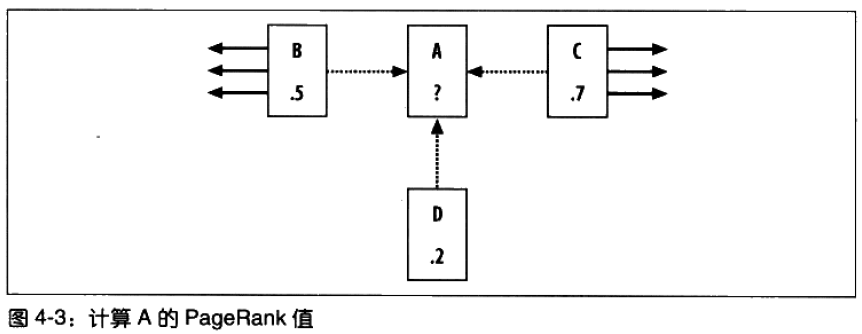
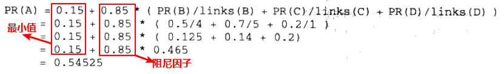
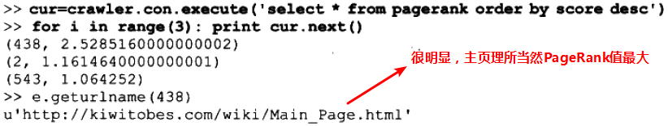
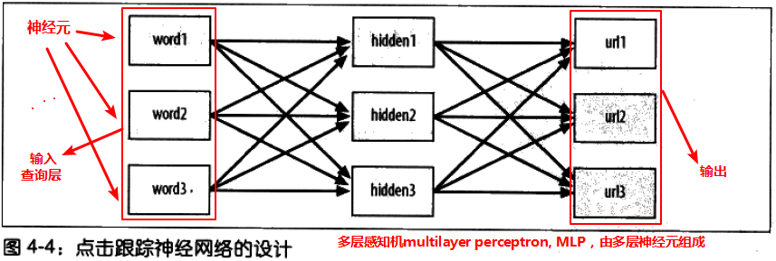
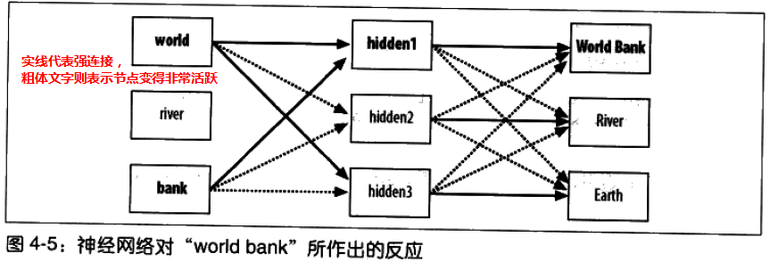
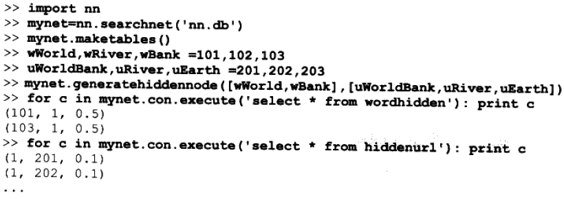
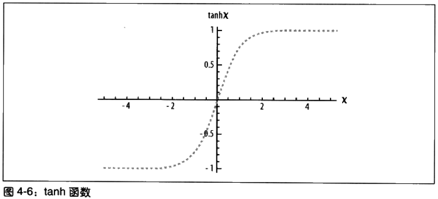
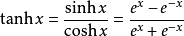
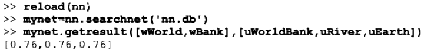
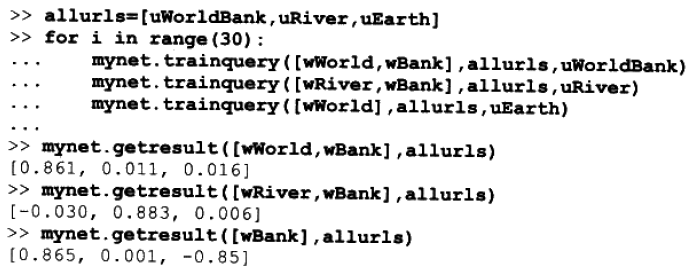

# 搜索与排名 #

**由于书本未提供数据文件且提供的链接无法被链接且pysqlite安装失败，所以本章只是阅读学习。**

[1.搜索引擎的组成](#搜索引擎的组成)

[2.一个简单的爬虫程序](#一个简单的爬虫程序)

[2.1.使用urllib2](#使用urllib2)

[2.2.爬虫程序的代码](#爬虫程序的代码)

[3.建立索引](#建立索引)

[3.1.建立数据库Schema](#建立数据库schema)

[3.2.在网页中查找单词](#在网页中查找单词)

[3.3.加入索引](#加入索引)

[4.查询](#查询)

[5.基于内容的排名](#基于内容的排名)

[5.1.归一化函数](#归一化函数)

[5.2.单词频度](#单词频度)

[5.3.文档位置](#文档位置)

[5.4.单词距离](#单词距离)

[6.利用外部会指链接](#利用外部会指链接)

[6.1.简单计数](#简单计数)

[6.2.PageRank算法](#pagerank算法)

[6.3.利用连接文本](#利用连接文本)

[7.从点击行为中学习](#从点击行为中学习)

[7.1.一个点击跟踪网络的设计](#一个点击跟踪网络的设计)

[7.2.设计数据库](#设计数据库)

[7.3.前馈法](#前馈法)

[7.4.利用反向传播进行训练](#利用反向传播进行训练)

[7.5.训练实验](#训练实验)

[7.6.与搜索引擎结合](#与搜索引擎结合)

[8.小结](#小结)

全文搜索引擎——Google的PageRank的排名

信息检索Information retrieval

## 搜索引擎的组成 ##

建立搜索引擎的步骤

1. 找到一种搜集文档的方法；
2. 待搜集完文档之后，需要为这些文档建立索引
3. 通过查询返回一个经过排序的文档列表了。

[searchengine.py](searchengine.py)

## 一个简单的爬虫程序 ##

本程序接受一小组等待建立索引的网页，然后在根据这些网页内部的链接进而找到其他的网页，以此类推。这一过程称为**检索**或**蛛行Spidering**

### 使用urllib2 ###

urllib2是Python自带的。

	>>> import urllib2
	>>> c = urllib2.urlopen('http://www.baidu.com')
	>>> contents = c.read()
	>>> print contents[0:100]
	<!DOCTYPE html>
	<!--STATUS OK-->

### 爬虫程序的代码 ###

	import urllib2
	from BeautifulSoup import *
	from urlparse import urljoin

---

这里用到的广度优先算法

	  # Starting with a list of pages, do a breadth
	  # first search to the given depth, indexing pages
	  # as we go
	  def crawl(self,pages,depth=2):
	    for i in range(depth):
	      newpages={}
	      for page in pages:

			#尝试链接页面地址
	        try:
	          c=urllib2.urlopen(page)
	        except:
	          print "Could not open %s" % page
	          continue
	        try:
	          soup=BeautifulSoup(c.read())
	          self.addtoindex(page,soup)
	  
	          links=soup('a')
	          for link in links:
	            if ('href' in dict(link.attrs)):
	              url=urljoin(page,link['href'])
	              if url.find("'")!=-1: continue

				  # remove location portion
	              url=url.split('#')[0]  
	              if url[0:4]=='http' and not self.isindexed(url):
					链接后页面的子链接
	                newpages[url]=1

	              linkText=self.gettextonly(link)

				  #链接地址和链接后页面的文本
	              self.addlinkref(page,url,linkText)
	  
	          self.dbcommit()
	        except:
	          print "Could not parse page %s" % page

		  #这里用到的广度优先算法
	      pages=newpages

## 建立索引 ##

目的：为全文索引建立数据库。

索引对应于一个列表，其中包含了yi

1. 所有不同的单词；
2. 这些单词所在的文档；
3. 以及单词在文档中出现的位置

使用pysqlite（本机安装失败）

安装后，需要用到调控数据代码

	from pysqlite2 import dbapi2 as sqlite

	  # Initialize the crawler with the name of database
	  def __init__(self,dbname):
	    self.con=sqlite.connect(dbname)
	  
	  def __del__(self):
	    self.con.close()
	
	  def dbcommit(self):
	    self.con.commit()

### 建立数据库Schema ###

1. urllist - 保存的是已经处理过索引的URL列表
2. wordlist - 保存的是单词列表
3. wordlocation - 保存的是单词在文档中所处位置的列表
4. link - 保存了两个URLID，指明从一张表到另一张表的链接关系
5. linkwords - 利用字段wordid和linked记录了哪些单词与链接实际相关。

创建数据库表及索引代码：

	  # Create the database tables
	  def createindextables(self): 
	    self.con.execute('create table urllist(url)')
	    self.con.execute('create table wordlist(word)')
	    self.con.execute('create table wordlocation(urlid,wordid,location)')
	    self.con.execute('create table link(fromid integer,toid integer)')
	    self.con.execute('create table linkwords(wordid,linkid)')
	    self.con.execute('create index wordidx on wordlist(word)')
	    self.con.execute('create index urlidx on urllist(url)')
	    self.con.execute('create index wordurlidx on wordlocation(wordid)')
	    self.con.execute('create index urltoidx on link(toid)')
	    self.con.execute('create index urlfromidx on link(fromid)')
	    self.dbcommit()

### 在网页中查找单词 ###

得出网页中的所有文字

	  # Extract the text from an HTML page (no tags)
	  def gettextonly(self,soup):
	    v=soup.string
	    if v==Null:   
	      c=soup.contents
	      resulttext=''
	      for t in c:
	        subtext=self.gettextonly(t)
	        resulttext+=subtext+'\n'
	      return resulttext
	    else:
	      return v.strip()

将字符串拆分成一组独立的单词。

	  # Seperate the words by any non-whitespace character
	  def separatewords(self,text):
	    splitter=re.compile('\\W*')
	    return [s.lower() for s in splitter.split(text) if s!='']

>PS. 额外工作：利用某种**词干提取算法Stemming algorithms**去除掉单词的后缀。该算法试图将单词转换成对应的词干。

>例如：将单词indexing变成index。这样，人们在搜索单词“index”时同样也会得到包含单词indexing的文档。

### 加入索引 ###

	  # Index an individual page
	  def addtoindex(self,url,soup):
	    if self.isindexed(url): return
	    print 'Indexing '+url
	  
	    # Get the individual words
	    text=self.gettextonly(soup)
	    words=self.separatewords(text)
	    
	    # Get the URL id
	    # 涉及 表urllist
	    urlid=self.getentryid('urllist','url',url)
	    
	    # Link each word to this url
	    for i in range(len(words)):
	      word=words[i]
	      if word in ignorewords: continue

	      # 涉及 表wordlist
	      wordid=self.getentryid('wordlist','word',word)

		  #涉及 表wordlocation
	      self.con.execute("insert into wordlocation(urlid,wordid,location) values (%d,%d,%d)" % (urlid,wordid,i))

getentryid函数的作用是返回某一条目的ID。如果条目不存在，则程序会在数据库中新建一条记录，并将ID返回。

	  # Auxilliary function for getting an entry id and adding 
	  # it if it's not present
	  def getentryid(self,table,field,value,createnew=True):
	    cur=self.con.execute(
	    "select rowid from %s where %s='%s'" % (table,field,value))
	    res=cur.fetchone()
	    if res==None:
	      cur=self.con.execute(
	      "insert into %s (%s) values ('%s')" % (table,field,value))
	      return cur.lastrowid
	    else:
	      return res[0] 

isindexed函数的作用是判断网页是否已经存入数据库。

	#涉及表 wordlocation 和 urllist
	def isindexed(self, url):
		u=self.con.execute("select rowid from urllist where url='%s'" % url).fetchone()
		# 检查它是否已经被检索过了
		v=self.con.execute(select from wordlocation where urlid=%d' % u[0]).fetchone()
		if v != None: 
			return True
		return False

## 查询 ##

用于创建

	class searcher:
	  def __init__(self,dbname):
	    self.con=sqlite.connect(dbname)
	
	  def __del__(self):
	    self.con.close()

查找那些包含所有不同单词的URL

	  def getmatchrows(self,q):
	    # Strings to build the query
	    fieldlist='w0.urlid'
	    tablelist=''  
	    clauselist=''
	    wordids=[]
	
	    # Split the words by spaces
	    words=q.split(' ')  
	    tablenumber=0
	
	    for word in words:
	      # Get the word ID
	      wordrow=self.con.execute(
	      "select rowid from wordlist where word='%s'" % word).fetchone()
	      if wordrow!=None:
	        wordid=wordrow[0]
	        wordids.append(wordid)
	        if tablenumber>0:
	          tablelist+=','
	          clauselist+=' and '
	          clauselist+='w%d.urlid=w%d.urlid and ' % (tablenumber-1,tablenumber)
	        fieldlist+=',w%d.location' % tablenumber
	        tablelist+='wordlocation w%d' % tablenumber      
	        clauselist+='w%d.wordid=%d' % (tablenumber,wordid)
	        tablenumber+=1
	
	    # Create the query from the separate parts
	    fullquery='select %s from %s where %s' % (fieldlist,tablelist,clauselist)
	    print fullquery
	    cur=self.con.execute(fullquery)
	    rows=[row for row in cur]
	
	    return rows,wordids

一个涉及两个单词（对应ID为10和17）的查询如下：

查询结果如下：

接下的目标：**用若干方法对这些搜索结果进行排序**

1. 基于内容的排名
2. 利用外部会指链接
3. 从点击行为中学习

## 基于内容的排名 ##

在获得与查询条件相匹配的网页。

但是，其返回结果的排列顺序却很简单，即其被检索时的顺序。

而面对大量的网页，**为了能够从中找出与査询真正匹配的页面**，我们就不得不在大量毫不相干的内容中逐一进行浏览，以搜寻任何对查询条件中某一部分内容有所提及的结果。

为了解决这一向题，**我们须要找到一种能够针对给定査询条件为网页进行评价的方法**，并且能在返回结果中将评价最高者排在最前面。

评价度量方法

1. 单词频度
2. 文档位置
3. 单词距离

	  def getscoredlist(self,rows,wordids):
	    totalscores=dict([(row[0],0) for row in rows])
	
	    # This is where we'll put our scoring functions
	    weights=[(1.0,self.locationscore(rows)), 
	             (1.0,self.frequencyscore(rows)),
	             (1.0,self.pagerankscore(rows)),
	             (1.0,self.linktextscore(rows,wordids)),
	             (5.0,self.nnscore(rows,wordids))]
	    for (weight,scores) in weights:
	      for url in totalscores:
	        totalscores[url]+=weight*scores[url]
	
	    return totalscores
	
	  #根据urlid查找数据库得出url
	  def geturlname(self,id):
	    return self.con.execute(
	    "select url from urllist where rowid=%d" % id).fetchone()[0]
	
	  def query(self,q):
	    rows,wordids=self.getmatchrows(q)

	    #根据评价算法得出评分
	    scores=self.getscoredlist(rows,wordids)
	    rankedscores=[(score,url) for (url,score) in scores.items()]
	    rankedscores.sort()
	    rankedscores.reverse()

		#根据评分，从高到低打印结果网页
	    for (score,urlid) in rankedscores[0:10]:
	      print '%f\t%s' % (score,self.geturlname(urlid))
	    return wordids,[r[1] for r in rankedscores[0:10]]

### 归一化函数 ###

Normalization Function 

因为，有的评价方法分值越大越好，而有的分值越小越好。

为了对不同方法的返回结果进行比较，需要一种对结果进行**归一化**处理的方法，即**令它们具有相同的值域及变化反向**。

	  def normalizescores(self,scores,smallIsBetter=0):
	    vsmall=0.00001 # Avoid division by zero errors
	    if smallIsBetter:
	      minscore=min(scores.values())
	      return dict([(u,float(minscore)/max(vsmall,l)) for (u,l) in scores.items()])
	    else:
	      maxscore=max(scores.values())
	      if maxscore==0: maxscore=vsmall
	      return dict([(u,float(c)/maxscore) for (u,c) in scores.items()])

每个评价函数都会调用该函数，将结果进行归一化处理，并返回一个介于0和1之间的值。

### 单词频度 ###

根据查询条件中的单词在网页中出现的次数对网页进行评价

	  def frequencyscore(self,rows):
	    counts=dict([(row[0],0) for row in rows])
	    for row in rows: counts[row[0]]+=1
	    return self.normalizescores(counts)

通常一个搜索引擎不会将评价结果告诉最终用户

但是对某些引用而言，这些评价值可能非常有用。

例如，

1. 我们希望在超出某个值域的时候，直接向用户返回排名最靠前的内容
2. 希望根据返回结果的相关程度，按一定比例的字体大小加以显示。

### 文档位置 ###

document location

通常，若一个网页与待搜索的单词相关，则该单词就更改有可能在靠近网页开始处的位置出现，甚至是出现在标题中。

利用这一点，搜索引擎可对待查单词在文档中出现越早的情况给予越高的评价。

	  def locationscore(self,rows):
	    locations=dict([(row[0],1000000) for row in rows])
	    for row in rows:
		  # 单词们的位置和，位置和越小，说明它们越靠近网页前部
	      loc=sum(row[1:])
	      if loc < locations[row[0]]:
			locations[row[0]] = loc
	    
	    return self.normalizescores(locations,smallIsBetter=1)

介绍的度量方法中，没有任何一个方法对于每一种情况而言都是最优的。

取决于搜索者的意图，上述各种搜索结果都是有效的，而且对于一组特定的文档与应用而言，为了给出最佳结果，不同的**加权组合**是必要的。

    # This is where we'll put our scoring functions
    weights=[(1.0,self.locationscore(rows)), 
             (1.0,self.frequencyscore(rows)),
             (1.0,self.pagerankscore(rows)),
             (1.0,self.linktextscore(rows,wordids)),
             (5.0,self.nnscore(rows,wordids))]

### 单词距离 ###

	  def distancescore(self,rows):
	    # If there's only one word, everyone wins!
	    if len(rows[0])<=2: return dict([(row[0],1.0) for row in rows])
	
	    # Initialize the dictionary with large values
	    mindistance=dict([(row[0],1000000) for row in rows])
	
	    for row in rows:
		  # 单词们 两两相连 的相减得差之和
	      dist=sum([abs(row[i]-row[i-1]) for i in range(2,len(row))])
		  # row[0]表示urlid
	      if dist<mindistance[row[0]]: mindistance[row[0]]=dist
	    return self.normalizescores(mindistance,smallIsBetter=1)

## 利用外部会指链接 ##

先前对评价的度量都是基于**网页内容**。

现在考查外界就该网页提供内容——谁链向了该网页，以及他们对该网页的评价，来进一步改善搜索结果。

这方法可避免可疑内容的网页或垃圾内容制造者生成的网页建立索引。

接下来用到的数据库表，links表和linkwords表。

1. links表中记录了与其源和目的相对应的URL ID；
2. linkwords表记录链接网页有哪些单词。

### 简单计数 ###

在每个网页上统计链接的数目，并将链接总数作为针对网页的度量。

科研论文的评论就经常采用这种方式，人们将论文的重要程度与其他论文对该论文的引用次数联系了起来。

	  def inboundlinkscore(self,rows):
	    uniqueurls=dict([(row[0],1) for row in rows])
	    inboundcount=dict([(u,self.con.execute('select count(*) from link where toid=%d' % u).fetchone()[0]) for u in uniqueurls])   
	    return self.normalizescores(inboundcount)

### PageRank算法 ###

该算法为每个网页都赋予了一个指示网页重要程度的评价值。

网页的重要性是依据指向该网页的所有其他网页的重要性，以及网页中所包含的链接数求得的。

若某个网页拥有来自其他热门网页的外部回指链接越多，人们无意间到达网页的可能性也就越大。

当然，若用户始终不停地点击，那么他们始终将到达每一个网页，但是大多数人在浏览一段时间后都会停止点击。为了反映这一种情况，PageRank还使用了一个值为0.85的**阻尼因子**，用以指示用户持续点击每个网页中链接的概率为85%.

计算A的PageRank的值

一开始为每一个网页的PageRank值赋予初始值，如1.0，然后反复计算，迭代若干次。

迭代地越多，每个网页的PageRank值将会越来越接近真实值。通常迭代20次足够。

---

PageRank的计算是一项**耗时**的工作，而且其计算结果又不随查询的变化而变化。

因此，可预先为每个URL计算好PageRank的值，并将结果缓存。

	  def calculatepagerank(self,iterations=20):

	    # clear out the current page rank tables
	    self.con.execute('drop table if exists pagerank')
	    self.con.execute('create table pagerank(urlid primary key,score)')
	    

	    # initialize every url with a page rank of 1
	    for (urlid,) in self.con.execute('select rowid from urllist'):
	      self.con.execute('insert into pagerank(urlid,score) values (%d,1.0)' % urlid)
	    self.dbcommit()
	    
	    for i in range(iterations):
	      print "Iteration %d" % (i)
	      for (urlid,) in self.con.execute('select rowid from urllist'):

			# 网页PageRank值的最小值
	        pr=0.15
	        
	        # Loop through all the pages that link to this one
	        for (linker,) in self.con.execute(
	        'select distinct fromid from link where toid=%d' % urlid):
	          # Get the page rank of the linker
	          linkingpr=self.con.execute(
	          'select score from pagerank where urlid=%d' % linker).fetchone()[0]
	
	          # Get the total number of links from the linker
	          linkingcount=self.con.execute(
	          'select count(*) from link where fromid=%d' % linker).fetchone()[0]
	          pr += 0.85*(linkingpr/linkingcount)
	        self.con.execute(
	        'update pagerank set score=%f where urlid=%d' % (pr,urlid))
	      self.dbcommit()

然后对PageRank进行归一化处理。

	  def pagerankscore(self,rows):
	    pageranks=dict([(row[0],self.con.execute('select score from pagerank where urlid=%d' % row[0]).fetchone()[0]) for row in rows])
	    maxrank=max(pageranks.values())
	    normalizedscores=dict([(u,float(l)/maxrank) for (u,l) in pageranks.items()])
	    return normalizedscores

### 利用连接文本 ###

根据指向某一网页的链接文本来决定网页的相关程度。

	  def linktextscore(self,rows,wordids):
	    linkscores = dict([(row[0],0) for row in rows])
	    for wordid in wordids:
	      cur=self.con.execute('select link.fromid,link.toid from linkwords,link where wordid =%d and linkwords.linkid=link.rowid' % wordid)
	      for (fromid,toid) in cur:
	        if toid in linkscores:

			  # 这里用到PageRank值
	          pr=self.con.execute('select score from pagerank where urlid=%d' % fromid).fetchone()[0]
	          linkscores[toid] += pr
	    maxscore = max(linkscores.values())
	    normalizedscores=dict([(u,float(l)/maxscore) for (u,l) in linkscores.items()])
	    return normalizedscores

## 从点击行为中学习 ##

对于搜索引擎而言，每一位用户可以通过只点击某条搜索结果，而不选择点击其他内容，向引擎几时提供有关于它对搜索结果喜好程度的信息。

目的：将记录用户点击查询结果的情况，并利用这一信息来改进搜索结果的排名。

---

方法：构造一个**人工神经网络**，向其提供：查询条件中的单词，返回给用户的搜索结果，以及用户的点击决策，然后再对其加以训练。

一旦网络经过了许多不同查询的训练之后，就可以利用它来改进搜索结果的排序，以更好地反映用户在过去一段时间里的实际点击情况。

### 一个点击跟踪网络的设计 ###

为了让神经网络得到最佳查询结果，将于查询条件中出现的单词相对应的输入结点设值为1。

这些节点的输出端开启后，会试图激活隐藏层。相应地，位于隐藏层中的节点如果得到一个足够强力的输入，就会触发其输出层中的节点。

随后，位于输出层中的节点将处于不同程度的活跃状态，可以利用其活跃程度来判断一个URL与原查询中出现的单词在相关性上的紧密程度。

如，下图，神经网络对“world bank”所作出的反应。

最终的结果还取决于被逐渐纠正的连接强度。为此只要有人执行搜索，并从结果中选择链接，就对网络进行训练。

例如，许多人已在搜索“world bank”之后，点击过有关World Bank的相关结果，而这一点加强了单词与URL的关联。

利用**反向传播backpropagation**的算法对网络进行训练。

**神经网络的威力在于**，它能根据与其他查询的相似度情况，对以前从未见过的查询结果做出合理的猜测。

### 设计数据库 ###

新建3个表

1. hiddennode代表隐藏层数据表
2. 单词层到隐藏层及其连接状态
3. 隐藏层到单词层及其连接状态

	from math import tanh
	from pysqlite2 import dbapi2 as sqlite

	class searchnet:
	    def __init__(self,dbname):
	      self.con=sqlite.connect(dbname)
	  
	    def __del__(self):
	      self.con.close()
	
	    def maketables(self):
	      self.con.execute('create table hiddennode(create_key)')
	      self.con.execute('create table wordhidden(fromid,toid,strength)')
	      self.con.execute('create table hiddenurl(fromid,toid,strength)')
	      self.con.commit()

---

判断当前连接的强度

    def getstrength(self,fromid,toid,layer):
      if layer==0: 
		table='wordhidden'
      else: 
		table='hiddenurl'
      res = self.con.execute('select strength from %s where fromid=%d and toid=%d' % (table,fromid,toid)).fetchone()
      
	  if res == None: 
          if layer == 0: 
			return -0.2
          if layer == 1: 
			return 0
      return res[0]

---

设置新的强度。该函数将会为训练神经网路的代码所用。

    def setstrength(self,fromid,toid,layer,strength):
      if layer == 0: 
		table='wordhidden'
      else: 
		table='hiddenurl'
      res = self.con.execute('select rowid from %s where fromid=%d and toid=%d' % (table,fromid,toid)).fetchone()
	  
      if res == None: 
        self.con.execute('insert into %s (fromid,toid,strength) values (%d,%d,%f)' % (table,fromid,toid,strength))
      else:
        rowid=res[0]
        self.con.execute('update %s set strength=%f where rowid=%d' % (table,strength,rowid))

---

可以预先建好所有节点。

每传入一组以前从未见过的单词组合，该函数就会在隐藏层中建立一个新的节点。

随后，函数会为单词与隐藏节点之间，以及查询节点与由查询所返回的URL结果之间，建立其具有默认权重的连接。

    def generatehiddennode(self,wordids,urls):
      
	  #不能超过3个单词
	  if len(wordids) > 3: 
		return None
      # Check if we already created a node for this set of words
      sorted_words = [str(id) for id in wordids]
      sorted_words.sort()
      createkey='_'.join(sorted_words)
      res=self.con.execute(
      "select rowid from hiddennode where create_key='%s'" % createkey).fetchone()

      # If not, create it # 创建中间的隐藏层
      if res == None:
        cur = self.con.execute("insert into hiddennode (create_key) values ('%s')" % createkey)
        hiddenid = cur.lastrowid
        # Put in some default weights
        
		#设置输入层
		for wordid in wordids:
          self.setstrength(wordid,hiddenid,0,1.0/len(wordids))
        
		#设置输出层
		for urlid in urls:
          self.setstrength(hiddenid,urlid,1,0.1)
        self.con.commit()

上述执行过程在隐藏层中**建立了一个新的节点**，还建立起了一个指向该新节点的带默认值的链接。

### 前馈法 ###

目的：编写相关的函数，**接受一组单词作为输入，激活网络中的链接，并针对URL给出一组输出结果**。

使用**双曲正切变换函数 hyperbolic tangent**，用以指示每个节点对输入的响应程度。

X轴代表了针对节点的总输入。

神经网络几乎总是利用**S型函数 sigmoid function**来计算神经元的输出

	#大概意思wordid和urlid那些已经存入数据库，过滤出来，相当于白名单

	#经过观察后，发现并不是白名单，wordhidden的toid和hiddenurl的from确实是指hiddenid。为啥hiddennode不创建多个字段，从而避免混淆。

	def getallhiddenids(self,wordids,urlids):
	  l1={}
	  for wordid in wordids:
	    cur=self.con.execute(
	    'select toid from wordhidden where fromid=%d' % wordid)
	    for row in cur: l1[row[0]]=1
	  for urlid in urlids:
	    cur=self.con.execute(
	    'select fromid from hiddenurl where toid=%d' % urlid)
	    for row in cur: l1[row[0]]=1
	  return l1.keys()

建立神经网络

	def setupnetwork(self,wordids,urlids):
	    # value lists
	    self.wordids=wordids
	    self.hiddenids=self.getallhiddenids(wordids,urlids)
	    self.urlids=urlids
	
	    # node outputs
	    self.ai = [1.0]*len(self.wordids)
	    self.ah = [1.0]*len(self.hiddenids)
	    self.ao = [1.0]*len(self.urlids)
	    
	    # create weights matrix
	    self.wi = [[self.getstrength(wordid,hiddenid,0) 
	                for hiddenid in self.hiddenids] 
	               for wordid in self.wordids]
	    self.wo = [[self.getstrength(hiddenid,urlid,1) 
	                for urlid in self.urlids] 
	               for hiddenid in self.hiddenids]

---

最后构造前馈算法。

该算法接受一列输入，将其推入网络，然后返回所有输出层结点的输出结果

	def feedforward(self):
	    # the only inputs are the query words
	    for i in range(len(self.wordids)):
	        self.ai[i] = 1.0
	
	    # hidden activations
	    for j in range(len(self.hiddenids)):
	        sum = 0.0
	        for i in range(len(self.wordids)):
	            sum = sum + self.ai[i] * self.wi[i][j]
	        self.ah[j] = tanh(sum)
	
	    # output activations
	    for k in range(len(self.urlids)):
	        sum = 0.0
	        for j in range(len(self.hiddenids)):
	            sum = sum + self.ah[j] * self.wo[j][k]
	        self.ao[k] = tanh(sum)
	
	    return self.ao[:]

---

建立神经网络，并调用feedforward函数针对一组单词与URL给出输出。

	def getresult(self,wordids,urlids):
	  self.setupnetwork(wordids,urlids)
	  return self.feedforward()

调用结果

因为尚未经过任何训练，所以此处的神经网络对于每个URL给出的结果都是一样的。

### 利用反向传播进行训练 ###

接着通过为神经网络提供某些人实际搜索的例子、相应的返回结果，以及用户决定点击的情况，对网络展开训练

利用**反向传播**进行训练，因为该算法在调整权重值时是沿着网络反向进行的。

训练算法来修改介于两节点间连接的权重值，以便更好地反映人们告知网络的正确答案。由于无法假设每个用户都会点击一个适合所有人的答案，因此权重值要逐步加以调整

因为在对网络进行训练时,我们始终都知道每个输出层节点的期望输出，所以在这种情况下，如果用户点击了预期的结果，则它应该朝着1的方向推进，否则就朝0的方向推进。修改某一节点输出结果的唯一方法，是修改针对该节点的总输入。

---

训练算法需要知道tanh函数的在其当前输出级别上的斜率slop，(也就是对tanh函数求导)

	def dtanh(y):
	    return 1.0-y*y

---

在执行反向传播算法之前，有必要运行一下feedforward函数，这样一来，每个节点的当前输出结果都将被存入实例变量中。

反向传播算法将执行如下步骤。

对于输出层中的每个节点:

1. 计算节点当前输出结果与期望结果之间的差距;

2. 利用danh函数确定节点的总输入须要如何改变;

3. 改变每个外部回指链接的强度值，其值与链接的当前强度及学习速率(learning rate)成定比例。

对于每个隐藏层中的节点:

1. 将每个输出链接(output link)的强度值乘以其目标节点所需的改变量，再累加求和，从而改变节点的输出结果

2. 使用 doanh函数确定节点的总输入所需的改变量;

3. 改变每个输入链接(input link)的强度值，其值与链接的当前强度及学习速率成一定比例。

由于全部计算都依赖于对当前权重的了解，而非更新后权重的了解，该算法的实现逻辑实际上是预先对所有误差进行计算，然后再对权重加以调整。

反向传播算法代码如下：

	def backPropagate(self, targets, N=0.5):
	    # calculate errors for output
	    output_deltas = [0.0] * len(self.urlids)
	    for k in range(len(self.urlids)):
	        error = targets[k]-self.ao[k]
	        output_deltas[k] = dtanh(self.ao[k]) * error
	
	    # calculate errors for hidden layer
	    hidden_deltas = [0.0] * len(self.hiddenids)
	    for j in range(len(self.hiddenids)):
	        error = 0.0
	        for k in range(len(self.urlids)):
	            error = error + output_deltas[k]*self.wo[j][k]
	        hidden_deltas[j] = dtanh(self.ah[j]) * error
	
	    # update output weights
	    for j in range(len(self.hiddenids)):
	        for k in range(len(self.urlids)):
	            change = output_deltas[k]*self.ah[j]
	            self.wo[j][k] = self.wo[j][k] + N*change
	
	    # update input weights
	    for i in range(len(self.wordids)):
	        for j in range(len(self.hiddenids)):
	            change = hidden_deltas[j]*self.ai[i]
	            self.wi[i][j] = self.wi[i][j] + N*change

---

训练时调用的函数

	def trainquery(self,wordids,urlids,selectedurl): 
	  # generate a hidden node if necessary
	  self.generatehiddennode(wordids,urlids)
	
	  self.setupnetwork(wordids,urlids)      
	  self.feedforward()
	  targets=[0.0]*len(urlids)
	  targets[urlids.index(selectedurl)]=1.0
	  error = self.backPropagate(targets)
	  self.updatedatabase()

---

更新数据库中的权重值

	def updatedatabase(self):
	  # set them to database values
	  for i in range(len(self.wordids)):
	      for j in range(len(self.hiddenids)):
	          self.setstrength(self.wordids[i],self. hiddenids[j],0,self.wi[i][j])
	  for j in range(len(self.hiddenids)):
	      for k in range(len(self.urlids)):
	          self.setstrength(self.hiddenids[j],self.urlids[k],1,self.wo[j][k])
	  self.con.commit()

### 训练实验 ###

### 与搜索引擎结合 ###

	import nn
	mynet=nn.searchnet('nn.db')

	def nnscore(self,rows,wordids):
		# Get unique URL IDs as an ordered list
		urlids = [urlid for urlid in dict([(row[0],1) for row in rows])]
		nnres = mynet.getresult(wordids,urlids)
		scores = dict([(urlids[i],nnres[i]) for i in range(len(urlids))])
		return self.normalizescores(scores)

## 小结 ##

所学到构建的搜索引擎，对于100,000规模的网页而言，性能应该绰绰有余，这对于**新闻站点**或**公司内部**而言，已经足够了。

---

搜索引擎的组成

[搜索引擎构建源码](searchengine.py)

1. 搜集文档
	- 内部文件系统
	- 网络爬虫
	- ...
2. 为上一步得到的文档建立索引
3. 通过查询返回一个经过排序的文档的列表

---

对搜索结果进行排名的方法

1. 基于内部排名
	- 文档位置
	- 单词距离
	- 单词频度
2. 利用外部回指链接
	- 简单的引用次数统计
	- PageRank算法
	- 利用链接文本（其中有使用到PageRank算法）
	- 从点击行为中学习（其中用到神经网络）

---

构建神经网络使用的函数

[neural network构建源码](nn.py)

函数名|描述
---|---
maketables()|创建数据库表
getstrength()|判断当前连接强度
setstrength()|判断连接是否已存在，并利用新的强度更新连接或创建连接。
generatehiddennode()|在隐藏层中建立一个新的节点。
getallhiddenids()|得出所有隐藏层节点的id
setupnetwork()|建立神经网络
feedforward()|算法接受一列输入，将其推入网络，然后返回所有输出层节点的输出结果。
getresult()|建立神经网络，输出评分数值（setupnetwork()和feedforward()结合）
backPropagate()|使用**反向传播算法**来修改介于两节点间连接的权重值，以便更好地反映人们告知网络的正确答案。由于无法假设每个用户都会点击一个适合所有人的答案，因此权重值要逐步加以调整。
trainquery()|训练神经网络所调用的函数
updatedatabase()|更新数据库中的权重值

