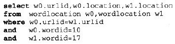

# 搜索与排名 #

**由于书本未提供数据文件且提供的链接无法被链接且pysqlite安装失败，所以本章只是阅读学习。**

全文搜索引擎——Google的PageRank的排名

信息检索Information retrieval

## 搜索引擎的组成 ##

建立搜索引擎的步骤

1. 找到一种搜集文档的方法；
2. 待搜集完文档之后，需要为这些文档建立索引
3. 通过查询返回一个经过排序的文档列表了。

[searchengine.py](searchengine.py)

## 一个简单的爬虫程序 ##

本程序接受一小组等待建立索引的网页，然后在根据这些网页内部的链接进而找到其他的网页，以此类推。这一过程称为**检索**或**蛛行Spidering**

### 使用urllib2 ###

urllib2是Python自带的。

	>>> import urllib2
	>>> c = urllib2.urlopen('http://www.baidu.com')
	>>> contents = c.read()
	>>> print contents[0:100]
	<!DOCTYPE html>
	<!--STATUS OK-->

### 爬虫程序的代码 ###

	import urllib2
	from BeautifulSoup import *
	from urlparse import urljoin

---

这里用到的广度优先算法

	  # Starting with a list of pages, do a breadth
	  # first search to the given depth, indexing pages
	  # as we go
	  def crawl(self,pages,depth=2):
	    for i in range(depth):
	      newpages={}
	      for page in pages:

			#尝试链接页面地址
	        try:
	          c=urllib2.urlopen(page)
	        except:
	          print "Could not open %s" % page
	          continue
	        try:
	          soup=BeautifulSoup(c.read())
	          self.addtoindex(page,soup)
	  
	          links=soup('a')
	          for link in links:
	            if ('href' in dict(link.attrs)):
	              url=urljoin(page,link['href'])
	              if url.find("'")!=-1: continue

				  # remove location portion
	              url=url.split('#')[0]  
	              if url[0:4]=='http' and not self.isindexed(url):
					链接后页面的子链接
	                newpages[url]=1

	              linkText=self.gettextonly(link)

				  #链接地址和链接后页面的文本
	              self.addlinkref(page,url,linkText)
	  
	          self.dbcommit()
	        except:
	          print "Could not parse page %s" % page

		  #这里用到的广度优先算法
	      pages=newpages

## 建立索引 ##

目的：为全文索引建立数据库。

索引对应于一个列表，其中包含了yi

1. 所有不同的单词；
2. 这些单词所在的文档；
3. 以及单词在文档中出现的位置

使用pysqlite（本机安装失败）

安装后，需要用到调控数据代码

	from pysqlite2 import dbapi2 as sqlite

	  # Initialize the crawler with the name of database
	  def __init__(self,dbname):
	    self.con=sqlite.connect(dbname)
	  
	  def __del__(self):
	    self.con.close()
	
	  def dbcommit(self):
	    self.con.commit()

### 建立数据库Schema ###

1. urllist - 保存的是已经处理过索引的URL列表
2. wordlist - 保存的是单词列表
3. wordlocation - 保存的是单词在文档中所处位置的列表
4. link - 保存了两个URLID，指明从一张表到另一张表的链接关系
5. linkwords - 利用字段wordid和linked记录了哪些单词与链接实际相关。

创建数据库表及索引代码：

	  # Create the database tables
	  def createindextables(self): 
	    self.con.execute('create table urllist(url)')
	    self.con.execute('create table wordlist(word)')
	    self.con.execute('create table wordlocation(urlid,wordid,location)')
	    self.con.execute('create table link(fromid integer,toid integer)')
	    self.con.execute('create table linkwords(wordid,linkid)')
	    self.con.execute('create index wordidx on wordlist(word)')
	    self.con.execute('create index urlidx on urllist(url)')
	    self.con.execute('create index wordurlidx on wordlocation(wordid)')
	    self.con.execute('create index urltoidx on link(toid)')
	    self.con.execute('create index urlfromidx on link(fromid)')
	    self.dbcommit()

### 在网页中查找单词 ###

得出网页中的所有文字

	  # Extract the text from an HTML page (no tags)
	  def gettextonly(self,soup):
	    v=soup.string
	    if v==Null:   
	      c=soup.contents
	      resulttext=''
	      for t in c:
	        subtext=self.gettextonly(t)
	        resulttext+=subtext+'\n'
	      return resulttext
	    else:
	      return v.strip()

将字符串拆分成一组独立的单词。

	  # Seperate the words by any non-whitespace character
	  def separatewords(self,text):
	    splitter=re.compile('\\W*')
	    return [s.lower() for s in splitter.split(text) if s!='']

>PS. 额外工作：利用某种**词干提取算法Stemming algorithms**去除掉单词的后缀。该算法试图将单词转换成对应的词干。

>例如：将单词indexing变成index。这样，人们在搜索单词“index”时同样也会得到包含单词indexing的文档。

### 加入索引 ###

	  # Index an individual page
	  def addtoindex(self,url,soup):
	    if self.isindexed(url): return
	    print 'Indexing '+url
	  
	    # Get the individual words
	    text=self.gettextonly(soup)
	    words=self.separatewords(text)
	    
	    # Get the URL id
	    # 涉及 表urllist
	    urlid=self.getentryid('urllist','url',url)
	    
	    # Link each word to this url
	    for i in range(len(words)):
	      word=words[i]
	      if word in ignorewords: continue

	      # 涉及 表wordlist
	      wordid=self.getentryid('wordlist','word',word)

		  #涉及 表wordlocation
	      self.con.execute("insert into wordlocation(urlid,wordid,location) values (%d,%d,%d)" % (urlid,wordid,i))

getentryid函数的作用是返回某一条目的ID。如果条目不存在，则程序会在数据库中新建一条记录，并将ID返回。

	  # Auxilliary function for getting an entry id and adding 
	  # it if it's not present
	  def getentryid(self,table,field,value,createnew=True):
	    cur=self.con.execute(
	    "select rowid from %s where %s='%s'" % (table,field,value))
	    res=cur.fetchone()
	    if res==None:
	      cur=self.con.execute(
	      "insert into %s (%s) values ('%s')" % (table,field,value))
	      return cur.lastrowid
	    else:
	      return res[0] 

isindexed函数的作用是判断网页是否已经存入数据库。

	#涉及表 wordlocation 和 urllist
	def isindexed(self, url):
		u=self.con.execute("select rowid from urllist where url='%s'" % url).fetchone()
		# 检查它是否已经被检索过了
		v=self.con.execute(select from wordlocation where urlid=%d' % u[0]).fetchone()
		if v != None: 
			return True
		return False

## 查询 ##

用于创建

	class searcher:
	  def __init__(self,dbname):
	    self.con=sqlite.connect(dbname)
	
	  def __del__(self):
	    self.con.close()

查找那些包含所有不同单词的URL

	  def getmatchrows(self,q):
	    # Strings to build the query
	    fieldlist='w0.urlid'
	    tablelist=''  
	    clauselist=''
	    wordids=[]
	
	    # Split the words by spaces
	    words=q.split(' ')  
	    tablenumber=0
	
	    for word in words:
	      # Get the word ID
	      wordrow=self.con.execute(
	      "select rowid from wordlist where word='%s'" % word).fetchone()
	      if wordrow!=None:
	        wordid=wordrow[0]
	        wordids.append(wordid)
	        if tablenumber>0:
	          tablelist+=','
	          clauselist+=' and '
	          clauselist+='w%d.urlid=w%d.urlid and ' % (tablenumber-1,tablenumber)
	        fieldlist+=',w%d.location' % tablenumber
	        tablelist+='wordlocation w%d' % tablenumber      
	        clauselist+='w%d.wordid=%d' % (tablenumber,wordid)
	        tablenumber+=1
	
	    # Create the query from the separate parts
	    fullquery='select %s from %s where %s' % (fieldlist,tablelist,clauselist)
	    print fullquery
	    cur=self.con.execute(fullquery)
	    rows=[row for row in cur]
	
	    return rows,wordids

一个涉及两个单词（对应ID为10和17）的查询如下：

查询结果如下：

接下的目标：**用若干方法对这些搜索结果进行排序**

1. 基于内容的排名
2. 利用外部会指链接
3. 从点击行为中学习

## 基于内容的排名 ##

## 利用外部会指链接 ##

## 从点击行为中学习 ##

## 小结 ##

