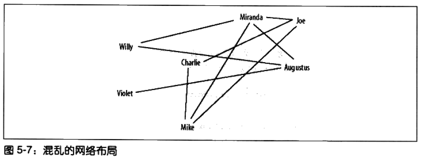
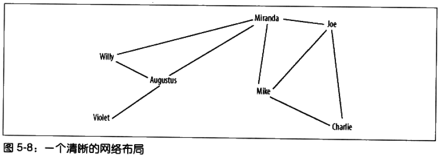
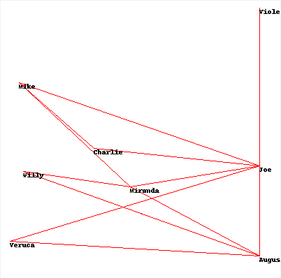

# 优化 #

Optimization

[1.组团旅游](#组团旅游)

[2.描述题解](#描述题解)

[3.成本函数](#成本函数)

[4.随机搜索](#随机搜索)

[5.爬山法](#爬山法)

[6.模拟退火算法](#模拟退火算法)

[7.遗传算法](#遗传算法)

[8.真实的航班搜索](#真实的航班搜索)

[8.1.Kayak API](#kayak-api)

[8.2.minidom包](#minidom包)

[8.3.航班搜索](#航班搜索)

[9.涉及偏好的优化](#涉及偏好的优化)

[9.1.学生宿舍优化问题](#学生宿舍优化问题)

[9.2.学生宿舍成本函数](#学生宿舍成本函数)

[9.3.执行优化函数](#执行优化函数)

[10.网络可视化](#网络可视化)

[10.1.布局问题](#布局问题)

[10.2.计算交叉线](#计算交叉线)

[10.3.绘制网格](#绘制网格)

[11.其他可能的应用场景](#其他可能的应用场景)

[12.小结](#小结)

本文教授一系列被称为随机优化stochastic optimization的技术来解决协作类问题。

**优化技术特别擅长于处理**：受多种变量的影响，存在许多可能解的问题，以及结果因这些变量的组合而产生很大变化的问题。

这些优化技术有着大量的应用：

1. 物理学——研究分子运动
2. 生物学——预测蛋白质的结构
3. 计算机科学——测定算法的最坏可能运行时间
4. NASA——设计具有正确操作特性的天线

---

**优化算法**是通过尝试许多不同题解并给这些题解打分以确定其质量的方式来找到一个问题的最优解。

优化算法的典型的应用场景是，存在大量可能的题解以至于无法对它们进行一一尝试的情况。

**最简单也是最低效的求解方法**，尝试随机猜测的上千个题解，并从中找出最佳解来。

更有效方法，则是一种对题解可能有改进的方式来对其进行智能化地修正。

---

本文例子

1. 如何计划旅游才最合理且划算？
2. 如何基于人们的偏好来分配有限的资源？
3. 如何用最少的交叉线来可视化社会网络？

## 组团旅游 ##

[本例源代码](optimization.py)

家庭人员信息

数据结构 人s=[(人名，居住地),...]

	import time
	import random
	import math
	
	people = [('Seymour','BOS'),
	          ('Franny','DAL'),
	          ('Zooey','CAK'),
	          ('Walt','MIA'),
	          ('Buddy','ORD'),
	          ('Les','OMA')]
	# 纽约的Laguardia机场
	destination='LGA'

---

[航班数据文件](schedule.txt)

部分航班信息

	#起点，终点，起飞时间，到达时间，价格
	LGA,OMA,6:19,8:13,239
	OMA,LGA,6:11,8:31,249
	LGA,OMA,8:04,10:59,136
	OMA,LGA,7:39,10:24,219
	LGA,OMA,9:31,11:43,210
	OMA,LGA,9:15,12:03,99
	...

---

将上述的数据载入一个字典中

	flights={}
	# 
	for line in file('schedule.txt'):
	  origin,dest,depart,arrive,price=line.strip().split(',')
	  flights.setdefault((origin,dest),[])
	
	  #键（起，止点）- 值（起飞时间，到达时间，价格）
	  # Add details to the list of possible flights
	  flights[(origin,dest)].append((depart,arrive,int(price)))

---

下一个函数用于计算某个给定时间在一天中的分钟数。

	def getminutes(t):
	  x=time.strptime(t,'%H:%M')
	  return x[3]*60+x[4]

## 描述题解 ##

**家庭中的每个成员应该乘坐哪个航班？**

用通用的表达方式，就是数字序列。

本例中，0是这天中的第一次航班，1是第二次，以此类推。

因每个都需往返两个航班，故列表长度是人数的两倍。

如

	f = [1, 4, 3, 2, 7, 3, 6, 3, 2, 4, 5, 3]

A乘坐第(f[0]+1=2)次航班前往目的地D，乘坐(f[1]+1=5)次返回A的居住地。B乘坐第(f[2]+1=4)次航班前往目的地D，乘坐(f[1]+1=3)次返回B的居住地。

方便人理解的打印函数，将人们决定搭乘的所有航班打印成表格。

	def printschedule(r):
	  for d in range(len(r)/2):
	    name=people[d][0]
	    origin=people[d][1]
	    out=flights[(origin,destination)][int(r[d])]
	    ret=flights[(destination,origin)][int(r[d+1])]
	    # 人名和起点，出发地址，到达时间，前往航班时间，前往航班票价，返回航班时间，返回航班票价
	    print '%10s%10s %5s-%5s $%3s %5s-%5s $%3s' % (name,origin,
	                                                  out[0],out[1],out[2],
	                                                  ret[0],ret[1],ret[2])

	    # TC.航班时间没有日期，感觉不好

---

	>>> import optimization
	>>> s=[1,4,3,2,7,3,6,3,2,4,5,3]
	>>> optimization.printschedule(s)
	   Seymour       BOS  8:04-10:11 $ 95 12:08-14:05 $142
	    Franny       DAL 12:19-15:25 $342 10:51-14:16 $256
	     Zooey       CAK 10:53-13:36 $189  9:58-12:56 $249
	      Walt       MIA  9:15-12:29 $225 16:50-19:26 $304
	     Buddy       ORD 16:43-19:00 $246 10:33-13:11 $132
	       Les       OMA 11:08-13:07 $175 15:07-17:21 $129
	>>> 

## 成本函数 ##

**任何优化算法的目标，就是要寻找 一组能够使成本函数的返回结果达到最小化的 输入。**（输入如本例的航班信息）

因此成本函数须要返回一个值用以表示方案的好坏。

对于好坏的程度并没有特定的衡量尺度，**唯一**的要求就是函数返回的值**越大**，表示该方案**越差**。

能左右旅游成本的变量

1. 航班价格
2. 飞行时间
3. 等待时间
4. 出发时间
5. 汽车租用时间

每当我们为一个复杂问题寻找最佳的方案时，都需要明确什么是最重要的因素。

选择好对成本产生影响的变量之后，我们就需要找到办法将它们组合在一起形成一个值

如

1. 飞行时间节省每一分钟价值1美元；
2. 在机场等待中所节省每一分钟价值0.5美元；
3. 若租用汽车未在约定时间之前归还，需多付50美元。

	def schedulecost(sol):
	  totalprice=0
	  latestarrival=0
	  earliestdep=24*60
	
	  for d in range(len(sol)/2):
	    # Get the inbound and outbound flights
	    # 得到往程航班和返程航班
	    origin=people[d][1]
	    outbound=flights[(origin,destination)][int(sol[d])]
	    returnf=flights[(destination,origin)][int(sol[d+1])]
	    
	    # Total price is the price of all outbound and return flights
	    # 总价格等于所有往返航班和返程航班价格之和
	    totalprice+=outbound[2]
	    totalprice+=returnf[2]

	    # 记录最晚到达时间和最早离开时间
	    # Track the latest arrival and earliest departure
	    if latestarrival<getminutes(outbound[1]): latestarrival=getminutes(outbound[1])
	    if earliestdep>getminutes(returnf[0]): earliestdep=getminutes(returnf[0])

	  # 每个人必须在机场等待直到最后一个到达为止
	  # 它们也必须在相同时间到达，并等候他们的返程时间
	  # Every person must wait at the airport until the latest person arrives.
	  # They also must arrive at the same time and wait for their flights.
	  totalwait=0  
	  for d in range(len(sol)/2):
	    origin=people[d][1]
	    outbound=flights[(origin,destination)][int(sol[d])]
	    returnf=flights[(destination,origin)][int(sol[d+1])]
	    totalwait+=latestarrival-getminutes(outbound[1])
	    totalwait+=getminutes(returnf[0])-earliestdep  
	
	  # 若租用汽车未在约定时间之前归还，需多付50美元。
	  # Does this solution require an extra day of car rental? That'll be $50!
	  # 书上这里有争议
	  if latestarrival>earliestdep: totalprice+=50

	  return totalprice+totalwait

---

	>>> import optimization
	>>> s=[1,4,3,2,7,3,6,3,2,4,5,3]
	>>> optimization.schedulecost(s)
	5285
	>>> 

**成本函数**既已建立，那么应该很清楚，我们目标就是要通过选择正确的数字序列来**最小化**该成本。

理论上，可尝试每组可行的组合。

但是，在本例子中，一共需要12次航班，每种航班又有10种可能，因此得到12^10=61,917,364,224种组合。

测试每种组合能确保我们得到最优答案，但对大多数计算机上，十分耗时。

## 随机搜索 ##

它不是好的优化算法，它是苹果其他算法优劣的**基线baseline**

	# domain=[(可选前往航班的序号范围),(可选返回航班的序号范围)] * 人数
	# costf计算成本的函数，如上文的schedulecost函数

	def randomoptimize(domain,costf):
	  best=999999999
	  bestr=None

	  # 进行
	  for i in range(0,1000):
	    # Create a random solution
	    r=[float(random.randint(domain[i][0],domain[i][1])) 
	       for i in range(len(domain))]
	    
	    # Get the cost
	    cost=costf(r)
	    
	    # Compare it to the best one so far
	    if cost<best:
	      best=cost
	      bestr=r 
	  return r

---

	>>> domain=[(0,9)]*(len(optimization.people)*2)
	>>> s=optimization.randomoptimize(domain, optimization.schedulecost)
	>>> optimization.schedulecost(s)
	8040
	>>> optimization.printschedule(s)
	   Seymour       BOS 11:16-13:29 $ 83  6:39- 8:09 $ 86
	    Franny       DAL  6:12-10:22 $230 19:57-23:15 $512
	     Zooey       CAK 20:30-23:11 $114 15:50-18:45 $243
	      Walt       MIA 15:34-18:11 $326 12:37-15:05 $170
	     Buddy       ORD 12:44-14:17 $134  6:03- 8:43 $219
	       Les       OMA  6:11- 8:31 $249 14:05-15:47 $226
	>>>

## 爬山法 ##

随机尝试各种题解十分低效，因为这方法没有充分利用已经发现的优解。

有一种可能，拥有较低总成本的时间安排非常接近其他低成本安排。

由于随机优化**到处跳跃jump around**，所以它不会自动去寻找与已经被发现的优解相接近的题解。

---

**爬山法**以一个随机解开始，然后在其临近的解集中寻找更好的题解。这类似走到谷底。

TC.类似数学上在定义域内找函数的最小值。

	def hillclimb(domain,costf):
	  # Create a random solution
	  sol=[random.randint(domain[i][0],domain[i][1])
	      for i in range(len(domain))]

	  # Main loop
	  while 1:
	    # Create list of neighboring solutions
	    neighbors=[]
	    
	    for j in range(len(domain)):

	      # 某次航班换成隔邻进行尝试查找
	      # One away in each direction
	      # warning：这里可能有越界的问题
	      if sol[j]>domain[j][0]:
	        neighbors.append(sol[0:j]+[sol[j]+1]+sol[j+1:])
	      if sol[j]<domain[j][1]:
	        neighbors.append(sol[0:j]+[sol[j]-1]+sol[j+1:])

	    # See what the best solution amongst the neighbors is
	    current=costf(sol)
	    best=current
	    for j in range(len(neighbors)):
	      cost=costf(neighbors[j])
	      if cost<best:
	        best=cost
	        sol=neighbors[j]

	    # If there's no improvement, then we've reached the top
	    if best==current:
	      break
	  return sol

---

	>>> s=optimization.hillclimb(domain, optimization.schedulecost)
	>>> optimization.schedulecost(s)
	3728
	>>> optimization.printschedule(s)
	   Seymour       BOS 15:27-17:18 $151 10:33-12:03 $ 74
	    Franny       DAL 10:30-14:57 $290 10:51-14:16 $256
	     Zooey       CAK 10:53-13:36 $189 13:37-15:33 $142
	      Walt       MIA 14:01-17:24 $338 12:37-15:05 $170
	     Buddy       ORD 12:44-14:17 $134 15:04-17:23 $189
	       Les       OMA 15:03-16:42 $135 15:07-17:21 $129
	>>> 

---

爬山法有一个较大缺陷。

爬山法得到的解可能是**局部范围内的最小值**，但不是全局最优解（最小值）。

优化算法应该找到的全局最优解。

解决方法：**随机重复爬山法**（random-restart hill climbing），即让爬山法以多个随机生成的初始解围起点运行若干次，借此希望其中有一个解能够逼近全局的最小值。

## 模拟退火算法 ##

Simulated Annealing/əˈniːlɪŋ/ v.

**模拟退火算法**是受物理学领域启发而来的一种优化算法。退火是指将合金加热后再慢慢冷却的过程。大量的原子因为受到激发而向周围跳跃，然后又逐渐稳定到一个低能阶的状态，所以这些原子能够找到一个低能阶的配置(configuration)。

退火算法以一个问题的随机解开始。它用一个变量来表示温度，这一温度开始时非常高，尔后逐渐变低。毎一次迭代期间，算法会随机选中题解中的某个数字，然后朝某个方向变化。

在例子中， Seymour的返程航班也许会从当天的第二趟移到第三趟。其成本会在这一变化前后分别计算出来，并进行比较。

---

**算法最为关键的部分**在于：如果新的成本值更低，则新的题解就会成为当前题解，这和爬山法非常相似。**不过，如果成本值更高的话，则新的题解仍将可能成为当前题解。**这是避免爬山法中缺陷——局部最小值问题的一种尝试。

某些情况下，在能够得到一个更优的解之前转向一个更差的解是很有必要的。**模拟退火算法之所以管用，不仅因为它总是会接受一个更优的解，而且还因为它在退火过程的开始阶段会接受表现较差的解。随着退火过程的不断进行，算法越来越不可能接受较差的解直到最后，它将只会接受更优的解。**更高成本的题解，其被接受的概率由下列公式给出:

	p=e^(-(highcost-lowcost)/temperature)

因为温度（接受较差解的意愿）开始非常之高，指数将总是接近于0，所以概率几乎为随着温度的递减，高成本值和低成本值之间的差异越来越重要一差异越大，概率越低因此该算法只倾向于稍差的解而不会是非常差的解。

	def annealingoptimize(domain,costf,T=10000.0,cool=0.95,step=1):
	  # Initialize the values randomly
	  vec=[float(random.randint(domain[i][0],domain[i][1])) 
	       for i in range(len(domain))]
	  
	  while T>0.1:
	    # Choose one of the indices
	    i=random.randint(0,len(domain)-1)
	
	    # Choose a direction to change it
	    dir=random.randint(-step,step)
	
	    # Create a new list with one of the values changed
	    vecb=vec[:]
	    vecb[i]+=dir

	    # 避免越界
	    if vecb[i]<domain[i][0]: vecb[i]=domain[i][0]
	    elif vecb[i]>domain[i][1]: vecb[i]=domain[i][1]
	
	    # Calculate the current cost and the new cost
	    ea=costf(vec)
	    eb=costf(vecb)

	    # p值从1向0趋近
	    p=pow(math.e,(-eb-ea)/T)
	
	    # Is it better, or does it make the probability
	    # cutoff?
	    # 退火过程的开始阶段会接受表现较差的解，随着退火过程的不断进行，算法越来越不可能接受较差的解直到最后，它将只会接受更优的解。
	    if (eb<ea or random.random()<p):
	      vec=vecb      
	
	    # Decrease the temperature
	    T=T*cool
	  return vec

---

	>>> s=optimization.annealingoptimize(domain,optimization.schedulecost)
	>>> optimization.schedulecost(s)
	2868
	>>> optimization.printschedule(s)
	   Seymour       BOS 17:11-18:30 $108 15:25-16:58 $ 62
	    Franny       DAL 15:44-18:55 $382 17:14-20:59 $277
	     Zooey       CAK 17:08-19:08 $262 15:50-18:45 $243
	      Walt       MIA 15:34-18:11 $326 15:23-18:49 $150
	     Buddy       ORD 15:58-18:40 $173 17:06-20:00 $ 95
	       Les       OMA 16:51-19:09 $147 15:07-17:21 $129
	>>> 

该算法有可能会得到一个较差的结果。

可以使用不同的初始温度和冷却率，进行调优。

## 遗传算法 ##

Genetic Algorithms

这算法受自然科学启发。

该算法先随机生成一组解，称其为**种群population**。

在优化过程每一步，算法计算整个种群的成本，从而得到一个有关题解的有序列表。

有序列表后，一个新的种群（下一代）被创建出来。

首先，将当前种群中位于最顶端的题解加入其所在的新种群。这过程叫**精英选拔elitism**。

然后，新种群中的余下部分是由修改最优解后形成的全新解所组成。

---

有两种修改题解的方法。其中较为简单的一种被称为**变异**( mutation/mjuːˈteɪʃn/)，其通常的做法是对个既有解进行微小的、简单的、随机的改变。在本例中，要完成变异只须从题解中选择个数字，然后对其进行递增或递减即可。

修改题解的另一种方法称之为**交叉**(crossover)或**配对**(breeding/ˈbriːdɪŋ/)。这种方法是选取最优解中的两个解，然后将它们按某种方式进行结合。在本例中，要实现交叉的一种简单方式是，从一个解中随机取出一个数字作为新题解中的某个元素，而剩余元素则来自另一个题解。

**一个新的种群是通过对最优解进行随机的变异和配对处理构造出来的**，它的大小通常与旧的种群相同。然后，这一过程会一直重复进行—新的种群经过排序，又一个种群被构造出来。达到指定的选代次数，或者连续经过数代后题解都没有得到改善，整个过程就结束了。

	# popsize 种群大小
	# mutprob 种群新成员使用变异而非交叉得来的概率
	# elite 种群中被认为是有借且被允许传入下一代的部分
	# maxiter迭代多少代

	def geneticoptimize(domain,costf,popsize=50,step=1,
	                    mutprob=0.2,elite=0.2,maxiter=100):
	  # Mutation Operation
	  # 编译操作
	  def mutate(vec):
	    i=random.randint(0,len(domain)-1)
	    if random.random()<0.5 and vec[i]>domain[i][0]:
	      return vec[0:i]+[vec[i]-step]+vec[i+1:] 
	    elif vec[i]<domain[i][1]:
	      return vec[0:i]+[vec[i]+step]+vec[i+1:]
	  
	  # Crossover Operation
	  # 交叉操作
	  def crossover(r1,r2):
	    i=random.randint(1,len(domain)-2)
	    return r1[0:i]+r2[i:]
	
	  # Build the initial population
	  pop=[]
	  for i in range(popsize):
	    vec=[random.randint(domain[i][0],domain[i][1]) 
	         for i in range(len(domain))]
	    pop.append(vec)
	  
	  # How many winners from each generation?
	  topelite=int(elite*popsize)
	  
	  # Main loop 
	  for i in range(maxiter):
	    scores=[(costf(v),v) for v in pop if v is not None]
	    scores.sort()
	    ranked=[v for (s,v) in scores]
	    
	    # Start with the pure winners
	    pop=ranked[0:topelite]
	    
	    # Add mutated and bred forms of the winners
	    while len(pop)<popsize:
	      if random.random()<mutprob:
	
	        # Mutation
	        c=random.randint(0,topelite)
	        pop.append(mutate(ranked[c]))
	      else:
	      
	        # Crossover
	        c1=random.randint(0,topelite)
	        c2=random.randint(0,topelite)
	        pop.append(crossover(ranked[c1],ranked[c2]))
	    
	    # Print current best score
	    print scores[0][0]
	    
	  return scores[0][1]

---

	>>> s=optimization.geneticoptimize(domain, optimization.schedulecost)
	3831
	3831
	3831
	...
	2591
	2591
	2591

---

遗传算法可以应用于以下问题。

- 寻找能够给出最佳音效的音乐斤外形；
- 为超音速飞机设计最佳的机翼；
- 给出量佳的化学制品库以供研发前沿药物参考之用；
- 自动化设计语音识別芯片。

---

很难优化的情景

在图的最右边，成本的最低点实际上处在一个非常陡峭的区域。接近它的任何解都有可能被排除在外，因为这些解的成本都很高，所以永远都找不到通往全局最小值的途径。大多数算法都会陷入图中左边某个局部最小化的区域里。

在无序状态成本计算下，优化算法们效果一般。

## 真实的航班搜索 ##

从kayak下载真实的航班信息。

[kayak.py源码](kayak.py)

https://www.kayak.com/labs/api/search

**由于Page not found，本节作阅读学习。**

### Kayak API ###

### minidom包 ###

minidom包类似BeautifulSoup，是标准Python发布包的一部分。

	>>> import xml.dom.minidom
	>>> dom=xml.dom.minidom.parseString('<data><rec>Hello!</rec></data>')
	>>> dom
	<xml.dom.minidom.Document instance at 0x0000000002BEDD48>
	>>> r=dom.getElementsByTagName('rec')
	>>> r
	[<DOM Element: rec at 0x2bede48>]
	>>> r[0].firstChild
	<DOM Text node "u'Hello!'">
	>>> r[0].firstChild.data
	u'Hello!'
	>>> 

### 航班搜索 ###

通过开发者密钥获取sessionid

	import time
	import urllib2
	import xml.dom.minidom
	
	kayakkey='YOUR KEY HERE'
	
	def getkayaksession():
	  # Construct the URL to start a session
	  url='http://www.kayak.com/k/ident/apisession?token=%s&version=1' % kayakkey
	  
	  # Parse the resulting XML
	  doc=xml.dom.minidom.parseString(urllib2.urlopen(url).read())
	  
	  # Find <sid>xxxxxxxx</sid>
	  sid=doc.getElementsByTagName('sid')[0].firstChild.data
	  return sid

---

获取searchid（像排队号码牌），为下文的flightsearchresults函数使用

	def flightsearch(sid,origin,destination,depart_date):
	  
	  # Construct search URL
	  url='http://www.kayak.com/s/apisearch?basicmode=true&oneway=y&origin=%s' % origin
	  url+='&destination=%s&depart_date=%s' % (destination,depart_date)
	  url+='&return_date=none&depart_time=a&return_time=a'
	  url+='&travelers=1&cabin=e&action=doFlights&apimode=1'
	  url+='&_sid_=%s&version=1' % (sid)
	
	  # Get the XML
	  doc=xml.dom.minidom.parseString(urllib2.urlopen(url).read())
	
	  # Extract the search ID
	  searchid=doc.getElementsByTagName('searchid')[0].firstChild.data
	
	  return searchid

---

等到完整的结果列表

	def flightsearchresults(sid,searchid):
	  def parseprice(p): 
	    return float(p[1:].replace(',',''))
	
	  # Polling loop
	  while 1:
	    time.sleep(2)
	
	    # Construct URL for polling
	    url='http://www.kayak.com/s/basic/flight?'
	    url+='searchid=%s&c=5&apimode=1&_sid_=%s&version=1' % (searchid,sid)
	    doc=xml.dom.minidom.parseString(urllib2.urlopen(url).read())
	
	    # Look for morepending tag, and wait until it is no longer true
	    morepending=doc.getElementsByTagName('morepending')[0].firstChild
	    if morepending==None or morepending.data=='false': break
	
	  # Now download the complete list
	  url='http://www.kayak.com/s/basic/flight?'
	  url+='searchid=%s&c=999&apimode=1&_sid_=%s&version=1' % (searchid,sid)
	  doc=xml.dom.minidom.parseString(urllib2.urlopen(url).read())
	
	  # Get the various elements as lists
	  prices=doc.getElementsByTagName('price')
	  departures=doc.getElementsByTagName('depart')
	  arrivals=doc.getElementsByTagName('arrive')  
	
	  # Zip them together

	  # zip([iterable, ...]) 
	  # This function returns a list of tuples, where the i-th tuple contains the i-th element from each of the argument sequences or iterables. 

	  return zip([p.firstChild.data.split(' ')[1] for p in departures],
	             [p.firstChild.data.split(' ')[1] for p in arrivals],
	             [parseprice(p.firstChild.data) for p in prices])

---

根据客户需要，找到相对应的航班信息

	def createschedule(people,dest,dep,ret):
	  # Get a session id for these searches
	  sid=getkayaksession()
	  flights={}
	  
	  for p in people:
	    name,origin=p
	    # Outbound flight
	    searchid=flightsearch(sid,origin,dest,dep)
	    flights[(origin,dest)]=flightsearchresults(sid,searchid)
	    
	    # Return flight
	    searchid=flightsearch(sid,dest,origin,ret)
	    flights[(dest,origin)]=flightsearchresults(sid,searchid)
	    
	  return flights

## 涉及偏好的优化 ##

**请记住**，利用优化算法解决问题的基本要求是：问题本身有一个定义好的成本函数，并且相似的解会产生相似的结果。

本节的问题的一般描述：如何将有限的资源分配给多个表达了偏好的人，并尽可能使他们都满意。

### 学生宿舍优化问题 ###

[dorm.py源码](dorm.py)

本节中的示例问题是，依据学生的首选和次选，为其分配宿舍。

将这种情况可以轻易地推广到其他问题：

1. 在线纸牌游戏中玩家的牌桌分配；
2. 大型编程项目中开发人员的bug分配；
3. 家庭成员中的家务分配。

须要再次说明的是，这类问题的**目的**是**为了从个体中提取信息，并将其组合起来产生出优化的结果**。

---

数据结构

	import random
	import math
	
	# The dorms, each of which has two available spaces
	dorms=['Zeus','Athena','Hercules','Bacchus','Pluto']
	
	# People, along with their first and second choices
	prefs=[('Toby', ('Bacchus', 'Hercules')),
	       ('Steve', ('Zeus', 'Pluto')),
	       ('Karen', ('Athena', 'Zeus')),
	       ('Sarah', ('Zeus', 'Pluto')),
	       ('Dave', ('Athena', 'Bacchus')), 
	       ('Jeff', ('Hercules', 'Pluto')), 
	       ('Fred', ('Pluto', 'Athena')), 
	       ('Suzie', ('Bacchus', 'Hercules')), 
	       ('Laura', ('Bacchus', 'Hercules')), 
	       ('James', ('Hercules', 'Athena'))]

---

出现的问题是每个人都不可能满足各自的首选，因为一个房间有三个想要住进去的人。需要将这些人中的任何一位安置于其次选宿舍中。

在真实生活中，问题也许会涉及成百上千名学生在更大数量的宿舍范围内竞争更多的住所。因为这个例子仅有大约100000个可能的解，所以将所有解都尝试一遍并从中找到最优解是可能的。但是当每间宿舍有4个隔间时，这一数字会快速增长到上万亿。

解决这一问题的一种办法是让成本函数返回一个很高的数值，用以代表无效解，但是这将使优化算法很难找到次优的解(better solutions)，因为算法无法确定返回结果是否接近于其他优解(good solutions)，甚或是有效的解。一般而言，最好不要让处理器的时钟周期浪费在无效解的搜索上。

---

解决这一问题的更好办法是寻找一种能让每个解都有效的题解表示法。有效解未必是优解；它仅代表恰有两名学生被安置于每间宿舍内。要达到这一目的，一种办法是设想每间宿舍都有两个“槽”，如此，在本例中共计有10个槽。将每名学生依序安置于各空槽内第一位可置于10个槽中的任何一个内，第二位则可置于剩余9个槽中的任何一个内，依次类推。

	# [(0,9),(0,8),(0,7),(0,6),...,(0,0)]
	domain=[(0,(len(dorms)*2)-i-1) for i in range(0,len(dorms)*2)]

---

打印题解

	>>> import dorm
	>>> [0]*10
	[0, 0, 0, 0, 0, 0, 0, 0, 0, 0]
	>>> dorm.printsolution([0]*10)
	Toby Zeus
	Steve Zeus
	Karen Athena
	Sarah Athena
	Dave Hercules
	Jeff Hercules
	Fred Bacchus
	Suzie Bacchus
	Laura Pluto
	James Pluto
	>>> 

### 学生宿舍成本函数 ###

	def dormcost(vec):
	  cost=0
	  # Create list a of slots
	  # 元素数值代表宿舍号
	  slots=[0,0,1,1,2,2,3,3,4,4]
	
	  # Loop over each student
	  for i in range(len(vec)):
	    x=int(vec[i])
	    dorm=dorms[slots[x]]
	    pref=prefs[i][1]
	    # First choice costs 0, second choice costs 1
	    if pref[0]==dorm: cost+=0
	    elif pref[1]==dorm: cost+=1
	    else: cost+=3
	    # Not on the list costs 3
	
	    # Remove selected slot
	    del slots[x]
	    
	  return cost

优化目标是近可能寻找成本为0的最优解。

本例中明确确定不存在为0的最优解，却可以了解目前与最优解的差距有多少。

这做法另一好处是，当优化算法找到一个最优解，可以让优化算法停止搜寻更优的解。

### 执行优化函数 ###

	>>> import optimization
	>>> s=optimization.randomoptimize(dorm.domain, dorm.dormcost)
	>>> dorm.dormcost(s)
	21
	>>> optimization.geneticoptimize(dorm.domain, dorm.dormcost)
	11
	9
	...
	4
	4
	4
	4
	[4, 0, 1, 0, 0, 0, 2, 0, 0, 0]
	>>> dorm.printsolution(s)
	Toby Zeus
	Steve Zeus
	Karen Hercules
	Sarah Bacchus
	Dave Athena
	Jeff Athena
	Fred Bacchus
	Suzie Pluto
	Laura Pluto
	James Hercules
	>>> 

## 网络可视化 ##

[socialnetwork.py源码](socialnetwork.py)

此处的网络，意指任何彼此相连的一组事物。

像微博、微信或QQ这样的社会网络便是在线应用领域中的一个极好的例子。

在那里，人们因互为朋友或具备特定关系而彼此相连。网站的每一位成员可以选择与他们相连的其他成员，共同构筑一个人际关系网络。

将这样的网络可视化输出，以明确人们彼此间的关系结构，例如寻找联络人(那些认识许多其他朋友的人，或是联系其他私人小圈子的人)。

### 布局问题 ###

上图的问题是多条线段相交，盘根错节，会使布局非常地混乱不堪。

本节考虑如何运用优化算法来构建更好的非杂乱无章的网络图。

---

数据结构

	import math
	
	people=['Charlie','Augustus','Veruca','Violet','Mike','Joe','Willy','Miranda']
	
	links=[('Augustus', 'Willy'), 
	       ('Mike', 'Joe'), 
	       ('Miranda', 'Mike'), 
	       ('Violet', 'Augustus'), 
	       ('Miranda', 'Willy'), 
	       ('Charlie', 'Mike'), 
	       ('Veruca', 'Joe'), 
	       ('Miranda', 'Augustus'), 
	       ('Willy', 'Augustus'), 
	       ('Joe', 'Charlie'), 
	       ('Veruca', 'Augustus'), 
	       ('Miranda', 'Joe')]

目标是要建立一个程序，令其能够读取一组有关于谁是谁的朋友的事实数据，并生成一个易于理解的网络图。

要完成这项工作，通常须要借助于**质点弹簣算法mass-and- spring algorithm**。这一算法是从物理学中建模而来的：各结点彼此向对方施以推力并试图分离，而结点间的连接则试图将关联结点彼此拉近。如此一来，网络便会逐渐呈现出这样一个布局：未关联的结点被推离，而关联的结点则被彼此拉近一却又不会靠得很拢。

>TC. 这算法该叫成刺猬报团取暖算法。

遗憾的是，质点弹簧算法无法避免交叉线。这使得很难在一个拥有大量连接的网络中观察结点的关联情况，因为追踪彼此交叉的连线是颇具难度的。不过，假如使用优化算法来构建布局的话，那么只需确定一个成本函数，并尝试令它的返回值尽可能地小。

本例中，成本函数是计算彼此交叉的连接数。

### 计算交叉线 ###

一个人用(x,y)坐标表示

将所有坐标放入列表

	sol=[120, 200, 250, 125...

---

	def crosscount(v):
	  # Convert the number list into a dictionary of person:(x,y)
	  loc=dict([(people[i],(v[i*2],v[i*2+1])) for i in range(0,len(people))])
	  total=0
	  
	  # Loop through every pair of links
	  for i in range(len(links)):
	    for j in range(i+1,len(links)):
	
	      # Get the locations 
	      (x1,y1),(x2,y2)=loc[links[i][0]],loc[links[i][1]]
	      (x3,y3),(x4,y4)=loc[links[j][0]],loc[links[j][1]]
	      
	      den=(y4-y3)*(x2-x1)-(x4-x3)*(y2-y1)
	
	      # den==0 if the lines are parallel
	      if den==0: continue
	
	      # Otherwise ua and ub are the fraction of the
	      # line where they cross
	      ua=((x4-x3)*(y1-y3)-(y4-y3)*(x1-x3))/den
	      ub=((x2-x1)*(y1-y3)-(y2-y1)*(x1-x3))/den
	      
	      # If the fraction is between 0 and 1 for both lines
	      # then they cross each other
	      if ua>0 and ua<1 and ub>0 and ub<1:
	        total+=1

	    # 两节点不能靠得太近
	    for i in range(len(people)):
	      for j in range(i+1,len(people)):
	        # Get the locations of the two nodes
	        (x1,y1),(x2,y2)=loc[people[i]],loc[people[j]]
	
	        # Find the distance between them
	        dist=math.sqrt(math.pow(x1-x2,2)+math.pow(y1-y2,2))
	        # Penalize any nodes closer than 50 pixels
	        if dist<50:
	          total+=(1.0-(dist/50.0))
	        
	  return total

上述算法定义域就是每组坐标的域值范围，假设将节点绘制于400*400的像素图中，定义域可以小于该范围值。

	domain=[(10,370)]*(len(people)*2)

---

	>>> import socialnetwork
	>>> sol=optimization.randomoptimize(socialnetwork.domain,socialnetwork.crosscount)
	>>> socialnetwork.crosscount(sol)
	12.800000000000004
	>>> sol=optimization.annealingoptimize(socialnetwork.domain,socialnetwork.crosscount,step=50,cool=0.99)
	>>> socialnetwork.crosscount(sol)
	2
	>>> sol
	[133, 211.0, 370, 365, 13, 344, 370, 10, 26, 117, 370, 236, 32, 244.0, 185, 266]
	>>> 

### 绘制网格 ###

使用PIL库，绘制上述坐标点，让人物关系清楚明了。

	from PIL import Image,ImageDraw

	def drawnetwork(sol):
	  # Create the image
	  img=Image.new('RGB',(400,400),(255,255,255))
	  draw=ImageDraw.Draw(img)
	
	  # Create the position dict
	  pos=dict([(people[i],(sol[i*2],sol[i*2+1])) for i in range(0,len(people))])

	  # 绘制连线
	  for (a,b) in links:
	    draw.line((pos[a],pos[b]),fill=(255,0,0))

	  # 绘制代表人的节点
	  for n,p in pos.items():
	    draw.text(p,n,(0,0,0))
	
	  img.show()

---

	>>> sol
	[133, 211.0, 370, 365, 13, 344, 370, 10, 26, 117, 370, 236, 32, 244.0, 185, 266]
	>>> socialnetwork.drawnetwork(sol)
	>>> 

## 其他可能的应用场景 ##

本章一再重申的，**关键步骤在于确定题解的表示法及成本函数**。如果能做到这些，那么就有机会利用优化算法来对问题进行求解。

---

知识问答竞赛小组人员分配

关于优化，有这样一项应用也许是值得关注的：或许我们会希望对一群人进行分组，让组员的技能得以均匀分布。在一个小型的竞赛活动中，我们可能希望将参赛者进行组队，使每个队都能在体育、历史、文学，以及电视方面具备足够的知识。另一种可能的应用场合是根据人们的技能搭配情况，为项目组分派任务。优化算法可以找到任务分解的最佳方案，从而使任务列表得以在最短时间内完成。

## 小结 ##

**优化问题关键步骤在于确定题解的表示法及成本函数。**

优化算法：

1. 随机搜索；
2. 爬山法；
3. 模拟退火算法；
4. 遗传算法。

---

本章例子：

1. 家庭聚会人员航班安排；
2. 个人偏好的优化——住宿人员安排；
3. 网络可视化——社交网络。

