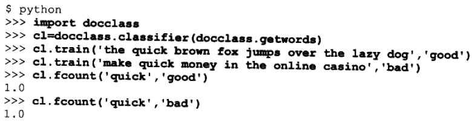
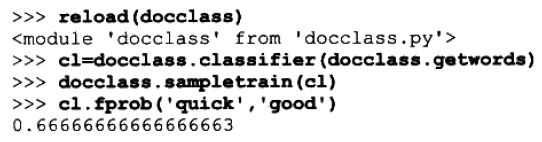
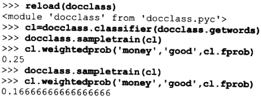
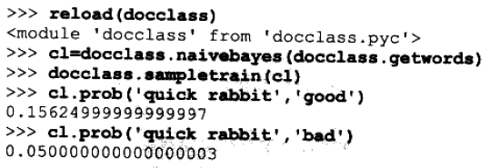
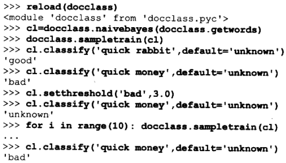

# 文档过滤 #

**文档分类**是机器智能（machine intelligence）的一个很有实用价值的应用。

**文档过滤**也是。最熟悉的文档过滤应用有**垃圾邮件过滤**、**垃圾网贴过滤**。

---

文档分类的应用

1. 垃圾信息（邮件、网贴等）的过虑；
2. 根据邮件正文自动将收件箱中的邮件划分为社交类邮件和工作类邮件；
3. 识别要求回复的邮件，并将其自动转发给最适合的人员进行处理。

## 过滤垃圾信息 ##

早期尝试对垃圾信息进行过滤所用的都是基于规则的分类器rule-based classifiers

典型的规则包含：

1. 英文大写字母的过度使用；
2. 与医学药品相关的单词；
3. 过于花俏HTML用色；
4. ...

---

基于规则的分类器的弱点：

1. 垃圾信息制造者知道了规则后，会绕开过滤器，其行为会变得更加隐蔽；
2. 用意诚实信息被误判成垃圾信息；

---

解决方法：

编写一个程序在开始阶段和逐渐收到更多消息之后，根据人们提供给它的有关哪些是垃圾邮件，哪些不是垃圾邮件的信息，不断地进行学习。

通过这样的方法，可以分别为不同的用户，群组或网站建立起各自的应用实例和数据集，它们对垃圾信息的界定将逐渐形成自己的观点。

## 文档和单词 ##

[docclass.py源码](docclass.py)

即将构造的分类器须要利用某些**特征**来对不同的内容项进行分类。所谓**特征**，**是指任用来判断具备或缺失的东西**。

当考虑对文档进行分类时，所调的内容即是文档**特征**则是文档中的单词。

当将**单词作为特征**时，其假设是：**某些单词相对而言更有现于垃圾信息中**。这一假设是大多数**垃圾信息过滤器背后所依赖的基本前提**。

不过，特征未必一定是一个个单词；它们也可以是词组或以归为文档中缺失存在的其他东西。

getwords()用以提取特征，用不重复的单词作为特征。

	import re
	import math

	def getwords(doc):
	  splitter=re.compile('\\W*')
	  print doc
	  # Split the words by non-alpha characters
	  words=[s.lower() for s in splitter.split(doc) 
	          if len(s)>2 and len(s)<20]
	  
	  # Return the unique set of words only
	  return dict([(w,1) for w in words])

决定采用哪些特征颇具技巧性，也十分重要。

**特征必须具备足够的普遍性，即时常出现，但又不能普遍到每一篇文档里都能找到。**

理论上，**整篇文档的文本都可以作为特征**，但是除非一再收到内容完全相同的邮件，否则这样的特征几乎可定是**毫无价值的**。

在另种极端情况下，特征也可以是单个字符。但是由于每一封电子邮件中都有可能会出现所有这些字符，因此要想利用这样的特征将希望看到和不希望看到的文档区分开来是很困难的。

即便选择使用单词作为特征，也依然还是会带来一些问题：

1. 如何正确划分单词；
2. 哪些标点符号应该被纳入单词；
3. 是否应该包含头信息(header information)等。

---

在根据特征进行判断时还有一点须要考虑，那就是**如何才能更好地利用特征将一组文档划归到目标分类中去**。

例如，前述 getwords函数的代码通过将单词转换为小写形式，从而减少了特征的总数。这意味着，程序会将位于句首以大写字母开头的单词与位于句中全小写形式的单词视为相同一一这样做非常好，因为具有不同大小写形式的同一单词往往代表的含义是相同的。然而，上述函数完全没有考虑到被用于许多垃圾信息中的“ SHOUTING风格”(译注1)，而这一点可能对区分垃圾邮件和非垃圾邮件是至关重要的。

除此以外，如果**超过半数以上的单词都是大写**时，那就说明**必定会有其他的特征**存在。

---

在选择特征集须要做大量的权衡，而且还要不断地进行调整。

## 对分类器进行训练 ##

如果分类器掌握的文档及其正确分类的样本越多，其预测的效果也就越好。

人们专门设计分类器目的是从极为不确定的状态开始，随着分类器不断了解到哪些特征对于分类而言更为重要，其确定性也在逐渐地增加。

---

编写一个代表分类器的类。

这样做的好处在于，可针对不同的用户、群组或查询、建立多个分类器实例，并分别对它们加以训练，以响应特定群组的需求。

	class classifier:
	  def __init__(self,getfeatures,filename=None):
	    # Counts of feature/category combinations
	    self.fc={}
	    # Counts of documents in each category
	    self.cc={}
	    self.getfeatures=getfeatures

其中，变量`fc`记录位于各分类中的不同特征的数量，例如

	{'python':{'bad':0,
			'good':6},
	#单词the被划分bad类文档
	'the':{'bad':3,
		'good':3}}

---

变量`cc`是一个记录各分类被使用次数的字典，稍后的概率计算要用到

		{'bad':6,
		'good':7}

---

`getfeature`函数作用是从即将被归类的内容向提取出特征来，也就是上述的`getwords`函数

另外的辅助函数，用以实现计数值的增加和获取：

	#增加对特征/分类组合的计数值
	def incf(self,f,cat):
		self.fc.setdefault(f,{})
		self.fc[f].setdefault(cat, 0)
		self.fc[f][cat]+=l
	
	#增加对某一分类的计数值
	def incc(self, cat)
		self.cc.setdefault(cat, o)
		self.cc[cat]+=l
	
	#某一特征出现于某一分类中的次数
	def fcount(self,f,cat)
		if f in self.fc and cat in self.fc[f]:
			return float(self.fc[f].cat)
		return 0.0
		
	#属于某一分类的内容项数量
	def catcount(self, cat)
		if cat in self.cc
			return float(self.cc[cat])
		return 0
	
	#所有内容项的数量
	def totalcount(self)
		return sum(self.cc.values())
	
	#所有分类的列表
	def categories(self)
		return self.cc.keys()

---

训练时调用的函数

	def train(self,item,cat):
		features=self.getfeatures(item)
		# Increment the count for every feature with this category
		for f in features:
		  self.incf(f,cat)
	
		# Increment the count for this category
		self.incc(cat)

---

运行结果

---

或创建一个训练函数

	def sampletrain(cl):
	  cl.train('Nobody owns the water.','good')
	  cl.train('the quick rabbit jumps fences','good')
	  cl.train('buy pharmaceuticals now','bad')
	  cl.train('make quick money at the online casino','bad')
	  cl.train('the quick brown fox jumps','good')

## 计算概率 ##

单词在分类中出现的频率=(一个单词在一篇属于分类A的文档中出现的次数，除以分类A的文档总数)

	def fprob(self,f,cat):
		if self.catcount(cat)==0: return 0
		
		# The total number of times this feature appeared in this 
		# category divided by the total number of items in this category
		return self.fcount(f,cat)/self.catcount(cat)

上述概率为**条件概率**，通常记为Pr(A|B)，读作“在给定B的条件下A的概率”

---

运行结果

在3篇被归为“good”的文档中，有2篇文档出现了单词“quick”。

所以，一篇“good”分类的文档中包含该单词的概率为，Pr(quick|good)=0.666(2/3)

### 从一个合理的推测开始 ###

但是prob方法有一个**小小的问题**——只根据以往见过的信息，会令其在训练的初期阶段，对那些极少出现的单词变得**异常敏感**。

例如

在训练用的样本数据中，单词“ money”只在一篇文档中出现过，并且由于这是一则涉及赌博的广告，因此文档被划归为了“bad”类。由于单词“ money”在一篇“bad'类的文档中出现过，而任何“good”类的文档中都没有该单词，所以此时利用 prob计算所得的单词“ money”在“good”分类中出现的概率为0。这样做有一些偏激，因为“ money可能完全是一个中性词，只是恰好先出现在了一篇“bad”类的文档中而已。

伴随着单词越来越多地出现在同属于一个分类的文档中，其对应的概率值也逐渐接近于0，这样才会更合理一些。

---

为了解决上述问题，在手头掌握的有关当前特征的信息极为有限时，需要根据一个假设的概率来作判断。

一个推荐的**初始值**是0.5（只0 ~ 1之间的中间数）。还需确定为假设的概率赋予多大的权重——权重为1代表假设概率的权重与一个单词相当。经过**加权**的概率值返回的是一个由getprobability与假设概率组成的加权平均。

在单词“money”的例子中，针对“money”的加权概率对于所有分类而言均是从0.5开始的。

待到训练时接受一篇“bad”分类的文档，并且发现“money”适合与“bad”分类时，其针对“bad”分类的概率就会变为0.75。

	(weight * assumedprob + count * fprob) / (count+weight)
	=(1 * 0.5 + 1 * 1.0) / (1.0 + 1.0)
	=0.75

---

	def weightedprob(self,f,cat,prf,weight=1.0,ap=0.5):
	    # Calculate current probability
	    basicprob=prf(f,cat)
	
	    # Count the number of times this feature has appeared in
	    # all categories
	    totals=sum([self.fcount(f,c) for c in self.categories()])
	
	    # Calculate the weighted average
	    bp=((weight*ap)+(totals*basicprob))/(weight+totals)
	    return bp

---

运行结果

随着单词的概率从假设的初始值开始被逐渐地“拉动”，多次运行使classifier对各个单词的概率变得更加确信了。

初始概率可根据背景信息进行设置：

1. 使用他人训练过的垃圾过滤器，将其所得概率值作为假设的概率初始值
2. 自定义个性化设计

**不管怎样，对于一个过滤器而言，它最好应该有能力处理极少会出现。**

## 朴素贝叶斯分类器 ##

一旦求出了指定单词在一篇属于某个分类的文档中出现的概率，就需要有一种方法将各个单词的概率进行组合，从而得出整篇文档属于该分类的概率。

这分类器被称为**朴素贝叶斯分类器**。

这种方法之所以被冠以**朴素**二字，是因为它假设将要被组合的**各个概率是彼此独立的**。即，一个单词在属于某个指定分类的文档中出现的概率，与其他单词出现于该分类的概率是不相关的。**事实上**这个假设是不成立的，因为你也许会发现，与有关 Python编程的文档相比，包含单词“ casino”的文档更有可能包含单词“money”。

这意味着，我们无法将采用朴素贝叶斯分类器所求得的结果实际用作一篇文档属于某个分类的概率，**因为这种独立性的假设会使其得到错误的结果**。不过，我们还是可以对各个分类的**计算结果进行比**较，然后再看哪个分类的概率最大。在现实中，若不考虑假设的潜在缺陷，朴素贝叶斯分类器将被证明是一种非常有效的文档分类方法。

### 整篇文档的概率 ###

**为了使用朴素贝叶斯分类器**，首先我们须要确定整篇文档属于给定分类的概率。须要假设概率的彼此独立性，即:可以通过将所有的概率相乘，计算出总的概率值。

例如，假设有20%的"bad”类文档中出现了单词“ Python——Pr(Python|Bad)=0.2——同时有80%的文档出现了单词“casino”(Pr(Casino |Bad)=0.8)。那么，预期两个单词出现于同一篇“bad”类文档中的独立概率为Pr( Python&Casino |Bad)=0.8×0.2=0.16。从中我们会发现，计算整篇文档的概率，只须将所有出现与某篇文档中的各单词的概率相乘即可。

docprob()函数来完成这任务：

	class naivebayes(classifier):
		  
		def docprob(self,item,cat):
		    features=self.getfeatures(item)   
		
		    # Multiply the probabilities of all the features together
		    p=1
		    for f in features: p*=self.weightedprob(f,cat,self.fprob)
		    return p

知道计算Pr(Document|Category)，不过只做到这一步还不行。为了这文档进行分类，真正需要Pr(Category|Document)。这里需要用到**贝叶斯定理**。

### 贝叶斯定理 ###

它是一种对条件概率进行调换求解（flipping around）的方法。

通常写作：

	Pr(A|B)=Pr(B|A)*Pr(A)/Pr(B)

对于上面的例子为：

	Pr(Category|Document)=Pr(Document|Category)*Pr(Category)/Pr(Document)

Pr(Category)是随机选择一篇文档属于该分类的概率，因此就是（属于该分类的文档数）除以（文档的总数）。

Pr(Document)没必要计算。这是因为我们不要准确的概率值，而是分别计算每个分类的概率，然后对所有的计算结果进行比较大小，比较过程中Pr(Document)值都一样，可忽略掉。

prob()函数用于计算分类的概率，并返回Pr(Document|Category)与Pr(Category)乘积。

	def prob(self,item,cat):
	    catprob=self.catcount(cat)/self.totalcount()
	    docprob=self.docprob(item,cat)
	    return docprob*catprob

运行结果

根据训练的数据，认为相比与“bad”分类，短语“quick rabbit”更适合与“good”分类。

### 选择分类 ###

**构造朴素贝叶斯分类器的最后一个步骤是实际判定某个内容项所属的分类**。此处最简单的方法，是计算被考查内容在每个不同分类中的概率，然后选择概率最大的分类。

如果我们只是在试图判断“将内容放到哪里最合适”的问题，那么这不失为一种可行的策略，**但是**，在许多应用中，**我们无法将各个分类同等看待**，而且在一些应用中，对于分类器而言，承认不知道答案，要好过判断答案就是概率值稍大一些的分类。

>TC.有时，无知是福。

在垃圾信息过滤的例子中，避免将普通邮件错当成垃圾邮件要比截获每一封垃圾邮件更为重要。收件箱中偶尔收到几封垃圾邮件还是可以容忍的，但是一封重要的邮件则有可能会因为自动过滤到废件箱而被完全忽视。**假如我们必须在废件箱中找回自己的重要邮件，那就真的没必要再使用垃圾信息过滤器了。**

>TC.垃圾信息过滤器把重要邮件分类成垃圾，这过滤器不用算了。

为了解决这一问题，我们可以为每个分类定义一个**最小阈值**。对于一封将要被划归到某个分类的新邮件而言，其概率与针对所有其他分类的概率相比，必须大于某个指定的数值才行。这一指定的数值就是阈值。

以垃圾邮件过滤为例，假如过滤到“bad”分类的阈值为3，则**针对“bad”分类的概率就必须至少3倍于针对“good”分类的概率才行**。

假如针对“good分类的阈值为1，则对于任何邮件，只要概率确实大于针对“bad”分类的概率，它就是属于“good”分类的。任何更有可能属于“bad”分类，但概率并没有超过3倍以上的邮件，都将被划归到“未知”分类中。

	def __init__(self,getfeatures):
	    classifier.__init__(self,getfeatures)
		#定义阈值
	    self.thresholds={}

	#设置阈值
	def setthreshold(self,cat,t):
	    self.thresholds[cat]=t
	
	#获得阈值
	def getthreshold(self,cat):
	    if cat not in self.thresholds: return 1.0
	    return self.thresholds[cat]

分类方法

	def classify(self,item,default=None):
	    probs={}
		#寻找概率最大的分类
	    # Find the category with the highest probability
	    max=0.0
	    for cat in self.categories():
	      probs[cat]=self.prob(item,cat)
	      if probs[cat]>max: 
	        max=probs[cat]
	        best=cat

		#确保概率值超出阈值*次大概率值
	    # Make sure the probability exceeds threshold*next best
	    for cat in probs:
	      if cat==best: continue
	      if probs[cat]*self.getthreshold(best)>probs[best]: return default
	    return best

现在运行一个较完整的文档分类系统。

若当前阈值令太多的垃圾邮件进入到收件箱中，或者有大量正常邮件被错归为垃圾邮件，可对阈值进行调整。

## 费舍尔方法 ##

## 将经过训练的分类器持久化 ##

## 过滤博客订阅源 ##

## 对特征检测的改进 ##

## 使用Akismet ##

## 替代方法 ##

