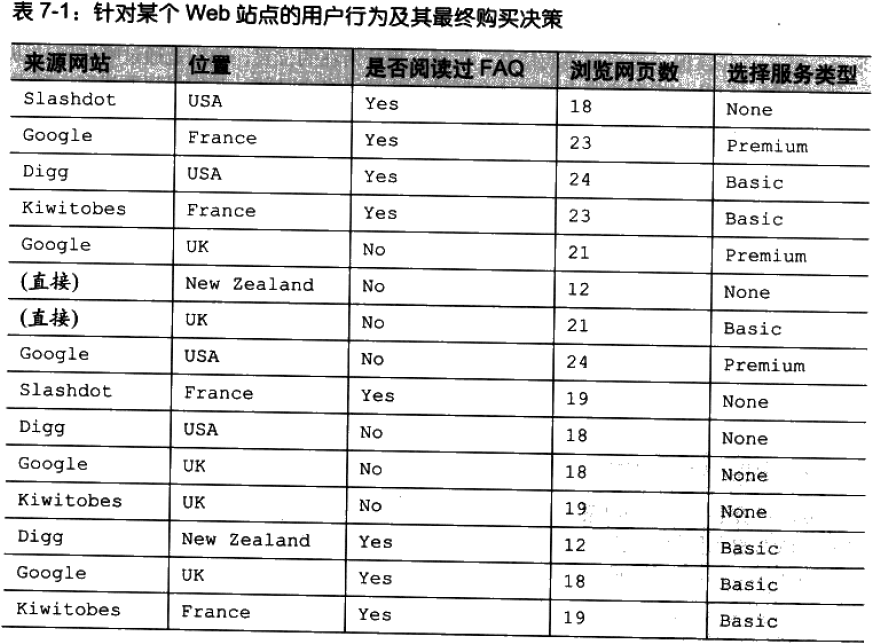
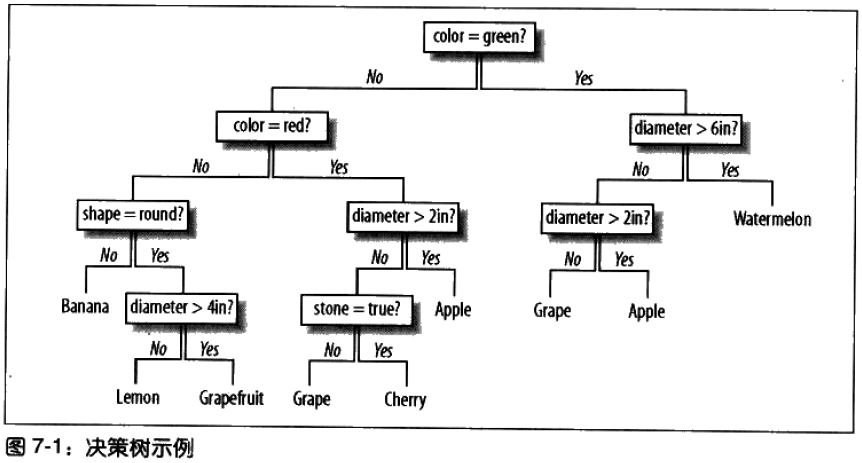
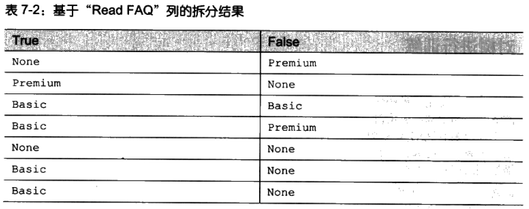
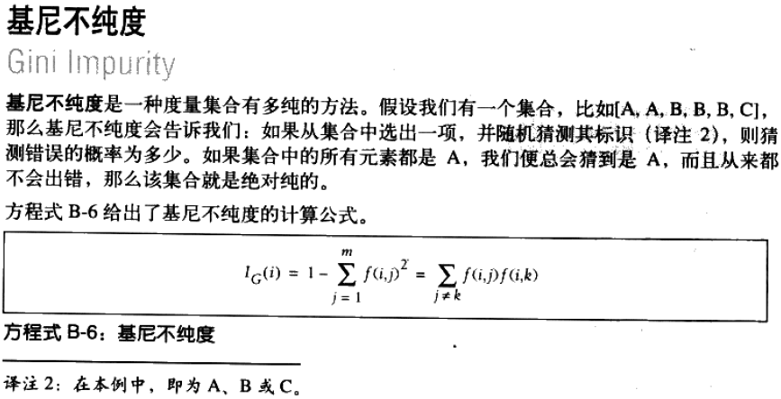
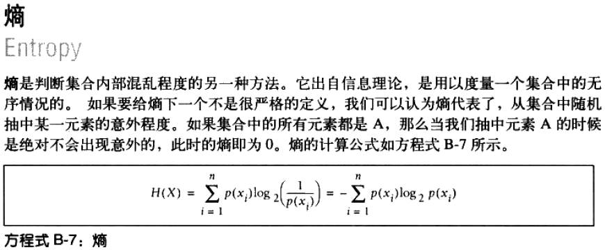
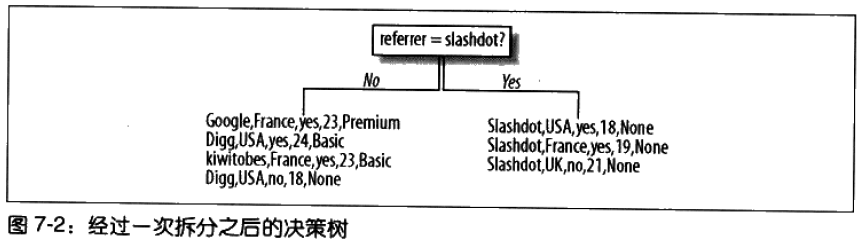
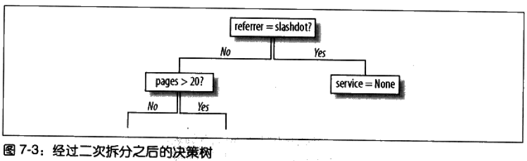
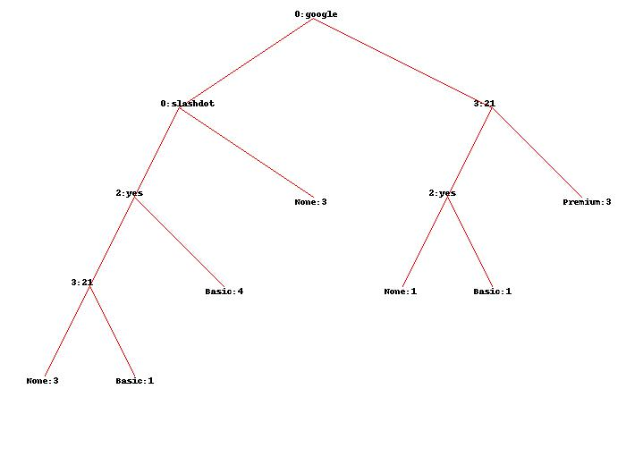
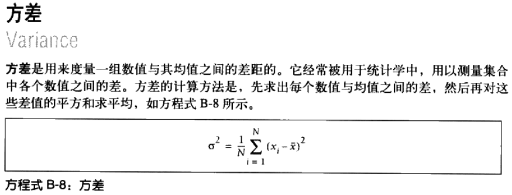

# 决策树建模 #

[1.预测注册用户](#预测注册用户)

[2.引入决策树](#引入决策树)

[3.对树进行训练](#对树进行训练)

[4.选择最合适的拆分方案](#选择最合适的拆分方案)

[4.1.基尼不纯度](#基尼不纯度)

[4.2.熵](#熵)

[5.以递归方式构造树](#以递归方式构造树)

[6.决策树的显示](#决策树的显示)

[6.1.图形显示方式](#图形显示方式)

[7.对新的观测数据进行分类](#对新的观测数据进行分类)

[7.1.真实世界里的决策树](#真实世界里的决策树)

[8.决策树的剪枝](#决策树的剪枝)

[9.处理缺失数据](#处理缺失数据)

[10.处理数值型结果](#处理数值型结果)

[11.对住房价格进行建模](#对住房价格进行建模)

[12.对“热度”评价进行建模](#对热度评价进行建模)

[13.什么时候使用决策树](#什么时候使用决策树)

[14.小结](#小结)

**决策树学习**的自动分类算法——产生的模型具有易于解释的特点。

**贝叶斯分类器**中的数字列表展现每个单词的重要程度，但是你必须经过计算才能知道结果如何。

理解**神经网络**的难度则更大，因为位于两个神经元之间的连接上的权重值本身并没有什么实际意义。

对于**决策树**，只需通过观察便可理解其推导的过程，甚至可转换成一系列if-else语句。

[treepredict.py](treepredict.py)

## 预测注册用户 ##

目标：预测一位用户成为付费顾客的可能性有多大

强调算法的清晰直观——若知道哪些因素可表明用户将会成为付费顾客，那么就

1. 可以利用这些信息来指导广告策略制定工作，让网站的某些功能具有更好的可用性；
2. 采取其他能够有效增加付费顾客数量的策略。

---

**情景描述**

假设有一个提供免费试用的在线应用。用户为了获得试用的机会而注册了账号，待使用了若干天之后，他们可以选择向基本服务或高级服务升级。

因为用户为了免费试用须要注册账号，所以可以借此将用户的相关信息收集起来，并且在试用结束的时候，网站的所有者会记录下哪些用户选择了成为付费客户。

为了尽量减少用户的工作量，使其能够尽快地注册账号，网站不会过多地询问用户的个人信息，相反，它会从服务器的日志中收集这些信息，比如:用户来自哪个网站，所在的地理位置，以及他们在注册之前曾经浏览过多少网页，等等。假设我们收集到了这些数据，井且将它们填入一张表格中，其结果可能如下：

	my_data=[['slashdot','USA','yes',18,'None'],
	        ['google','France','yes',23,'Premium'],
	        ['digg','USA','yes',24,'Basic'],
	        ['kiwitobes','France','yes',23,'Basic'],
	        ['google','UK','no',21,'Premium'],
	        ['(direct)','New Zealand','no',12,'None'],
	        ['(direct)','UK','no',21,'Basic'],
	        ['google','USA','no',24,'Premium'],
	        ['slashdot','France','yes',19,'None'],
	        ['digg','USA','no',18,'None'],
	        ['google','UK','no',18,'None'],
	        ['kiwitobes','UK','no',19,'None'],
	        ['digg','New Zealand','yes',12,'Basic'],
	        ['slashdot','UK','no',21,'None'],
	        ['google','UK','yes',18,'Basic'],
	        ['kiwitobes','France','yes',19,'Basic']]

最后一列服务列代表了用户是否已经注册，也是希望预测的内容。 

接下来的目标：找到一个算法，能够将一个合理的推测值填入“服务”栏。

## 引入决策树 ##

一旦有了决策树，据此进行决策的过程就变得非常容易理解了。只要沿着树的路径一直向下，正确回答每一个问题，最终就会得到答案。

沿着最终的叶节点向上回溯，就会得到一个有关最终分类结果的推理过程。

决策树的节点编程

	class decisionnode:
	  def __init__(self,col=-1,value=None,results=None,tb=None,fb=None):
		# 待检测的判断条件 所对应的列索引值。
	    self.col=col

		# value对应于为了使结果为true，当前列必须匹配的值。
	    self.value=value

		# 保存的是针对于当前分支的结果，它是一个字典。除叶节点外，在其他节点上该值都为None。
	    self.results=results

		# 对应于结果分别为true或false时，类似二叉树的左右子树
	    self.tb=tb
	    self.fb=fb

## 对树进行训练 ##

将使用一种叫作CART(Classification and Regression Trees分类回归树)算法。

为了构造决策树，算法首先创建一个根节点。然后通过评估表中的所有观测变量，从中选出最合适的变量对数据进行拆分。为此，算法考查了所有不同的变量，然后从中选出一个条件（如：用户是否读过FAQ?）对结果数据进行分解，以使我们更容易地推出用户的意图来（用户会因哪一项服务而注册账号）。

	# Divides a set on a specific column. Can handle numeric
	# or nominal values
	def divideset(rows,column,value):
	   # Make a function that tells us if a row is in 
	   # the first group (true) or the second group (false)
	   split_function=None
	   if isinstance(value,int) or isinstance(value,float):
	      split_function=lambda row:row[column]>=value
	   else:
	      split_function=lambda row:row[column]==value
	   
	   # Divide the rows into two sets and return them
	   set1=[row for row in rows if split_function(row)]
	   set2=[row for row in rows if not split_function(row)]
	   return (set1,set2)

函数 divides的作用是根据列表中某一栏的数据将列表拆分成两个数据集。该函数接受个列表，一个指示表中列所在位置的数字，和一个用以对列进行拆分的参考值作为参数。

以“ Read FAQ”为例，可能的取值有Yes或No，而对于“ Referrer”而言，则会有很多可能的取值。随后，算法会返回两个列表:

1. 第一个列表所包含的数据行，其指定列中的数据将会与我们先前指定的参考值相匹配，
2. 第二个列表，则包含了与参考值不相匹配的剩余数据行。

	>>> 
	 RESTART: C:\Users\Administrator.USER-20180302VA\Desktop\Lab\ProgrammingCollectiveIntelligence\C07\treepredict.py 
	>>> divideset(my_data, 2, 'yes')
	([['slashdot', 'USA', 'yes', 18, 'None'], ['google', 'France', 'yes', 23, 'Premium'], ['digg', 'USA', 'yes', 24, 'Basic'], ['kiwitobes', 'France', 'yes', 23, 'Basic'], ['slashdot', 'France', 'yes', 19, 'None'], ['digg', 'New Zealand', 'yes', 12, 'Basic'], ['google', 'UK', 'yes', 18, 'Basic'], ['kiwitobes', 'France', 'yes', 19, 'Basic']], [['google', 'UK', 'no', 21, 'Premium'], ['(direct)', 'New Zealand', 'no', 12, 'None'], ['(direct)', 'UK', 'no', 21, 'Basic'], ['google', 'USA', 'no', 24, 'Premium'], ['digg', 'USA', 'no', 18, 'None'], ['google', 'UK', 'no', 18, 'None'], ['kiwitobes', 'UK', 'no', 19, 'None'], ['slashdot', 'UK', 'no', 21, 'None']])
	>>> 

这拆分结果所选用的变量并**不理想**，因为两边似乎都混杂了各种情况。

下一目标：要一种方法来选择**最合适的变量**用来拆分。

## 选择最合适的拆分方案 ##

为了选择合适的变量，需要一方法来**衡量数据集合中各种因素的混合情况**。

目标就是找出合适的变量，使得生成的两个数据集在混杂程度上能够尽可能小。

首先，需要一个函数来对数据集合中的每一项结果进行计数。（返回一字典：结果值2结果值出现次数）

	# Create counts of possible results (the last column of 
	# each row is the result)
	def uniquecounts(rows):
	   results={}
	   for row in rows:
	      # The result is the last column
	      r=row[len(row)-1]
	      if r not in results: results[r]=0
	      results[r]+=1
	   return results

计算数据集合的混杂程度的方式之二：

1. 基尼不纯度 Gini impurity
2. 熵 entropy/ˈentrəpi/

计算数据集合的混杂程度将用到uniquecounts函数

### 基尼不纯度 ###

基尼不纯度，是**指将来自集合中的某种结果随机应用于集合中某一数据项的预期误差率**。

如果集合中的每个数据项都属于同一分类，那么推测结果总会是正确的，因而此时的误差率为0。如果有4种可能的结果均匀地分布在集合内，则推测有75%的可能是不正确的，因而此时的误差率为0.75。

	# Probability that a randomly placed item will
	# be in the wrong category
	def giniimpurity(rows):
	  total=len(rows)
	  counts=uniquecounts(rows)
	  imp=0
	  for k1 in counts:
	    p1=float(counts[k1])/total
	    for k2 in counts:
	      if k1==k2: continue
	      p2=float(counts[k2])/total
	      imp+=p1*p2
	  return imp

该函数利用集合中每一项结果出现的次数除以集合的总行数来计算相应的概率，然后将所有这些概率值的乘积累加起来。这样就会得到某一行数据被随机分配到错误结果的总概率。

这一概率的值越高，就说明对数据的拆分越不理想。概率值为0则代表拆分的结果非常理想，因为这说明了每一行数据都已经被分配到了正确的集合中。

### 熵 ###

在信息理论中，熵代表的是集合的无序程度，这里也就是集合的混杂程度。

	# Entropy is the sum of p(x)log(p(x)) across all 
	# the different possible results
	def entropy(rows):
	   from math import log
	   log2=lambda x:log(x)/log(2)  
	   results=uniquecounts(rows)
	   # Now calculate the entropy
	   ent=0.0
	   for r in results.keys():
	      p=float(results[r])/len(rows)
	      ent=ent-p*log2(p)
	   return ent

---

运行结果

[my_data](#对树进行训练)

	>>> giniimpurity(my_data)
	0.6328125
	>>> entropy(my_data)
	1.5052408149441479
	>>> set1,set2=divideset(my_data, 2, 'yes')
	>>> giniimpurity(set1)
	0.53125
	>>> entropy(set1)
	1.2987949406953985
	>>> 

熵和基尼不纯度之间的主要区别在于，熵达到峰值的过程要相对慢一些。因此熵对于混乱集合的“判罚”往往要更重一些。人们通常用熵。

## 以递归方式构造树 ##

为了弄明白一个属性的好坏程度，算法首先求出整个群组的熵，然后尝试利用每个属性的可能取值对群组进行拆分，并求出两个新群组的熵。

为了确定哪个属性最适合用来拆分，算法会计算相应的**信息增益**( Information gain)。所谓信息增益，是指当前熵与两个新群组经加权平均后的熵之间的差值。

算法会针对每个属性计算相应的信息增益，然后从中选出信息增益最大的属性。

待根结点处的判断条件确定之后，算法会根据该条件返回的true或false，分别建立两个分支。

以此类推，继续拆分

通过计算每个新生节点的最佳拆分属性，对分支的拆分过程和树的构造过程会不断地持续下去。当拆分某个节点所得的信息增益不大于0的时候，对分支的拆分才会停止。

	def buildtree(rows,scoref=entropy):
	  if len(rows)==0: return decisionnode()
	  current_score=scoref(rows)
	
	  # Set up some variables to track the best criteria
	  best_gain=0.0
	  best_criteria=None
	  best_sets=None
	  
	  column_count=len(rows[0])-1
	  for col in range(0,column_count):
	    # Generate the list of different values in
	    # this column
	    column_values={}

	    # 个人猜测for去重
	    for row in rows:
	       column_values[row[col]]=1 

	    # Now try dividing the rows up for each value
	    # in this column
	    for value in column_values.keys():
	      (set1,set2)=divideset(rows,col,value)
	      
	      # Information gain 信息增益
	      p=float(len(set1))/len(rows)
	      gain=current_score-p*scoref(set1)-(1-p)*scoref(set2)
	      if gain>best_gain and len(set1)>0 and len(set2)>0:
	        best_gain=gain
	        best_criteria=(col,value)
	        best_sets=(set1,set2)

	  # Create the sub branches   
	  if best_gain>0:
	    trueBranch=buildtree(best_sets[0])
	    falseBranch=buildtree(best_sets[1])
	    return decisionnode(col=best_criteria[0],value=best_criteria[1],
	                        tb=trueBranch,fb=falseBranch)
	  else:
	    return decisionnode(results=uniquecounts(rows))

---

生成决策树

	>>> buildtree(my_data)
	<__main__.decisionnode instance at 0x0000000003129B48>
	>>> tree=buildtree(my_data)
	>>> 

## 决策树的显示 ##

二叉树的前序遍历

	def printtree(tree,indent=''):
	   # Is this a leaf node?
	   if tree.results!=None:
	      print str(tree.results)
	   else:
	      # Print the criteria
	      print str(tree.col)+':'+str(tree.value)+'? '
	
	      # Print the branches
	      print indent+'T->',
	      printtree(tree.tb,indent+'  ')
	      print indent+'F->',
	      printtree(tree.fb,indent+'  ')

---

打印二叉树

	>>> printtree(tree)
	0:google? 
	T-> 3:21? 
	  T-> {'Premium': 3}
	  F-> 2:yes? 
	    T-> {'Basic': 1}
	    F-> {'None': 1}
	F-> 0:slashdot? 
	  T-> {'None': 3}
	  F-> 2:yes? 
	    T-> {'Basic': 4}
	    F-> 3:21? 
	      T-> {'Basic': 1}
	      F-> {'None': 3}
	>>> 

### 图形显示方式 ###

	# 获取分支宽度
	def getwidth(tree):
	  if tree.tb==None and tree.fb==None: return 1
	  return getwidth(tree.tb)+getwidth(tree.fb)

	# 获取分支深度
	def getdepth(tree):
	  if tree.tb==None and tree.fb==None: return 0
	  return max(getdepth(tree.tb),getdepth(tree.fb))+1
	
	# 使用Python Imaging Liberary
	from PIL import Image,ImageDraw

	# 绘制决策树
	def drawtree(tree,jpeg='tree.jpg'):
	  w=getwidth(tree)*100
	  h=getdepth(tree)*100+120
	
	  img=Image.new('RGB',(w,h),(255,255,255))
	  draw=ImageDraw.Draw(img)
	
	  drawnode(draw,tree,w/2,20)
	  img.save(jpeg,'JPEG')
	  
	# 绘制节点
	def drawnode(draw,tree,x,y):
	  if tree.results==None:
	    # Get the width of each branch
	    w1=getwidth(tree.fb)*100
	    w2=getwidth(tree.tb)*100
	
	    # Determine the total space required by this node
	    left=x-(w1+w2)/2
	    right=x+(w1+w2)/2
	
	    # Draw the condition string
	    draw.text((x-20,y-10),str(tree.col)+':'+str(tree.value),(0,0,0))
	
	    # Draw links to the branches
	    draw.line((x,y,left+w1/2,y+100),fill=(255,0,0))
	    draw.line((x,y,right-w2/2,y+100),fill=(255,0,0))
	    
	    # Draw the branch nodes
	    drawnode(draw,tree.fb,left+w1/2,y+100)
	    drawnode(draw,tree.tb,right-w2/2,y+100)
	  else:
	    txt=' \n'.join(['%s:%d'%v for v in tree.results.items()])
	    draw.text((x-20,y),txt,(0,0,0))

---

绘制决策树

	>>> drawtree(tree)
	>>> 

True分支总是位于右侧。

## 对新的观测数据进行分类 ##

	def classify(observation,tree):
	  if tree.results!=None:
	    return tree.results
	  else:
	    v=observation[tree.col]
	    branch=None
	    if isinstance(v,int) or isinstance(v,float):
	      if v>=tree.value: branch=tree.tb
	      else: branch=tree.fb
	    else:
	      if v==tree.value: branch=tree.tb
	      else: branch=tree.fb
	    return classify(observation,branch)

---

对新的观测数据进行分类

	>>> classify(['(direct)','USA','yes',5], tree)
	{'Basic': 4}
	>>> 

### 真实世界里的决策树 ###

由于决策树具有易于解释的特点，因此它是商务分析、医疗决策和政策制定领城里应用最为广泛的数据挖掘方法之一。

通常，决策树的构造是自动进行的，专家们可以利用生成的决策树来理解问题的某些关健因素，然后对其加以改进，以便史好地与他的观点相匹配。

这一过程允许机器协助专家进行决策，并清断地展示出推导的路径，从而我们可以据此来判断预测的质量。

如今，决策树以这样的形式被广泛运用于众多应用系统之中，其中就包括了**顾客调查金融风险分析**、**辅助诊断**和**交通预测**。

## 决策树的剪枝 ##

来训练决策树会有一个问题，那就是决策树可能会变得过度拟合（overfitted）也就是说，它可能会变得过于针对训练数据。

专门针对训练集所创建出来的分支，其熵值与真实情况相比可能会有所降低，但决策上的判断条件实际上是完全随意的，因此棵过度拟合的决策树所给出的答案也许会比实际情况更具特殊性。

---

因为前述算法直到无法再进一步降低熵的时候才会停止分支的创建过程，所以一种可能的解决办法是，只要当熵减少的数量小于某个最小值时，我们就停止分支的创建。

这种策略时常被人们采用，但是它有一个小小的缺陷——我们有可能会遇到这样的数据集：某一次分支的创建并不会令熵降低多少，但是随后创建的分支却会使熵大幅降低。

对此，一种替代的策路是，**先构造好如前所述的整棵树，然后再尝试消除多余的节点。这个过程就是剪枝**。

---

剪枝的过程就是对具有相同父节点的一组节点进行检査，判断如果将其合并，熵的增加量是否会小于某个指定的阈值。如果确实如此，则这些叶节点会被合并成一个单一的节点，合并后的新节点包含了所有可能的结果值。这种做法有助于避免过度拟合的情况，也使得根据决策树作出的预测结果，不至于比从数据集中得到的实际结论还要特殊。

	def prune(tree,mingain):
	  # If the branches aren't leaves, then prune them
	  if tree.tb.results==None:
	    prune(tree.tb,mingain)
	  if tree.fb.results==None:
	    prune(tree.fb,mingain)
	    
	  # If both the subbranches are now leaves, see if they
	  # should merged
	  if tree.tb.results!=None and tree.fb.results!=None:
	    # Build a combined dataset
	    tb,fb=[],[]
	    for v,c in tree.tb.results.items():
	      tb+=[[v]]*c
	    for v,c in tree.fb.results.items():
	      fb+=[[v]]*c
	    
	    # Test the reduction in entropy
	    delta=entropy(tb+fb)-(entropy(tb)+entropy(fb)/2)
	
	    if delta<mingain:
	      # Merge the branches
	      tree.tb,tree.fb=None,None
	      tree.results=uniquecounts(tb+fb)

---

	>>> prune(tree, 0.1)
	>>> printtree(tree)
	0:google? 
	T-> 3:21? 
	  T-> {'Premium': 3}
	  F-> 2:yes? 
	    T-> {'Basic': 1}
	    F-> {'None': 1}
	F-> 0:slashdot? 
	  T-> {'None': 3}
	  F-> 2:yes? 
	    T-> {'Basic': 4}
	    F-> 3:21? 
	      T-> {'Basic': 1}
	      F-> {'None': 3}
	>>> prune(tree, 1.0)
	>>> printtree(tree)
	0:google? 
	T-> 3:21? 
	  T-> {'Premium': 3}
	  F-> 2:yes? 
	    T-> {'Basic': 1}
	    F-> {'None': 1}
	F-> {'None': 6, 'Basic': 5}
	>>> 

只有将最小增益值调得非常高的时候，某个叶节点才会合并。

## 处理缺失数据 ##

除了易于解释外，决策树还有一个优点，就是它处理缺失数据的能力。

使用数据集也许会缺失某些信息——譬如，用户IP地址因未知原因没有获取，所以这字段为空。

如果缺失了某些数据，而这些数据是确定分支走向所必需的，那么实际上我们可以选择两个分支都走。

不过，此处不是平均地统计各分支对应的结果值，而是**对其进行加权统计**。

在一棵基本的决策树中，所有节点都隐含有一个值为1的权重，即观测数据对于数据项是否属于某个特定分类的概率具有百分之百的影响。而如果要走多个分支的话，那么可以给每个分支赋以一个权重，其值等于所有位于该分支的其他数据行所占的比重。

	def mdclassify(observation,tree):
	  if tree.results!=None:
	    return tree.results
	  else:

		# 关键是这段
	    v=observation[tree.col]
	    if v==None:
	      tr,fr=mdclassify(observation,tree.tb),mdclassify(observation,tree.fb)
	      tcount=sum(tr.values())
	      fcount=sum(fr.values())
	      tw=float(tcount)/(tcount+fcount)
	      fw=float(fcount)/(tcount+fcount)
	      result={}
	      for k,v in tr.items(): result[k]=v*tw
	      for k,v in fr.items(): result[k]=v*fw
	      return result

	# 与classify()函数的类似
	    else:
	      if isinstance(v,int) or isinstance(v,float):
	        if v>=tree.value: branch=tree.tb
	        else: branch=tree.fb
	      else:
	        if v==tree.value: branch=tree.tb
	        else: branch=tree.fb
	      return mdclassify(observation,branch)

---

	>>> tree=buildtree(my_data)
	>>> mdclassify(['google', None, 'yes', None], tree)
	{'Premium': 2.25, 'Basic': 0.25}
	>>> mdclassify(['google', 'France', None, None], tree)
	{'None': 0.125, 'Premium': 2.25, 'Basic': 0.125}
	>>> 

## 处理数值型结果 ##

有时，当在以数字作为输出结果的数据集上执行buildtree函数时，效果可能不一定非常的理想。

如果我们将所有数字都看作是不同的分类，那么目前的算法将不会考虑这样个事实：有些数字彼此非常的接近，而其他数字则相差很远，我们将这些数字完全看作成了绝对的离散。

为了解决这个问题，当拥有一棵以数字作为输出结果的决策树时，可以使用方差(variance)作为评价函数来取代熵或基尼不纯度。

	def variance(rows):
	  if len(rows)==0: return 0
	  data=[float(row[len(row)-1]) for row in rows]
	  mean=sum(data)/len(data)
	  variance=sum([(d-mean)**2 for d in data])/len(data)
	  return variance

该函数可以作为 buildtree 的一个参数，它的作用是计算一个数据集的统计方差。

偏低的方差代表数字彼此都非常的接近，而偏高的方差则意味着数字分散得很开。

当使用方差作为评价函数来构造决策树时，选择节点判断条件的依据就变成了：拆分之后令数字较大者位于树的一側，数字较小者位于树的另一侧。以这种方式来拆分数据，就可以降低分支的整体方差。

## 对住房价格进行建模 ##

[房地产数据](addresslist.txt)

[zillow.py](zillow.py)

## 对“热度”评价进行建模 ##

[hotornot.py](hotornot.py)

## 什么时候使用决策树 ##

**或许决策树最大的优势就在于它可以轻易地对一个受训模型给予解释**。

在本章的例子里，执行完算法程序之后，不仅可以得到一棵用以预测新用户的决策树，而且还可以得到个有助于我们做出判断的问题列表。

从中我们可以发现，比如那些通过 Slashdot找到该站点的用户从来都不会成为付费订户，而那些通过 Google找到该站点并且至少浏览了20个网页的用户，则很有可能会成为付费订户。

根据这一情况，也许就会对广告策略作出相应的调整，使其更加倾向于那些能够带来更高访问流量的目标站点。

除此以外，还发现了某些变量，比如用户的出生国籍，对于最终输出结果的确定并没有起到多大的作用。假如有些数据难以收集或收集的代价高昂，而且又知道这些数据无关痛痒时那么完全可以不对它们进行收集。

---

与其他几种机器学习算法不同，决策树可以**同时接受**分类( categorical)数据和数值( numerical)数据作为输入。

在本章的第一个例子中，输入数据除了“浏览网页数”是数值数据外，其他几个都属于分类数据。不仅如此，许多算法在运行之前都要求必须对输入数据做预处理，或是归一化处理，而本章中的代码却可以接受包括分类数据和数值数据在内的任何数据列表，并据此构造出相应的决策树来。

---

决策树还允许数据的不确定性分配(**允许数据的缺失**)。由于种种原因，不一定总是能掌握足够的信息来做出正确的分类—在一棵决策树上也许会存在一部分节点，它们具有多种可能的结果值，但是又无法再进一步拆分。

本章中的代码会返回一个字典对象，其中包含了针对不同结果的统计量，借助这一信息，可以判断出结果的可信度。要知道，并不是所有算法都能够评估出一个不确定结果的概率来的。

---

不过，此处所使用的决策树算法的确**还是有缺陷的**。

虽然对于只包含少数几种可能结果的问题而言，算法处理起来非常有效，但是当面对拥有大量可能结果的数据集时，算法就变得不那么有效了。

在第一个例子中，仅有的输出结果包括了none、basi和 premium。**而当输出结果有上百个的时候，决策树就会变得异常复杂，而且预测的效果也可能会大打折扣**。

---

本章介绍的决策树还有**另一个较大的缺陷**，尽管它可以处理简单的数值型数据，但是它只能创建满足“大于/小于”条件的节点。

对于某些数据集，当对其进行分类的时候，决定分类的因素往往取决于更多变量的复杂组合，此时要根据前述的决策树进行分类就比较困难了。例如，假设结果值是由两个变量的差来决定的，那么这棵树就会变得非常庞大而且预测的准确性也会迅速下降。

---

总之，对于有大量数值型输入和输出的问题，决策树未必是一个好的选择;

如果数值型输入之间存在许多错综复杂的关系，比如当我们进行金融数据分析或影像分析的时候，决策树同样也不一定是很好的选择。

决策树最适合用来处理的，是那些带分界点( breakpoints)的、由大量分类数据和数值数据共同组成的数据集。

如果对决策过程的理解至关重要，那么采用决策树就再合适不过了；就如同你已经看到的那样，明白推理过程有可能和知道最终的预测结果同样的重要。

## 小结 ##

决策树的优点：

1. 可以轻易地对一个受训模型给予解释
2. 可以**同时接受**分类( categorical)数据和数值( numerical)数据作为输入
3. 允许数据的缺失

决策树的缺点：

1. 对拥有大量可能结果的数据集时，算法就变得不那么有效
2. 尽管它可以处理简单的数值型数据，但是它只能创建满足“大于/小于”条件的节点

---

本章相关决策树函数

函数|描述
---|---
divideset(rows,column,value)|在某一列上对数据集合进行拆分，能够处理数值型数据或名词性数据
uniquecounts(rows)|对各种可能的结果进行计数，giniimpurity(rows)、entropy(rows)将调用该函数
giniimpurity(rows)|计算集合的混杂程度的方式一
entropy(rows)|计算集合的混杂程度的方式二
buildtree(rows,scoref=entropy)|创建决策树
printtree(tree,indent='')|简单打印决策树
drawtree(tree,jpeg='tree.jpg')|生成决策树的图片
classify(observation,tree)|根据决策树对数据进行分类
prune(tree,mingain)|修剪决策树的过细分支
mdclassify(observation,tree)|根据决策树对部分特征缺失数据进行分类
variance(rows)|计算集合的混杂程度的方式三，主要处理数值型结果
