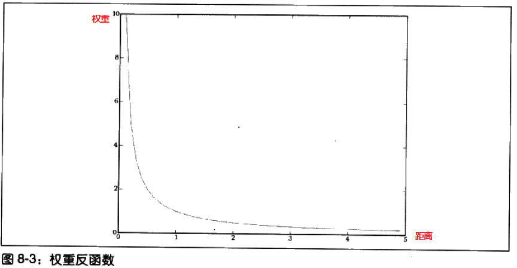
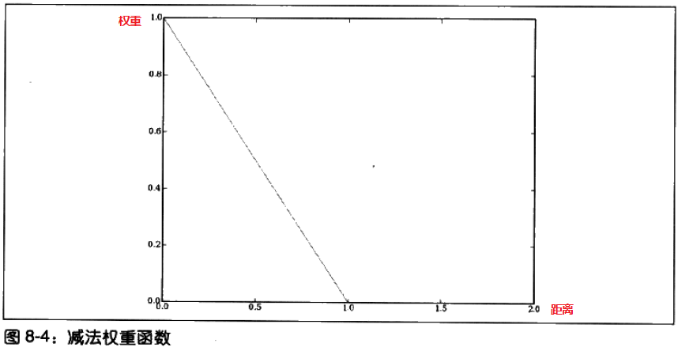
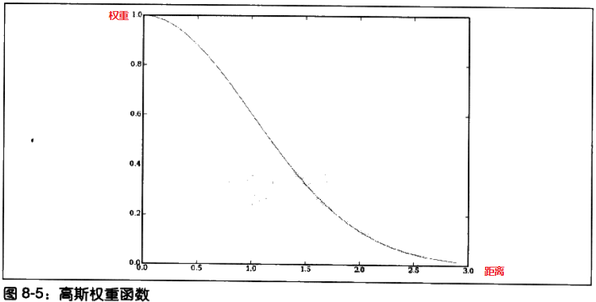
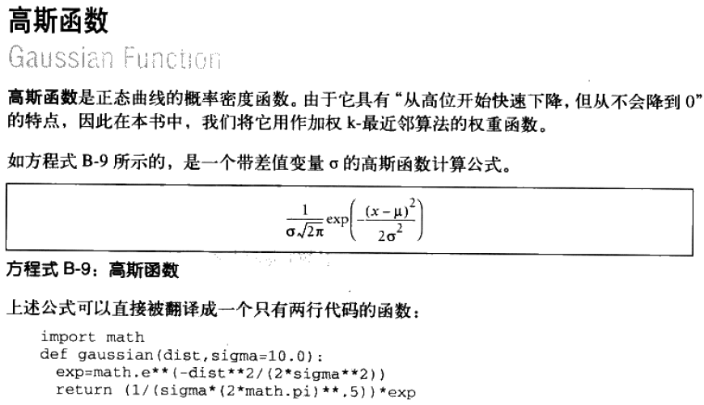
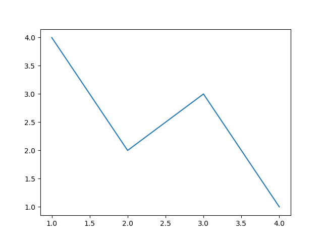
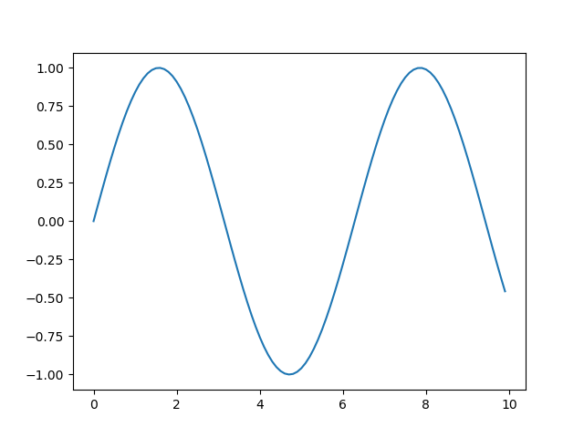
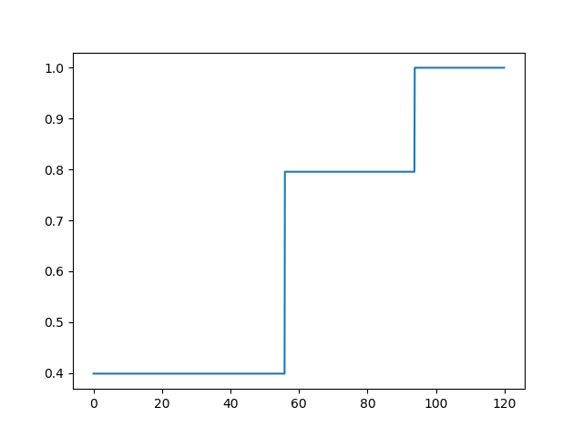
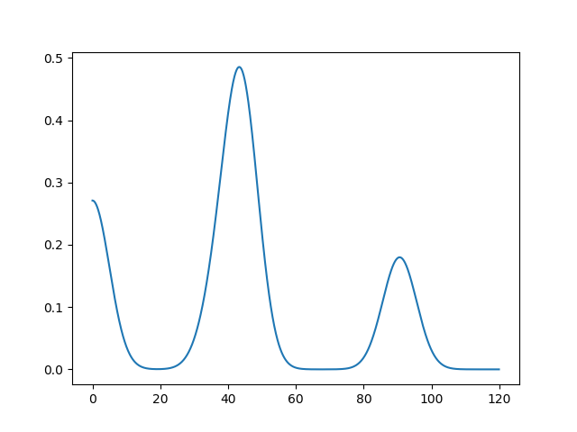

# 构建价格模型 #

[1.构造一个样本数据集](#构造一个样本数据集)

[2.k-最近邻分配算法](#k-最近邻分配算法)

[2.1.近邻数](#近邻数)

[2.2.定义相似度](#定义相似度)

[2.3.kNN代码](#knn代码)

[3.为近邻分配权重](#为近邻分配权重)

[3.1.反函数](#反函数)

[3.2.减法函数](#减法函数)

[3.3.高斯函数](#高斯函数)

[3.4.加权kNN](#加权knn)

[4.交叉验证](#交叉验证)

[5.不同类型的变量](#不同类型的变量)

[5.1.加入数据集](#加入数据集)

[5.2.按比例缩放](#按比例缩放)

[6.对缩放结果进行优化](#对缩放结果进行优化)

[7.不对称分布](#不对称分布)

[7.1.估计概率密度](#估计概率密度)

[7.2.绘制概率分布](#绘制概率分布)

[7.2.1.累积概率](#累积概率)

[7.2.2.尝试将处于不同价位点的实际概率值绘制](#尝试将处于不同价位点的实际概率值绘制)

[8.使用真实数据——eBayAPI](#使用真实数据ebayapi)

[9.何时使用k-最邻近算法](#何时使用k-最邻近算法)

[10.小结](#小结)

利用多种不同属性（比如价格）对数值型数据进行预测时，贝叶斯分类器，决策树，支持向量机都不是最佳算法。

目的：

1. 分类器算法接受训练，根据之前见过的样本数据作出数字类的预测，而且显示出预测的概率分布情况，以帮助用户对预测过程加以解释。
2. 如何利用算法来构造价格预测模型。

解答2缘由：

1. 经济学家认为，价格（尤其是拍卖价格）是一种利用集体智慧来决定商品真实价值的非常好的方法；在一个拥有众多买家和卖家的大型市场中，通常对于交易双方而言，商品的价格最终将会达到一个最优解。
2. 对价格预测也是测试分类器算法的一种很好的手段。

进行数值型预测的一项关键工作是确定哪些变量是重要的，以及如何将它们组合在一起。

## 构造一个样本数据集 ##

[numpredict.py](numpredict.py)

情景：

**根据一个人为假设的简单模型来构造一个有关葡萄酒价格的数据集**。

酒的价格是根据**酒的等级**及**其储藏的年代**共同来决定的。

该模型假设葡萄酒有“峰值年（peakage）”的现象，即：较之峰值年而言，年代稍早一些的酒的品质会比较好一些，而紧随其后的则品质稍差些。

一瓶高等级的葡萄酒将从高价位开始，尔后价格逐渐走高直至其“峰值年"，而一瓶低等级的葡萄酒则会从一个低价位开始，价格一路走低。

	# 根据等级，已存储年龄得出酒价
	def wineprice(rating,age):
	  peak_age=rating-50
	  
	  # Calculate price based on rating
	  price=rating/2
	  if age>peak_age:
	    # Past its peak, goes bad in 10 years
	    price=price*(5-(age-peak_age)/2)
	  else:
	    # Increases to 5x original value as it
	    # approaches its peak
	    price=price*(5*((age+1)/peak_age))
	  if price<0: price=0
	  return price

	# 生成（等级，已存储年龄）特征，（酒价）分类数据集
	def wineset1():
	  rows=[]
	  for i in range(300):
	    # Create a random age and rating
	    rating=random()*50+50
	    age=random()*50
	
	    # Get reference price
	    price=wineprice(rating,age)
	    
	    # Add some noise # 模拟税收，价格局部变动
	    price*=(random()*0.2+0.9)
	
	    # Add to the dataset
	    rows.append({'input':(rating,age),
	                 'result':price})
	  return rows

运行代码

	>>> 
	 RESTART: C:\Users\Administrator.USER-20180302VA\Desktop\Lab\ProgrammingCollectiveIntelligence\C08\numpredict.py 
	>>> wineprice(95.0, 3.0)
	21.111111111111114
	>>> wineprice(95.0, 8.0)
	47.5
	>>> wineprice(99.0, 1.0)
	10.102040816326529
	>>> data=wineset1()
	>>> data[0]
	{'input': (75.49955179321756, 23.42460727367927), 'result': 184.60154078303577}
	>>> data[1]
	{'input': (90.98280059701668, 0.051264242473414434), 'result': 5.570848286414397}
	>>> 

## k-最近邻分配算法 ##

对于葡萄酒定价问题而言，最简单的做法与人们尝试手工进行定价时所采用的做法是一样的一一即，找到几瓶情况最为相近的酒，并假设其价格大体相同。

使用k-最近邻算法（k-nearest neighbors，kNN）通过寻找与当前所关注的商品情况相似的一组商品，对这些商品的价格求均值，进而作出价格预测。

### 近邻数 ###

kNN中的k代表的，是为了求得最终结果而参与求平均运算的商品数量。

k的值根据实际情况选择，不能过大或过小。

### 定义相似度 ###

选用**欧几里得距离算法**衡量两件商品之间相似程度的方法。

	def euclidean(v1,v2):
	  d=0.0
	  for i in range(len(v1)):
	    d+=(v1[i]-v2[i])**2
	  return math.sqrt(d)

运行代码

	>>> data[0]['input']
	(75.49955179321756, 23.42460727367927)
	>>> data[1]['input']
	(90.98280059701668, 0.051264242473414434)
	>>> euclidean(data[0]['input'], data[1]['input'])
	28.036479058090837
	>>> 

### kNN代码 ###

kNN是一种实现起来相对简单的算法。虽然这种算法的计算量很大（computationally intensive），但是其优点在于每次有新数据加入时，都无需重新训练。

	# 计算给定商品与原数据集中任一其他商品间的距离
	def getdistances(data,vec1):
	  distancelist=[]
	  
	  # Loop over every item in the dataset
	  for i in range(len(data)):
	    vec2=data[i]['input']
	    
	    # Add the distance and the index
	    distancelist.append((euclidean(vec1,vec2),i))
	  
	  # Sort by distance
	  distancelist.sort()
	  return distancelist

	# 利用其中前k项结果求出平均值
	def knnestimate(data,vec1,k=5):
	  # Get sorted distances
	  dlist=getdistances(data,vec1)
	  avg=0.0
	  
	  # Take the average of the top k results
	  for i in range(k):
	    idx=dlist[i][1]
	    avg+=data[idx]['result']
	  avg=avg/k
	  return avg

运行代码

	>>> knnestimate(data,(95.0, 3.0))
	17.225810699279158
	>>> knnestimate(data,(99.0, 3.0))
	22.031353661602076
	>>> knnestimate(data,(95.0, 5.0))
	29.10861771952609
	>>> wineprice(99.0, 5.0)
	30.306122448979593
	>>> knnestimate(data,(95.0, 3.0), k=1)
	22.54614350103098
	>>> 

## 为近邻分配权重 ##

### 反函数 ###

上述算法有可能会选择距离太远的近邻，因此，一种补偿的办法是根据距离的远近为其赋予相应的权重。

	def inverseweight(dist,num=1.0,const=0.1):
	  return num/(dist+const)

该函数实现简单，但是最为主要的潜在缺陷在于，它会为近邻项赋予很大的权重，而稍远的一项，其权重“衰减”得很快。

### 减法函数 ###

	def subtractweight(dist,const=1.0):
	  if dist>const: 
	    return 0
	  else: 
	    return const-dist

该函数克服了前述对近邻权重分配过大的潜在问题，但是权重可能为0，因此我们有可能找不到距离足够近的项，将其视为近邻，即对于某些项，算法根本就无法做出预测。

### 高斯函数 ###

该方法克服前述方法的局限。就是有点复杂，算起来较慢

	def gaussian(dist,sigma=5.0):
	  return math.e**(-dist**2/(2*sigma**2))

运行代码

	>>> subtractweight(0.1)
	0.9
	>>> inverseweight(0.1)
	5.0
	>>> gaussian(0.1)
	0.9998000199986667
	>>> gaussian(1.0)
	0.9801986733067553
	>>> subtractweight(1.0)
	0.0
	>>> inverseweight(1.0)
	0.9090909090909091
	>>> gaussian(3.0)
	0.835270211411272
	>>> 

PS. 运行结果与书本有出入，公式前后并不一致。

### 加权kNN ###

	def weightedknn(data,vec1,k=5,weightf=gaussian):
	  # Get distances
	  dlist=getdistances(data,vec1)
	  avg=0.0
	  totalweight=0.0
	  
	  # Get weighted average
	  for i in range(k):
	    dist=dlist[i][0]
	    idx=dlist[i][1]
	    weight=weightf(dist)
	    avg+=weight*data[idx]['result']
	    totalweight+=weight

	  if totalweight==0: return 0
	  avg=avg/totalweight
	  return avg

运行代码

	>>> weightedknn(data,(99.0, 5.0))
	27.992611805843243
	>>> 

## 交叉验证 ##

交叉验证是将数据拆分成训练集与测试集的一系列技术的统称。

将训练集传入算法随着正确答案的得出(在本章的例子中即为价格)，就得到了一组用以进行预测的数据集。

随后，要求算法对测试集中的每一项数据都作出预测。其所给出的答案，将与正确答案进行对比，算法会计算出一个整体分值，以评估其所做预测的准确程度

---

数据集分成两部分，5%数据用于测试，95%用于训练。

	def dividedata(data,test=0.05):
	  trainset=[]
	  testset=[]
	  for row in data:
	    if random()<test:
	      testset.append(row)
	    else:
	      trainset.append(row)
	  return trainset,testset

---

	def testalgorithm(algf,trainset,testset):
	  error=0.0
	  for row in testset:
	    guess=algf(trainset,row['input'])
	    error+=(row['result']-guess)**2
	    #print row['result'],guess
	  #print error/len(testset)
	  return error/len(testset)

testalgorithm的a1gf接受一个算法函数作为参数，而该算法函数则接受一个数据集和个査询项作为参数。 

testalgorithm会循环遍历测试集中的每一行，并利用a1gf得出最佳的猜测结果。随后，它会从实际结果中减去猜测所得的结果。

对数字求平方是一种常见的做法，因为它会突显较大的差值。这意味着，一个在大多数时候都非常接近于正确值，但是偶尔会有较大偏离的算法，要比始终都比较接近于正确值的算法稍逊一些。一般而言，这种情况是我们所期望的，不过有时也有例外，那就是：如果算法在余下的大多数时候准确度都非常的高，那么偶尔犯一个大错误还是可以接受的。如果是这种情况，那么我们可以对函数稍做修改，只要将差值的绝对值累加起来即可。

---

	def crossvalidate(algf,data,trials=100,test=0.1):
	  error=0.0
	  for i in range(trials):
	    trainset,testset=dividedata(data,test)
	    error+=testalgorithm(algf,trainset,testset)
	  return error/trials

该函数对数据采取若干不同的划分，并在每个划分上执行testalgorithm函数，然后再将所有的结果都累加起来，以求得最终的评分值。

---

运行代码

	>>> data=wineset1()
	>>> crossvalidate(knnestimate, data)# kNN默认选5个近邻
	298.7994273869
	>>> def knn3(d,v):return knnestimate(d, v, k=3)
	
	>>> crossvalidate(knn3, data)
	252.18174022304578
	>>> def knn1(d,v):return knnestimate(d, v, k=1)
	
	>>> crossvalidate(knn1, data)
	352.0428832264139
	>>> 

从上看出，选择太少近邻或太多近邻导致效果不彰。k值为5比1或3的好。

	>>> crossvalidate(weightedknn,data)
	280.68594920470093
	>>> def knninverse(d, v):return weightedknn(d, v, weightf=inverseweight)
	
	>>> crossvalidate(knninverse,data)
	296.12994220636386
	>>> 

至于选择哪个，自己执生。

## 不同类型的变量 ##

### 加入数据集 ###

将新的变量加入到数据集

	def wineset2():
	  rows=[]
	  for i in range(300):
	    rating=random()*50+50
	    age=random()*50
	    aisle=float(randint(1,20))
	    bottlesize=[375.0,750.0,1500.0][randint(0,2)]
	    price=wineprice(rating,age)
	    price*=(bottlesize/750)
	    price*=(random()*0.2+0.9)
	    rows.append({'input':(rating,age,aisle,bottlesize),
	                 'result':price})
	  return rows

运行代码

	>>> data=wineset2()
	>>> crossvalidate(knn3, data)
	500.7449458494611
	>>> crossvalidate(weightedknn, data)
	515.6156961829049
	>>> 

结果糟糕。其原因在于，算法现在还不知道如何对不同的变量加以区别对待。

### 按比例缩放 ###

此处，所需要的并不是一种根据变量的实际值来计算距离的方法，而是需要一种对数值进行归一化处理的方法，从而使所有变量都位于相同的值域范围之内。

这样做也有助于找到减少多余变量的方法，或者至少能够降低其对计算结果的影响。

为了达成上述两个目标，一种办法就是在进行任何计算之前先对数据重新按比例进行缩放。

	def rescale(data,scale):
	  scaleddata=[]
	  for row in data:
	    scaled=[scale[i]*row['input'][i] for i in range(len(scale))]
	    scaleddata.append({'input':scaled,'result':row['result']})
	  return scaleddata

运行代码

	>>> 
	 RESTART: C:\Users\Administrator.USER-20180302VA\Desktop\Lab\ProgrammingCollectiveIntelligence\C08\numpredict.py 
	>>> data=wineset2()
	>>> sdata=rescale(data,[10,10,0,0.5])
	>>> crossvalidate(knnestimate,sdata)
	473.72014016615475
	>>> crossvalidate(weightedknn,sdata)
	838.3613563789352
	>>> 

## 对缩放结果进行优化 ##

在有许多输入变量需要考察的情况下，利用**优化算法**（爬山法，模拟退火算法，遗传算法）自动寻找最优解的办法。

定义一个成本函数

	def createcostfunction(algf,data):
	  def costf(scale):
	    sdata=rescale(data,scale)
	    # 直接调用交叉验证时的函数
	    return crossvalidate(algf,sdata,trials=20)
	  return costf

设置变量们权重值域

	weightdomain=[(0,10)]*4

使用模拟退火算法运行代码

	>>> import optimization
	>>> import numpredict
	>>> data=numpredict.wineset2()
	>>> costf=numpredict.createcostfunction(numpredict.knnestimate,data)
	>>> optimization.annealingoptimize(numpredict.weightdomain,costf,step=2)
	[9.0, 9.0, 8.0, 6.0] 329.572393039
	[9.0, 9.0, 8.0, 4.0] 352.078113319
	[7.0, 9.0, 8.0, 4.0] 432.154759685
	...略...
	[8, 10, 0, 8.0] 346.108416761
	[8, 10, 0, 8.0] 349.249066339
	[7, 10, 0, 8.0] 332.393589718
	[7, 10, 0, 8.0]
	>>> 

**以这种方式对变量缩放进行优化的一个好处在于，很快就能发觉哪些变量是重要的，并且其重要程度有多大**。

有的时候，有些数据很难收集到，或者收集的代价高昂，此时如果能够确定这些数据不是很有价值，那就可以将其忽略以避免额外的成本投入。

此外，特别是在制定价格策略的时候，知道哪些变量是重要的，有可能会影响到我们所关注的方向而这些方向将会成为市场营销工作中相当重要的一部分内容；另外，这样做也有可能会为我们揭示出，如何将商品设计得与众不同，才能赢得最高的价格。

## 不对称分布 ##

对于葡萄酒购买渠道分别有：

1. 从小酒馆购得
2. 从折扣店购得，这里有5折折扣

这些信息在数据集中并没有被记录下来。

	# 模拟两个渠道购得
	def wineset3():
	  rows=wineset1()
	  for row in rows:
	    if random()<0.5:
	      # Wine was bought at a discount store
	      row['result']*=0.6
	  return rows

假如使用kNN算法或加权kNN算法，对不同的葡萄酒进行价格预估，会发生什么情况。

由于事实上数据集中并不包含任何有关购买者是从小酒馆还是从折扣店购买葡萄酒的信息，因此算法无法将这一情况考虑在内，其所得到的最近邻结果也将不会考虑购买源这一因素。

**最终的结果**是：算法给出的平均值将同时涉及两组人群，这就相当于可能有25%的折扣。

验证一下这种情况：

	>>> data=numpredict.wineset3()
	>>> numpredict.wineprice(99.0, 20.0)
	106.07142857142857
	>>> numpredict.weightedknn(data,[99.0, 20.0])
	86.35355150106489
	>>> 

如果只想得到一个简单的数字，那么这不失为一种预测的办法，**但是它并不能准确地反应出某人实际最终的购买情况**。

为了不只是简单地得到一个平均值，需要一种方法能够在某些方面更近一步地对数据进行考查。

### 估计概率密度 ###

除了取近邻的加权平均并得到一个价格预估外，也许需要知道**某瓶葡萄酒落入指定价格区间的概率**。

上面的例子，假设输入条件为99.0级和20年，那么需要一个函数来告诉我们，价格在[40,80]区间的概率为50%，在[80,100]的为50%。

	def probguess(data,vec1,low,high,k=5,weightf=gaussian):
	  dlist=getdistances(data,vec1)
	  nweight=0.0
	  tweight=0.0
	  
	  for i in range(k):
	    dist=dlist[i][0]
	    idx=dlist[i][1]
	    weight=weightf(dist)
	    v=data[idx]['result']
	    
	    # Is this point in the range?
	    if v>=low and v<=high:
	      nweight+=weight
	    tweight+=weight
	  if tweight==0: return 0
	  
	  # The probability is the weights in the range
	  # divided by all the weights
	  return nweight/tweight

运行代码

	>>> data=wineset3()
	>>> probguess(data, [99.0,20], 40, 80)
	0.7980215674812295
	>>> probguess(data, [99.0,20], 80, 120)
	0.2019784325187704
	>>> probguess(data, [99.0,20], 120, 1000)
	0.0
	>>> probguess(data, [99.0,20], 30, 120)
	1.0
	>>> 

通过绘图，获得概率分布整体视图的方法。

### 绘制概率分布 ###

使用matplotlib库绘制图

绘图初体验

	>>> from pylab import *
	>>> a=array([1,2,3,4])
	>>> b=array([4,2,3,1])
	>>> plot(a,b)
	[<matplotlib.lines.Line2D object at 0x00000000073DEAC8>]
	>>> show()

---

	>>> t1=arange(0.0,10.0,0.1)
	>>> plot(t1,sin(t1))
	[<matplotlib.lines.Line2D object at 0x0000000007721390>]
	>>> show()

---

查看概率分布的方法：

1. 累积概率cumulative probability
2. 尝试将处于不同价位点的实际概率值绘制

#### 累积概率 ####

累积概率图显示的是结果小于给定值的概率分布情况。

以价格为例，图形从概率为0开始(对应于价格小于0的概率)，尔后随着商品在某一价位处命中的概率值而逐级递增。

直到最高价位处，图形对应的概率值达到1(因为实际价格小于或等于最高价格的可能性必为100%)。

	from pylab import *
	
	def cumulativegraph(data,vec1,high,k=5,weightf=gaussian):
	  t1=arange(0.0,high,0.1)
	  cprob=array([probguess(data,vec1,0,v,k,weightf) for v in t1])
	  plot(t1,cprob)
	  show()

运行代码

	>>> cumulativegraph(data, (1, 1), 120)

通过观察图形，可以很清楚地看到，此处的概率值集中在60美元和110美元之间，因为那段区间是累积概率发生跳跃的地方。预先得知这一情况将使我们能够在**不依靠猜测的情况下**进行概率的计算。

#### 尝试将处于不同价位点的实际概率值绘制 ####

由于任何一瓶葡萄酒准确位于某一价位的概率都是非常低的，因此这种方法相比而言所要求的技巧性会更高一些。

这样绘制出来的图形，在我们预测的价格附近会形成一个个小小的突起，而其余地方则几平都会是0。

这样的结果并不是我们想要的，我们需要的是有一种方法能够在某些“窗口”(windows)范围内将概率值组合起来。

为了达成这目的，有一种方法是，**假设每个价位点的概率都等于其周边概率的一个加权平均**

	def probabilitygraph(data,vec1,high,k=5,weightf=gaussian,ss=5.0):
	  # Make a range for the prices
	  t1=arange(0.0,high,0.1)
	  
	  # Get the probabilities for the entire range
	  probs=[probguess(data,vec1,v,v+0.1,k,weightf) for v in t1]
	  
	  # Smooth them by adding the gaussian of the nearby probabilites
	  smoothed=[]
	  for i in range(len(probs)):
	    sv=0.0
	    for j in range(0,len(probs)):
	      dist=abs(i-j)*0.1
	      weight=gaussian(dist,sigma=ss)
	      sv+=weight*probs[j]
	    smoothed.append(sv)
	  smoothed=array(smoothed)
	    
	  plot(t1,smoothed)
	  show()

运行代码

	>>> data=wineset3()
	>>> probabilitygraph(data, (1, 1), 120)
	>>> 

通过上图可以更加清楚地看到结果数据集中分布的区域。

这样的概率分布清楚地反映出：在预測葡萄酒价格时缺少了一部分关键数据，那就是有些人的葡萄酒生意何以比其他人做得更好的原因。

有的时候能够明确地指出这些数据是什么，但有的时候，只会发现自己须要在更低的价格范围内销售葡萄酒才行。

## 使用真实数据——eBayAPI ##

[ebaypredict.py](ebaypredict.py)

## 何时使用k-最邻近算法 ##

kNN也存在一些**不足之处**。

1. 因为算法须要计算针对每个点的距离，因此预测过程的计算量很大。
2. 而且，在一个包含有许多变量的数据集中，可能很难确定合理的权重值，也很难决定是否应该去除某些变量。

优化可能有助于解决这一问题，但是对于大数据集而言，寻找一个优解可能会花费非常长的时间。

---

尽管如此，kNN较之其他方法还是有一定**优势**的。

关于预测计算量非常大这一特点，也有其好的一面，那就是可以在无须任何计算开销的前提下将新的观测数据加入到数据集中。

要正确地解释这一点也很容易，因为算法是在使用其他观测数据的加权值来进行预测的。

---

尽管确定权重可能是需要技巧的，但是一旦确定了最佳的权重值，就可以凭借这些信息更好地掌握数据集所具备的特征。

最后，当怀疑数据集中还有其他无法度量的变量时，我们还可以建立概率函数。

## 小结 ##

kNN的缺点

1. 计算量大
2. 无关变量干扰结果（通过权重进行优化）

---

kNN的优点

1. 新数据加入无需从头再来。

