# 高阶分类-核方法与SVM #

[1.婚介数据集](#婚介数据集)

[2.数据中的难点](#数据中的难点)

[2.1.决策树分类器](#决策树分类器)

[3.基本的线性分类](#基本的线性分类)

[4.分类特征](#分类特征)

[4.1.是否问题](#是否问题)

[4.2.兴趣列表](#兴趣列表)

[4.3.利用雅虎API来确定距离](#利用雅虎api来确定距离)

[4.3.1.获取雅虎密钥](#获取雅虎密钥)

[4.3.2.使用API](#使用api)

[4.3.3.计算距离](#计算距离)

[4.4.构建新的数据集](#构建新的数据集)

[5.对数据进行缩放处理](#对数据进行缩放处理)

[6.理解核方法](#理解核方法)

[6.1.核技法](#核技法)

[7.支持向量机](#支持向量机)

[7.1.支持向量机的应用](#支持向量机的应用)

[8.使用LIBSVM](#使用libsvm)

[8.1.获取LIBSVM](#获取libsvm)

[8.2.你好LIBSVM](#你好libsvm)

[8.3.将SVM用于婚介数据集](#将svm用于婚介数据集)

[9.基于Facebook的匹配](#基于facebook的匹配)

[9.1.获得开发者密钥](#获得开发者密钥)

[9.2.建立会话](#建立会话)

[9.3.下载好友数据](#下载好友数据)

[9.4.构造匹配数据集](#构造匹配数据集)

[9.5.构造SVM模型](#构造svm模型)

本章例子是关于如何为约会网站的用户寻找配对。

给定两人的信息，我们能否预测出他们将会成为一对好朋友呢？

这问题涉及许多变量，既有数值型的，也有名词性的，还有大量的非线性关系。

重要事实：将一个复杂数据集扔给一个算法，然后希望它能够学会如何进行精确分类，这几乎是不可能的。

选择正确的算法，然后对数据进行适当地预处理，这是要获得满意的分类结果所需的。

## 婚介数据集 ##

字段信息：

1. 年龄
2. 是否吸烟？
3. 是否要孩子？
4. 兴趣列表
5. 家庭住址

---

数据文件

- [agesonly.csv](agesonly.csv)

	24,30,1
	30,40,1
	22,49,0
	43,39,1
	23,30,1
	...

- [matchmaker.csv](matchmaker.csv)

	39,yes,no,skiing:knitting:dancing,220 W 42nd St New York NY,43,no,yes,soccer:reading:scrabble,824 3rd Ave New York NY,0
	23,no,no,football:fashion,102 1st Ave New York NY,30,no,no,snowboarding:knitting:computers:shopping:tv:travel,151 W 34th St New York NY,1
	50,no,no,fashion:opera:tv:travel,686 Avenue of the Americas New York NY,49,yes,yes,soccer:fashion:photography:computers:camping:movies:tv,824 3rd Ave New York NY,0
	...

上面每一行数据都对应于一对男女的信息，最后一列表示似乎配对成功

加载数据集函数

	class matchrow:
	  def __init__(self,row,allnum=False):
	    if allnum:
	      self.data=[float(row[i]) for i in range(len(row)-1)]
	    else:
	      self.data=row[0:len(row)-1]
	    self.match=int(row[len(row)-1])
	
	def loadmatch(f,allnum=False):
	  rows=[]
	  for line in file(f):
	    rows.append(matchrow(line.split(','),allnum))
	  return rows

运行代码

	>>> 
	 RESTART: C:\Users\Administrator.USER-20180302VA\Desktop\Lab\ProgrammingCollectiveIntelligence\C09\advancedclassify.py 
	>>> agesonly=loadmatch("agesonly.csv",allnum=True)
	>>> matchmaker=loadmatch('matchmaker.csv')
	>>> 

## 数据中的难点 ##

上述数据集有两个值得注意的地方：

1. 变量的相互作用
2. 非线性的特点

生成一个涉及男女年龄对比情况的散布图，配对的.，否则为+。

	from pylab import *
	def plotagematches(rows):
	  xdm,ydm=[r.data[0] for r in rows if r.match==1],\
	          [r.data[1] for r in rows if r.match==1]
	  xdn,ydn=[r.data[0] for r in rows if r.match==0],\
	          [r.data[1] for r in rows if r.match==0] 
	  
	  plot(xdm,ydm,'bo')
	  plot(xdn,ydn,'b+')
	  
	  show()

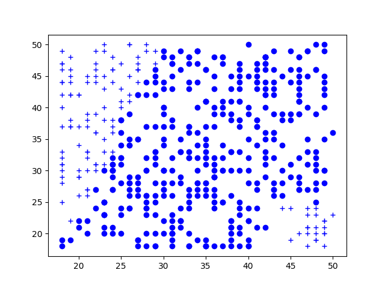

尽管很显然还有许多其他因素会对两个人是否成功匹配构成影响，但上图却是根据简化了的只包含年龄信息的数据集绘制而成的。

观图可得：

1. 它还给出了一条明显的边界，表明人们不会去寻找远远超出其年龄范围内的人进行配对。

2. 图上的边界看上去似乎还有些曲折，并且年龄越大边界就越不清晰，这表明人们的年龄越见长就越能忍受更大的年龄差距。

### 决策树分类器 ###

尝试使用决策树分类器对数据进行分类。

决策树算法是根据数值边界来对数据进行划分的。

借助带有两个变量函数精确表达分界线dividing line时，问题也就随之而来。

两人的年龄差作为变量进行预测。得到：

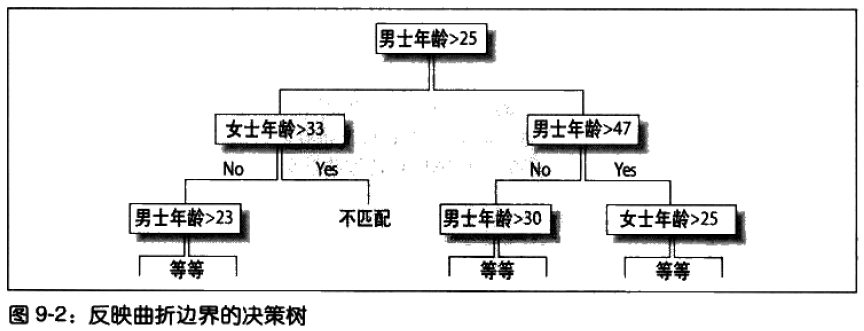

上述结果对于解释决策的过程显然**没有任何用处**。

这棵决策树也许对自动分类会有帮助，但是这样做**太麻烦也太死板**了。

假如考虑除年龄之外的其他变量，结果甚至有可能会变得令人更加难以理解。

>PS.决策树对数值分类的缺陷

为了明白决策树到底做了些什么，看一下散布图，以及根据决策树生成的决策边界。

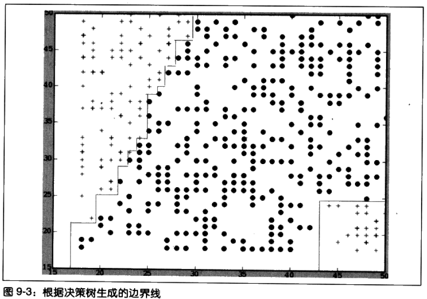

决策边界是这样一条线：位于这条线一侧的毎一个点会被赋予某个分类，而位于另一侧的每一个点会被赋予另一个分类。从图中可看到，决策树的约束条件使边界线呈现出垂直或水平向的分布。

此处有两个要点：

1. 在没有弄清楚数据本身的含义及如何将其转换成更易于理解的形式之前，轻率地使用提供给数据是错误的。**建立散布图有助于找到数据真正的划分方式**。
2. 尽管决策树有其自身的优势，但是在确定向题的分类时，**如果存在多个数值型输入，且这些输入彼此间所呈现的关系并不简单，决策树则常常不是最有效的方法**。

## 基本的线性分类 ##

**线性分类的工作原理**是寻找每个分类中所有数据的平均值，并构造一个代表该分类中心位置的点，然后即可通过判断距离哪个中心点位置最近来对新的坐标点进行分类。

实现一个函数计算分类的均值点average point

	def lineartrain(rows):
	  averages={}
	  counts={}
	  
	  for row in rows:
	    # Get the class of this point # 配对结果
	    cl=row.match
	    
	    averages.setdefault(cl,[0.0]*(len(row.data)))
	    counts.setdefault(cl,0)
	    
	    # Add this point to the averages
	    for i in range(len(row.data)):
	      averages[cl][i]+=float(row.data[i])
	      
	    # Keep track of how many points in each class
	    counts[cl]+=1
	    
	  # Divide sums by counts to get the averages
	  for cl,avg in averages.items():
	    for i in range(len(avg)):
	      avg[i]/=counts[cl]
	  
	  return averages

运行代码

	>>> agesonly=loadmatch("agesonly.csv",allnum=True)
	>>> matchmaker=loadmatch('matchmaker.csv')
	>>> lineartrain(agesonly)
	{0: [26.914529914529915, 35.888888888888886], 1: [35.48041775456919, 33.01566579634465]}
	>>> 

年龄数据的分布图有助于理解线性分类的作用

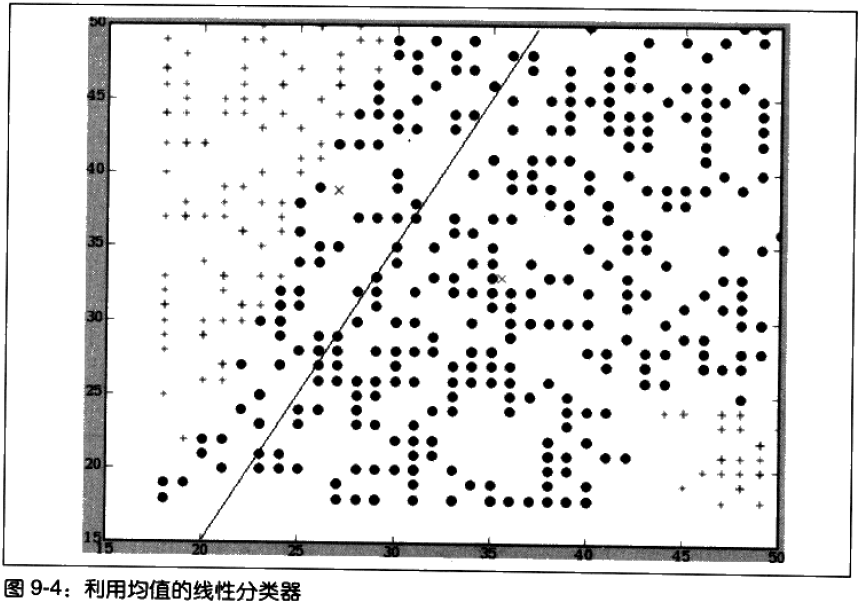

图中的X表示由lineartrain计算求得的均值点。划分数据的直线位于两个X的中间位置。

这意味着，所有位于直线左侧的坐标点都更接近于表示“不相匹配(no match)”的均值点，而所有位于右侧的坐标点则都更接近于表示“相匹配(match)”的均值点。

任何时候当我们遇到一对新的年龄数据时，如果想要推测二者是否相匹配，只须将其想象成上图中的一个坐标点，并判断其更接近于哪个均值点即可。

判定一个坐标点距离均值点的远近程度：

1. 利用欧几里得距离公式，先计算坐标点到每个分类的均值点的距离，然后从中选择距离较短者
2. 向量和点积

---

**向量**

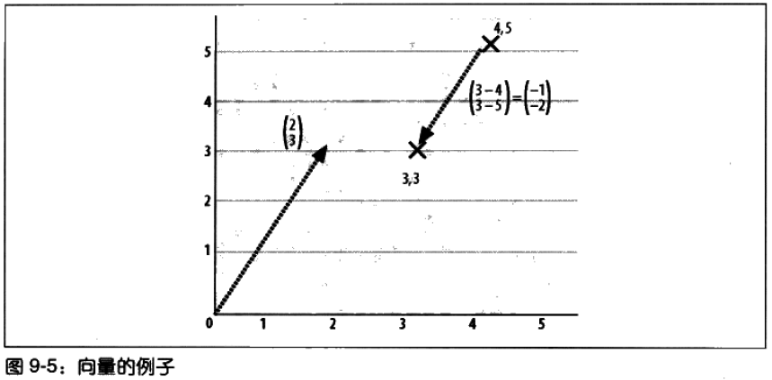

**点积**指两个向量将第一个向量中的每个值与第二个向量中的对应值相乘，然后再将所得的每个乘积相加，最后得到一个结果。

	# 计算点积
	def dotproduct(v1,v2):
	  return sum([v1[i]*v2[i] for i in range(len(v1))])

点积也可以利用两个向量的长度乘积，再乘以两者夹角的余弦求得。注意，角度大于90时，余弦值为负数，点积也为负数。

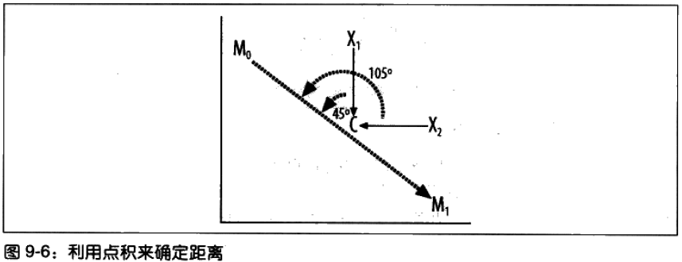

在图中，看到有两个均值点，分别对应于“相匹配”(M0)和“不相匹配”(M1)两种情况，以及一个位置介于M0与M1中间的C。另外还有两个点，X0和X1，它们是即将要被分类的两个例子。除此以外，图上还显示了连接M0到M1的向量，以及连接X1到C和X2到C的两个向量。

在图中，X1更接近于M，因此它应该被划归为“相匹配”。我们注意到，介于向量X1→C和M0→M1的夹角为45度，小于90度，因此X1→C与M→M1的点积结果为正数。

而由于向量X2→C和M0→M1的指向相反，因此介于两者间的夹角大于90度。即X2→C和M0→M1的点积结果为负数

夹角大者点积为负，夹角小者点积为正，因此只须通过观察点积结果的正负号，就可以判断出新的坐标点属于哪个分类。

寻找分类公式

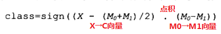

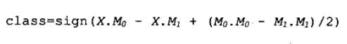

	# 计算公式
	def dpclassify(point,avgs):
	  b=(dotproduct(avgs[1],avgs[1])-dotproduct(avgs[0],avgs[0]))/2
	  y=dotproduct(point,avgs[0])-dotproduct(point,avgs[1])+b
	
	  return 0 if y > 0 else 1

运行代码

	>>> agesonly=loadmatch("agesonly.csv",allnum=True)
	>>> avgs=lineartrain(agesonly)
	>>> dpclassify([30,30],avgs)
	1
	>>> dpclassify([30,25],avgs)
	1
	>>> dpclassify([25,40],avgs)
	0
	>>> dpclassify([48,20],avgs)
	1
	>>> 

请记住这是一个线性分类器，所以它只找出了一条分界线来。

这意味着，如果找不到一条划分数据的直线来，或者如果实际存在多条直线时，就如同前面那个年龄对比的例子中所呈现的那样，那么此时分类器将会得到错误的答案。

在那个例子中，48岁与20岁的年龄对比实际上应该是“不相匹配”的结果，但是因为我们只找到了一条直线，而相应的坐标点又落在了这条直线的右侧，所以函数得出了“相匹配”的结论。

## 分类特征 ##

数据类型通常包含有：

1. 数值型数据
2. 分类数据categorical data

接下来讨论的分类器只能处理数值型数据。

所以，对于**分类数据**，需要将其转换成**数值型数据**

### 是否问题 ###

	def yesno(v):
	  if v=='yes': return 1
	  elif v=='no': return -1
	  else: return 0

### 兴趣列表 ###

	#计算两人的共同兴趣
	def matchcount(interest1,interest2):
	  l1=interest1.split(':')
	  l2=interest2.split(':')
	  x=0
	  for v in l1:
	    if v in l2: x+=1
	  return x

### 利用雅虎API来确定距离 ###

没用雅虎api计算的调用下面函数

	def milesdistance(a1,a2):
	  return 1

>PS. 我没用雅虎API下面四级标题的略读。

#### 获取雅虎密钥 ####

要注册获得

#### 使用API ####

	yahookey="YOUR API KEY"
	from xml.dom.minidom import parseString
	from urllib import urlopen,quote_plus
	
	loc_cache={}
	def getlocation(address):
	  if address in loc_cache: return loc_cache[address]
	  data=urlopen('http://api.local.yahoo.com/MapsService/V1/'+\
	               'geocode?appid=%s&location=%s' %
	               (yahookey,quote_plus(address))).read()
	  doc=parseString(data)
	  lat=doc.getElementsByTagName('Latitude')[0].firstChild.nodeValue
	  long=doc.getElementsByTagName('Longitude')[0].firstChild.nodeValue  
	  loc_cache[address]=(float(lat),float(long))
	  return loc_cache[address]

#### 计算距离 ####

	def milesdistance(a1,a2):
	  lat1,long1=getlocation(a1)
	  lat2,long2=getlocation(a2)
	  latdif=69.1*(lat2-lat1)
	  longdif=53.0*(long2-long1)
	  return (latdif**2+longdif**2)**.5
### 构建新的数据集 ###

将前面的有分类数据的转换成数据型数据。

	def loadnumerical():
	  oldrows=loadmatch('matchmaker.csv')
	  newrows=[]
	  for row in oldrows:
	    d=row.data
	    data=[float(d[0]),yesno(d[1]),yesno(d[2]),
	          float(d[5]),yesno(d[6]),yesno(d[7]),
	          matchcount(d[3],d[8]),
	          milesdistance(d[4],d[9]),
	          row.match]
	    newrows.append(matchrow(data))
	  return newrows

运用代码

	>>> 
	 RESTART: C:\Users\Administrator.USER-20180302VA\Desktop\Lab\ProgrammingCollectiveIntelligence\C09\advancedclassify.py 
	>>> numericalset=loadnumerical()
	>>> numericalset[0].data
	[39.0, 1, -1, 43.0, -1, 1, 0, 0]
	>>> 

## 对数据进行缩放处理 ##

对数据进行归一化处理

	def scaledata(rows):
	  low=[999999999.0]*len(rows[0].data)
	  high=[-999999999.0]*len(rows[0].data)
	  # Find the lowest and highest values
	  for row in rows:
	    d=row.data
	    for i in range(len(d)):
	      if d[i]<low[i]: low[i]=d[i]
	      if d[i]>high[i]: high[i]=d[i]
	  
	  # Create a function that scales data
	  def scaleinput(d):
	     return [(d[i]-low[i])/(high[i]-low[i])
	            for i in range(len(low))]
	  
	  # Scale all the data
	  newrows=[matchrow(scaleinput(row.data)+[row.match])
	           for row in rows]
	  
	  # Return the new data and the function
	  return newrows,scaleinput

运行代码

	>>> scaledset, scalef=scaledata(numericalset)
	>>> scaledset[0].data
	[0.65625, 1, 0, 0.78125, 0, 1, 0, 0]
	>>> scaledset[0].match
	0
	# 线性分类器
	>>> avgs=lineartrain(scaledset)
	# 点积分类
	>>> dpclassify(scalef(numericalset[0].data),avgs)
	1
	>>> scaledset[11].match
	1
	>>> dpclassify(scalef(numericalset[11].data),avgs)
	1
	>>> 

请注意，须要先对样例数据进行缩放处理，将其调整至新的值域空间。

**尽管此处所用的线性分类器对于某些例子是有效的，但是只试图寻找一条分界线的局限性现在已经变得越来越明显了**。

为了有所改进，需要一种能够超越线性分类的新的分类方法。

## 理解核方法 ##

对下面图的数据进行线性分类会如何？

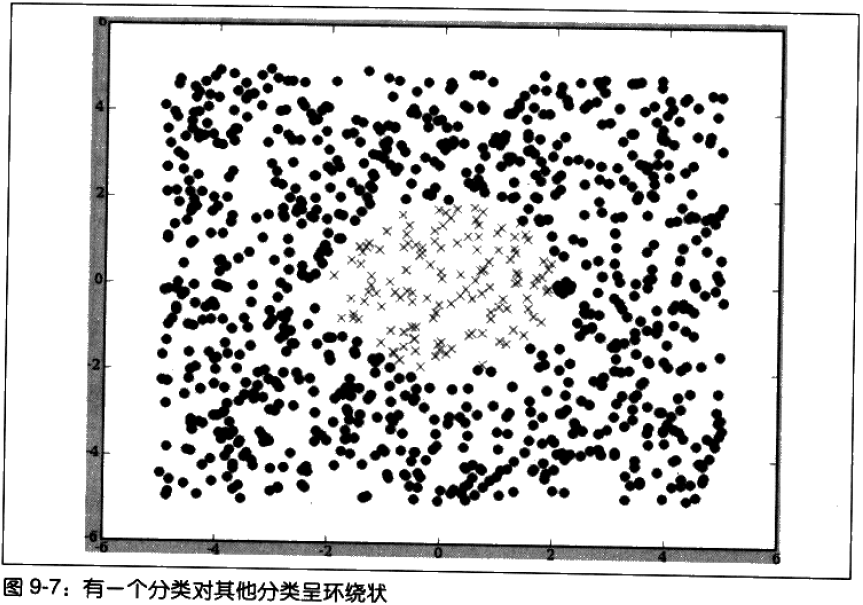

均值点都会在相似的位置，线性分类器却无法识别这两个分类。

假如先**对每一个x值和y值求平方**，原来位于(-1,2)处的坐标点现在将变成(1,4)，原来位于(0.5,1)处的坐标点现在将变成(0.25,1)，依此类推。新的坐标点分布情况如下图所示。

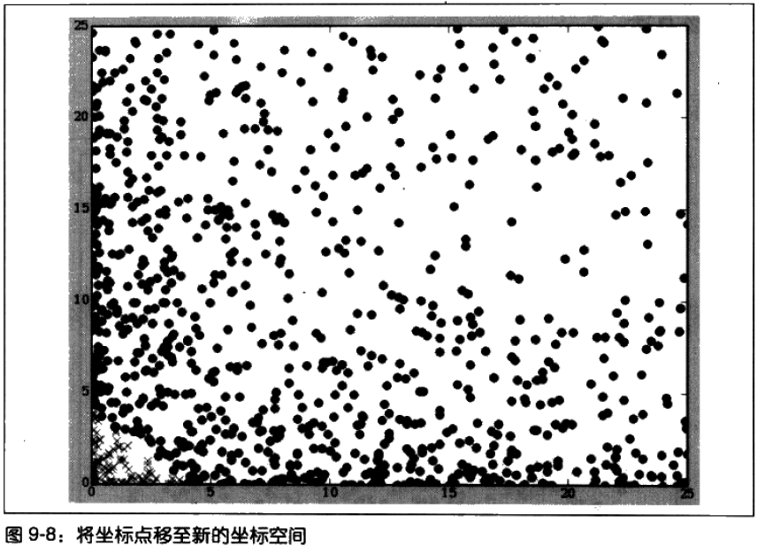

所有的X现在都已经偏移到了图上的角落处，所有的O都则位于角落以外的区域。现在，要用一条直线来划分X和O已经变得非常容易了，并且任何时侯只要有待分类的新数据，只须对x值和y值求平方，并观察其落于直线的哪一侧即可。

上述例子可得知，通过**预先对坐标点进行变换**，构造一个只用一条直线就可以进行划分的新数据集是完全有可能的。

然而，在这里之所以选择这样一个例子，是因为它非常容易变换;在面对真实问题时，变换的方法可能要复杂许多，其中就包括数据的多维变换。

例如，将一个包含x和y坐标的数据集,变换成一个由a、b、c三个坐标构成的新数据集，其条件分别是a=x2、b=x*y、c=y2。一旦将数据置于多维空间中，寻找两个分类间的分界线就容易多了。

### 核技法 ###

尽管可以编写代码将数据依照如上方法变换到新的坐标空间中，但**实际上通常不会这样去做**，因为要找到一条与实际数据集相匹配的分界线，必须要将数据投影到成百上千个维度上，要实现这样的功能是非常不切实际的。

然而，对于任何用到了点积运算的算法一包括线性分类器——可以采用一种叫做**核技法**。

**核技法的技术核技法的思路是用一个新的函数来取代原来的点积函数，当借助某个映射函数将数据第次变换到更高维度的坐标空间时，新函数将会返回高维度坐标空间内的点积结果**。

此处就变换方法的数量而言并没有任何的限制，但是在现实中只会采用少数几种变换方法。其中备受人们推崇的一种方法(也是将要在此处采用的方法)被称为**径向甚函数**(radial-basis function)

径向甚函数与点积类似，它接受两个向量作为输入参数，并返回一个标量值。
与点积不同的是，**径向基函数是非线性的**，因而它能够将数据映射到更为复杂的空间中。

	# 径向基函数，gamma根据实际情况调整的出最佳分离
	def rbf(v1,v2,gamma=10):
	  dv=[v1[i]-v2[i] for i in range(len(v1))]
	  l=veclength(dv)
	  return math.e**(-gamma*l)

现在，需要一个新的函数，用以计算坐标点在变换后的空间中与均值点间的距离。遗憾的是，目前的均值点是在原始空间中计算得到的，因此无法在此处直接使用它。

事实上，**根本无法计算均值点**，因为实际上不会在新的坐标空间中计算坐标点的位置。所幸的是，

先对一组向量求均值，然后再计算均值与向量A的点积结果（前面线性分类计算方法），与**先对向量A与该组向量中的每一个向量求点积，然后再计算均值**，在效果上是完全等价的（交换律）。

因此，不再尝试分类的两个坐标点求点积，也不再计算某个分类的均值点，而是**计算出某个坐标点与分类中其余每个坐标点之间的点积或径向基函数的结果，然后再对它们求均值**。

	def nlclassify(point,rows,offset,gamma=10):
	  sum0=0.0
	  sum1=0.0
	  count0=0
	  count1=0
	  
	  for row in rows:
	    if row.match==0:
	      sum0+=rbf(point,row.data,gamma)
	      count0+=1
	    else:
	      sum1+=rbf(point,row.data,gamma)
	      count1+=1
	  y=(1.0/count0)*sum0-(1.0/count1)*sum1+offset
	
	  if y>0: return 0
	  else: return 1
	
	def getoffset(rows,gamma=10):
	  l0=[]
	  l1=[]
	  for row in rows:
	    if row.match==0: l0.append(row.data)
	    else: l1.append(row.data)
	  sum0=sum(sum([rbf(v1,v2,gamma) for v1 in l0]) for v2 in l0)
	  sum1=sum(sum([rbf(v1,v2,gamma) for v1 in l1]) for v2 in l1)
	  
	  return (1.0/(len(l1)**2))*sum1-(1.0/(len(l0)**2))*sum0

此处的偏移量( offset)参数，在转换后的空间中也会发生改变，而其计算过程可能会有些费时。因此，应该预先为某个数据集计算一次偏移量，然后在每次调用classify时将其传入。

运行代码

	>>> agesonly=loadmatch("agesonly.csv",allnum=True)
	>>> offset=getoffset(agesonly)
	>>> nlclassify([30,30],agesonly,offset)
	1
	>>> nlclassify([30,25],agesonly,offset)
	1
	>>> nlclassify([25,40],agesonly,offset)
	0
	>>> nlclassify([48,20],agesonly,offset)
	0
	>>> 

---

	>>> numericalset=loadnumerical()
	>>> scaledset, scalef=scaledata(numericalset)
	>>> ssoffset=getoffset(scaledset)
	>>> nlclassify(scalef(numericalset[0].data),scaledset,ssoffset)
	0
	>>> numericalset[0].match
	0
	>>> nlclassify(scalef(numericalset[1].data),scaledset,ssoffset)
	1
	>>> numericalset[1].match
	1
	>>> nlclassify(scalef(numericalset[2].data),scaledset,ssoffset)
	0
	>>> numericalset[2].match
	0
	>>> 
	# 男不要孩，而女要
	>>> newrow=[28.0,-1,-1,26.0,-1,1,2,0.8]
	>>> nlclassify(scalef(newrow),scaledset,ssoffset)
	0
	# 男女都要孩
	>>> newrow=[28.0,-1,1,26.0,-1,1,2,0.8]
	>>> nlclassify(scalef(newrow),scaledset,ssoffset)
	1
	>>> 

## 支持向量机 ##

Support-Vector Machines

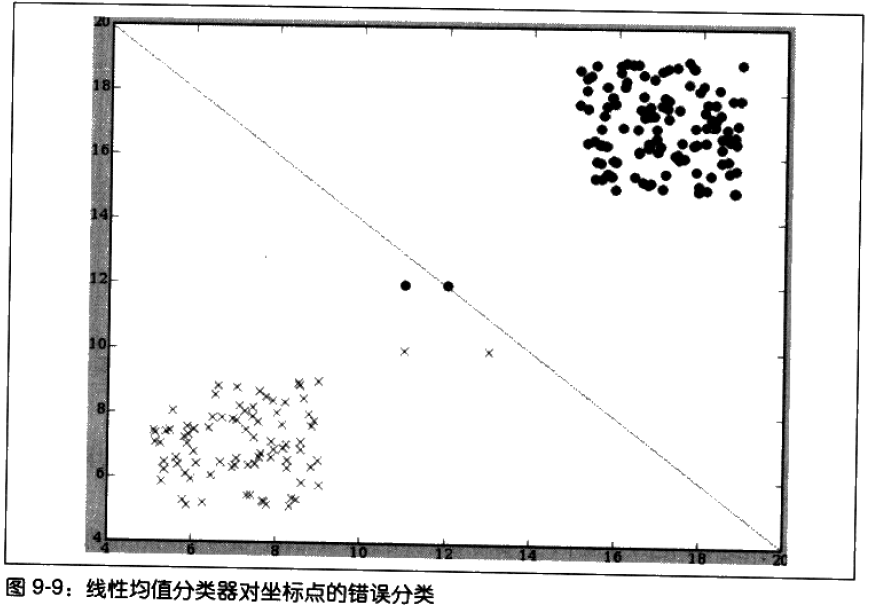

（上面图所带来的问题）

注意，有两个坐标点因为与其他大多数数据相比，都更加接近于利用均值点计算得到的分界线，所以它们被划归到了错误的分类。此处的问题在于，因为大多数数据都是远离分界线的，所以判断坐标点的分类与是否位于直线的某一側并没有太大的关系。

**支持向量机**是广为人知的一组方法的统称，借助于它可以构造出解决上述问题的分类器。其思路就是，尝试寻找一条尽可能远离所有分类的线，这条线被称为**最大间隔超平面**( maximum-margin hyperplane)，如下图所示。

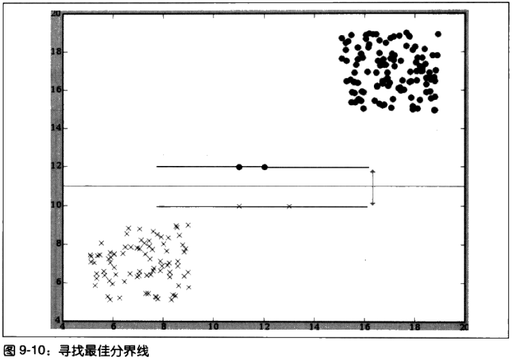

此处**选择分界线的依据**是：寻找两条分别经过各分类相应坐标点的**平行线**，并使其与分界线的距离尽可能的远。

同样，对于新的数据点，可以通过观察其位于分界线的哪一侧来判断其所属的分类。请注意，只有位于间隔区边缘的坐标点オ是确定分界线位置所必需的；可以去掉其余所有的数据，而分界线依然还会处于相同的位置。

将位于这条分界线附近的坐标点称做**支持向量**。寻找支持向量，并利用支持向量来寻找分界线的算法便是**支持向量机**。

通过前面的论述已知，只要利用点积结果来做比较，借助于核技法的使用，就可以将一个线性分类器转换成非线性分类器。

支持向量机所使用的也是点积的结果，因此同样也可以利用核技法将其用于非线性分类。

### 支持向量机的应用 ###

支持向量机在高维数据集上有不错的表现，它时常被用于解决数据量很大data-intensive的或数据复杂集科学问题，如：

- 对面部表情进行分类。
- 使用军事数据侦测入侵者。
- 根据蛋白质序列预测蛋白质结构。
- 笔迹识别。
- 确定地震期间的潜在危害。

## 使用LIBSVM ##

训练支持向量机的算法所涉及的数学概念，计算量非常庞大，所以使用LIBSVM开源库

### 获取LIBSVM ###

[LIBSVM官网](https://www.csie.ntu.edu.tw/~cjlin/libsvm/)

>PS. 接下来代码与书本的不同，书本提供的代码未能正常运行，所以按官网提供方法使用LIBSVM

下列文件从官网下载：

- [svm.py](svm.py)
- [svmutil.py](svmutil.py)
- [commonutil.py](commonutil.py)
- libsvm.dll

### 你好LIBSVM ###

引用库

	>>> from svm import *

构造一个简单的数据集，svm_problem第一参数表示分类数据，第二则为输入数据。

	>>> prob = svm_problem([1,-1], [[1,0,1],[-1,0,-1]])

svm_parameter来指定所选用的核方法。

具体参数设置请参考官网，-t 0意味只使用线性方程函数作为内核类型

	>>> param = svm_parameter('-t 0 -c 4')

进行训练

	>>> m = libsvm.svm_train(prob, param)

预测新的变量

	>>> x0, max_idx = gen_svm_nodearray([1,1,1])
	>>> libsvm.svm_predict(m,x0)
	1.0
	>>> 

---

保存及加载已构造完成的受训模型

	>>> from svmutil import *
	>>> svm_save_model('model_file', m)
	>>> m = svm_load_model('model_file')
	>>> x0, max_idx = gen_svm_nodearray([1,1,1])
	>>> libsvm.svm_predict(m,x0)
	1.0
	>>> 

### 将SVM用于婚介数据集 ###

	>>> answers,inputs=[r.match for r in scaledset],[r.data for r in scaledset]
	>>> from svm import *
	>>> param = svm_parameter('-t 2 -c 4')
	>>> prob=svm_problem(answers,inputs)
	>>> m = libsvm.svm_train(prob, param)
	>>> newrow=[28.0,-1,1,26.0,-1,1,2,0.8]
	>>> x0, max_idx = gen_svm_nodearray(scalef(newrow))
	>>> libsvm.svm_predict(m,x0)
	0.0
	>>> newrow=[28.0,-1,-1,26.0,-1,1,2,0.8]
	>>> x0, max_idx = gen_svm_nodearray(scalef(newrow))
	>>> libsvm.svm_predict(m,x0)
	0.0
	# 书本这里1.0
	
	#重设参数-c
	>>> param = svm_parameter('-t 2 -c 10')
	>>> m = libsvm.svm_train(prob, param)
	>>> libsvm.svm_predict(m,x0)
	0.0
	>>> newrow=[28.0,-1,1,26.0,-1,1,2,0.8]
	>>> x0, max_idx = gen_svm_nodearray(scalef(newrow))
	>>> libsvm.svm_predict(m,x0)
	0.0
	>>> 
	# 改了参数也不行

PS.这里结果跟书本的不同

LIBSVM也提供了对模型进行交叉验证功能。

**交叉验证的工作原理**——数据集被自动划分为训练集和测试集。训练集的作用是构造模型，而测试集的作用是对模型进行测试，以评估预测结果的好坏程度。

	 m=libsvm.svm_train(prob, param, '-v 4')

## 基于Facebook的匹配 ##

[facebook.py](facebook.py)

### 获得开发者密钥 ###

略

### 建立会话 ###

略

### 下载好友数据 ###

略

### 构造匹配数据集 ###

略

### 构造SVM模型 ###

略

