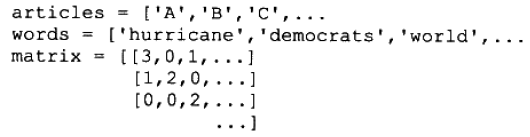
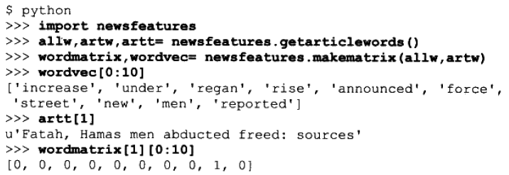
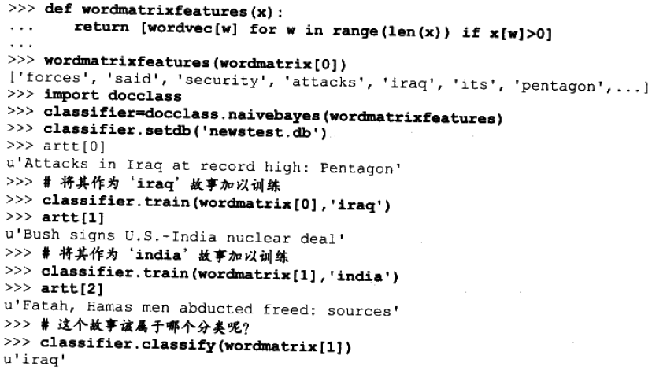
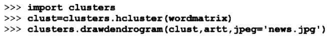
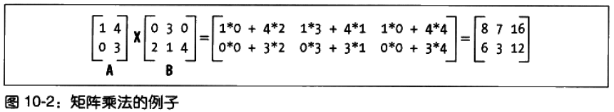
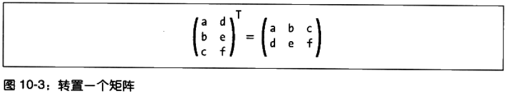
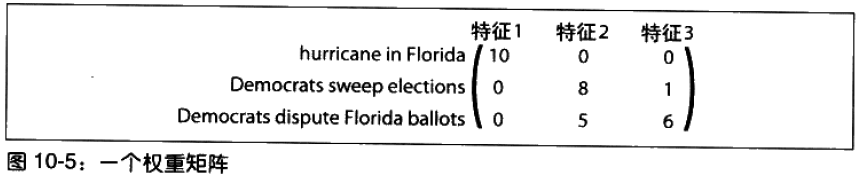
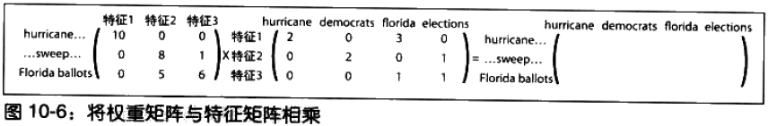

# 寻找独立特征 #

**本章将研究如何在数据集并未明确标识结果的前提下，从中提取出重要的潜在特征**。

和聚类一样，这些方法的目的**不是为了预测**，而是要尝试对数据进行特征识别，并告知值得关注的重要的信息。

**特征提取**是这种思想更为一般的表现形式；它会尝试从数据集中寻找新的数据行，将这些新找到的数据行加以组合，就可以重新构造数据集。

和原始数据集不同，位于新数据集中的每一行数据并不属于某个聚类，而是由若干特征的组合构造而成的

特征提取的应用：

1. 对重复出现于一组文档中的**单词使用模式**word-usage patterns 进行识别，这可帮助我们有效地识别出，以不同组合形式独立出现于各个文档中的主题。
2. 股票市场数据，假设这些数据背后潜藏着诸多原因，正是这些原因共同组合的结果，导致了证券市场的格局。可以将同样的算法用于这些数据，寻找数据背后的原因，以及它们各自对结果所构成的影响。

## 搜集一组新闻 ##

### 选择新闻来源 ###

[newsfeatures.py](newsfeatures.py)

	import feedparser
	import re
	
	
	feedlist=['http://today.reuters.com/rss/topNews',
	          'http://today.reuters.com/rss/domesticNews',
	          'http://today.reuters.com/rss/worldNews',
	          'http://hosted.ap.org/lineups/TOPHEADS-rss_2.0.xml',
	          ...
	          'http://www.foxnews.com/xmlfeed/rss/0,4313,81,00.rss',
	          'http://rss.cnn.com/rss/edition.rss',
	          'http://rss.cnn.com/rss/edition_world.rss',
	          'http://rss.cnn.com/rss/edition_us.rss']

### 下载新闻来源 ###

特征提取算法接受一个大型的数字矩阵，其中的每一行代表一个数据项，而每一列则代表数据项的一个属性。

在本例中，**行**对应各类文章，**列**对应于单词，而**矩阵中的每一个数字**则代表了某个单词在一篇给定文章中出现的次数。

	# 删除文章中所有的图片和HTML标记
	def stripHTML(h):
	  p=''
	  s=0
	  for c in h:
	    if c=='<': s=1
	    elif c=='>':
	      s=0
	      p+=' '
	    elif s==0: p+=c
	  return p
	
	# 拆分文本中的单词
	def separatewords(text):
	  splitter=re.compile('\\W*')
	  return [s.lower() for s in splitter.split(text) if len(s)>3]

	# 从信息源提取必要的信息
	def getarticlewords():
	  allwords={}
	  articlewords=[]
	  articletitles=[]
	  ec=0
	  # Loop over every feed
	  for feed in feedlist:
	    f=feedparser.parse(feed)
	    
	    # Loop over every article
	    for e in f.entries:
	      # Ignore identical articles
	      if e.title in articletitles: continue
	      
	      # Extract the words
	      txt=e.title.encode('utf8')+stripHTML(e.description.encode('utf8'))
	      words=separatewords(txt)
	      articlewords.append({})
	      articletitles.append(e.title)
	      
	      # Increase the counts for this word in allwords and in articlewords
	      for word in words:
	        allwords.setdefault(word,0)
	        allwords[word]+=1
	        articlewords[ec].setdefault(word,0)
	        articlewords[ec][word]+=1
	      ec+=1
	  return allwords,articlewords,articletitles

getarticlewords函数返回值介绍：

- allwords记录单词在所有文章中被使用的次数；
- articlewords单词在每篇文章中出现的次数，对应**矩阵中的数字**；
- articletitles文章标题的列表，对应**矩阵的行**。

### 转换成矩阵 ###

	def makematrix(allw,articlew):
	  wordvec=[]
	  
	  # Only take words that are common but not too common
	  for w,c in allw.items():
	    if c>3 and c<len(articlew)*0.6:
	      wordvec.append(w) 
	  
	  # Create the word matrix
	  l1=[[(word in f and f[word] or 0) for word in wordvec] for f in articlew]
	  return l1,wordvec

运行代码

wordmatrix就是想要的**矩阵**，wordvec就是对应**矩阵的列**

## 先前的方法 ##

讨论先前方法只为了比较。

### 贝叶斯分类 ###

贝叶斯分类是一种监督学习法。如果想要尝试使用贝叶斯分类器，首先必须要对某几个样本故事进行分类，以供分类器训练之用。随后，分类器才能将后续故事放入先前定义好的分类中。

除了须要在开始阶段接受训练这个明显的**缺点**外，这种方法还有一个**局限**：开发人员必须确定所有不同的分类。

迄今为止我们见过的所有分类器，如决策树和支持向量机，在面对这样的数据集时都存在同样的限制。

最终，贝叶斯分类器会掌握所有的主题，但是因为它要求在每个主题上都要训练若干个样本，所以**这种分类器更加适合**与类别较少，而每个类别包含的样本数较多的情况。

### 聚类 ###

聚类是另一个非监督算法。

主题相近的新闻故事被分到一起。因为不同的新闻出版社往往使用相近的语言来报道完全相同的东西。

但是，按部就班地将新闻故事逐一放入各个“桶buckets”，不一定能得到准确的结果。有时可能将一篇健康类文章和跑道杀人犯的文章混为一谈。

有时，新闻文章和人一样也是不可拆分的，必须将其视作独一无二的整体才行。

## 非负矩阵因式分解 ##

### 矩阵数据简介 ###

- 矩阵乘法

- 矩阵装置

### 这与文章矩阵有何关系 ###

我们已有一个带单词计数信息的文章矩阵。

目标：对文章矩阵进行因式分解，即，找到两个更少的矩阵，使得二者相乘以得到原来的矩阵。

这两个矩阵分别是：

1. 特征矩阵
2. 权重矩阵

#### 特征矩阵 ####

在该矩阵中，每个**特征**对应**一行**，每个**单词**对应一**列**。**矩阵中的数字**代表了某个单词相对于**某个特征的重要程度**。

由于每个特征都应该对应于在一组文章中出现的某个主题，因此假如有一篇文章报道了一个新的电视秀节目，那么也许会期望这篇文章相对于单词“ television”能够有一个较高的权重值。

### 权重矩阵 ###

该矩阵的作用是将特征映射到文章矩阵。其中每一**行**对应于**一篇文章**，每一**列**对应于一个**特征**。**矩阵中的数字**代表了，将每个特征应用于**每篇文章的程度**。

### 这两矩阵相乘 ###

权重矩阵与特征矩阵相乘，就可重新得到文章的矩阵

如果特征数量与文章数量恰好相等，那么最理想的结果就是能够为每一篇文章都找到一个与之完美匹配的特征。

**在此处使用矩阵因式分解的目的，是为了缩减观测数据(本例中为文章)的集合规模，并且保证缩减之后足以反映某些共性特征**。

理想情况下，这个相对较小的特征集能够与不同的权重值相结合，从而完美地重新构造出原始的数据集。但在现实中这种可能性是非常小的，因此算法的目标是要尽可能地重新构造出原始数据集来。

---

**非负矩阵因式分解**之所以如此称呼，是因为其所返回的特征和权重都是非负值。

在现实中，这意味着所有的特征值都必须是正数或零，这一点对于本例子而言是毫无疑问的，因为单词在一篇文章中出现的次数是不可能为负的。

同时，这也意味着特征是不能做减法的(即从某些特征中去掉一部分其他的特征)——如果明确排除掉某些单词，则NMF将无法找到有效解。尽管这样的约束也许会阻碍算法得到最佳的因式分解，但是其结果却往往更易于理解，

### 使用NumPy ###

NumPy提供支持矩阵操作的函数，它并有高性能著称

创建矩阵

	>>> from numpy import *
	>>> l1=[[1,2,3],[4,5,6]]
	>>> l1
	[[1, 2, 3], [4, 5, 6]]
	>>> m1=matrix(l1)
	>>> m1
	matrix([[1, 2, 3],
	        [4, 5, 6]])
	>>> m2=matrix([[1,2],[3,4],[5,6]])
	>>> m2
	matrix([[1, 2],
	        [3, 4],
	        [5, 6]])

---

矩阵乘法和矩阵转置

	>>> m1*m2
	matrix([[22, 28],
	        [49, 64]])
	>>> transpose(m1*m2)
	matrix([[22, 49],
	        [28, 64]])
	>>> 

---

shape返回矩阵的函数与列数，这遍历矩阵中的元素是很有用的。

	>>> shape(m1)
	(2L, 3L)
	>>> shape(m2)
	(3L, 2L)
	>>> 

---

NumPy提供一个高效的数组对象。

矩阵与高效数组相互转换。

但进行乘法运算时，数组的行为与矩阵有所不同；数组仅当彼此拥有完全相同的形式时才可以相乘，并且其运算规则是将一个数组中的每个值与另一个数组中的对应值相乘。

	>>> a1=m1.A
	>>> a1
	array([[1, 2, 3],
	       [4, 5, 6]])
	>>> a2=array([[1,2,3],[1,2,3]])
	>>> a1*a2
	array([[ 1,  4,  9],
	       [ 4, 10, 18]])
	>>> 

### 非负矩阵因式分解算法实现 ###

## 结果呈现 ##

## 利用股票市场的数据 ##

