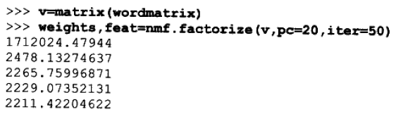
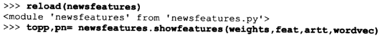
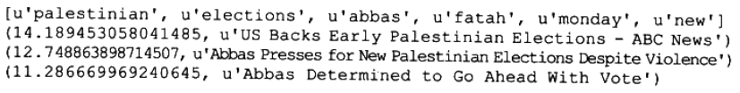
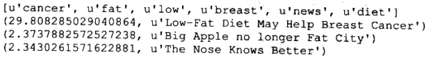
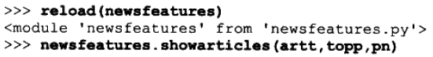
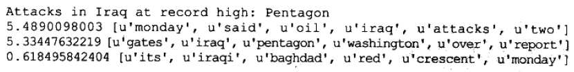
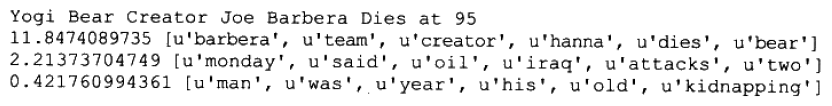
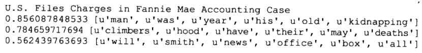

# 寻找独立特征 #

**本章将研究如何在数据集并未明确标识结果的前提下，从中提取出重要的潜在特征**。

和聚类一样，这些方法的目的**不是为了预测**，而是要尝试对数据进行特征识别，并告知值得关注的重要的信息。

**特征提取**是这种思想更为一般的表现形式；它会尝试从数据集中寻找新的数据行，将这些新找到的数据行加以组合，就可以重新构造数据集。

和原始数据集不同，位于新数据集中的每一行数据并不属于某个聚类，而是由若干特征的组合构造而成的

特征提取的应用：

1. 对重复出现于一组文档中的**单词使用模式**word-usage patterns 进行识别，这可帮助我们有效地识别出，以不同组合形式独立出现于各个文档中的主题。
2. 股票市场数据，假设这些数据背后潜藏着诸多原因，正是这些原因共同组合的结果，导致了证券市场的格局。可以将同样的算法用于这些数据，寻找数据背后的原因，以及它们各自对结果所构成的影响。

## 搜集一组新闻 ##

### 选择新闻来源 ###

[newsfeatures.py](newsfeatures.py)

	import feedparser
	import re
	
	
	feedlist=['http://today.reuters.com/rss/topNews',
	          'http://today.reuters.com/rss/domesticNews',
	          'http://today.reuters.com/rss/worldNews',
	          'http://hosted.ap.org/lineups/TOPHEADS-rss_2.0.xml',
	          ...
	          'http://www.foxnews.com/xmlfeed/rss/0,4313,81,00.rss',
	          'http://rss.cnn.com/rss/edition.rss',
	          'http://rss.cnn.com/rss/edition_world.rss',
	          'http://rss.cnn.com/rss/edition_us.rss']

### 下载新闻来源 ###

特征提取算法接受一个大型的数字矩阵，其中的每一行代表一个数据项，而每一列则代表数据项的一个属性。

在本例中，**行**对应各类文章，**列**对应于单词，而**矩阵中的每一个数字**则代表了某个单词在一篇给定文章中出现的次数。

	# 删除文章中所有的图片和HTML标记
	def stripHTML(h):
	  p=''
	  s=0
	  for c in h:
	    if c=='<': s=1
	    elif c=='>':
	      s=0
	      p+=' '
	    elif s==0: p+=c
	  return p
	
	# 拆分文本中的单词
	def separatewords(text):
	  splitter=re.compile('\\W*')
	  return [s.lower() for s in splitter.split(text) if len(s)>3]

	# 从信息源提取必要的信息
	def getarticlewords():
	  allwords={}
	  articlewords=[]
	  articletitles=[]
	  ec=0
	  # Loop over every feed
	  for feed in feedlist:
	    f=feedparser.parse(feed)
	    
	    # Loop over every article
	    for e in f.entries:
	      # Ignore identical articles
	      if e.title in articletitles: continue
	      
	      # Extract the words
	      txt=e.title.encode('utf8')+stripHTML(e.description.encode('utf8'))
	      words=separatewords(txt)
	      articlewords.append({})
	      articletitles.append(e.title)
	      
	      # Increase the counts for this word in allwords and in articlewords
	      for word in words:
	        allwords.setdefault(word,0)
	        allwords[word]+=1
	        articlewords[ec].setdefault(word,0)
	        articlewords[ec][word]+=1
	      ec+=1
	  return allwords,articlewords,articletitles

getarticlewords函数返回值介绍：

- allwords记录单词在所有文章中被使用的次数；
- articlewords单词在每篇文章中出现的次数，对应**矩阵中的数字**；
- articletitles文章标题的列表，对应**矩阵的行**。

### 转换成矩阵 ###

	def makematrix(allw,articlew):
	  wordvec=[]
	  
	  # Only take words that are common but not too common
	  for w,c in allw.items():
	    if c>3 and c<len(articlew)*0.6:
	      wordvec.append(w) 
	  
	  # Create the word matrix
	  l1=[[(word in f and f[word] or 0) for word in wordvec] for f in articlew]
	  return l1,wordvec

运行代码

wordmatrix就是想要的**矩阵**，wordvec就是对应**矩阵的列**

## 先前的方法 ##

讨论先前方法只为了比较。

### 贝叶斯分类 ###

贝叶斯分类是一种监督学习法。如果想要尝试使用贝叶斯分类器，首先必须要对某几个样本故事进行分类，以供分类器训练之用。随后，分类器才能将后续故事放入先前定义好的分类中。

除了须要在开始阶段接受训练这个明显的**缺点**外，这种方法还有一个**局限**：开发人员必须确定所有不同的分类。

迄今为止我们见过的所有分类器，如决策树和支持向量机，在面对这样的数据集时都存在同样的限制。

最终，贝叶斯分类器会掌握所有的主题，但是因为它要求在每个主题上都要训练若干个样本，所以**这种分类器更加适合**与类别较少，而每个类别包含的样本数较多的情况。

### 聚类 ###

聚类是另一个非监督算法。

主题相近的新闻故事被分到一起。因为不同的新闻出版社往往使用相近的语言来报道完全相同的东西。

但是，按部就班地将新闻故事逐一放入各个“桶buckets”，不一定能得到准确的结果。有时可能将一篇健康类文章和跑道杀人犯的文章混为一谈。

有时，新闻文章和人一样也是不可拆分的，必须将其视作独一无二的整体才行。

## 非负矩阵因式分解 ##

### 矩阵数据简介 ###

- 矩阵乘法

- 矩阵装置

### 这与文章矩阵有何关系 ###

我们已有一个带单词计数信息的文章矩阵。

目标：对文章矩阵进行因式分解，即，找到两个更少的矩阵，使得二者相乘以得到原来的矩阵。

这两个矩阵分别是：

1. 特征矩阵
2. 权重矩阵

#### 特征矩阵 ####

在该矩阵中，每个**特征**对应**一行**，每个**单词**对应一**列**。**矩阵中的数字**代表了某个单词相对于**某个特征的重要程度**。

由于每个特征都应该对应于在一组文章中出现的某个主题，因此假如有一篇文章报道了一个新的电视秀节目，那么也许会期望这篇文章相对于单词“ television”能够有一个较高的权重值。

### 权重矩阵 ###

该矩阵的作用是将特征映射到文章矩阵。其中每一**行**对应于**一篇文章**，每一**列**对应于一个**特征**。**矩阵中的数字**代表了，将每个特征应用于**每篇文章的程度**。

### 这两矩阵相乘 ###

权重矩阵与特征矩阵相乘，就可重新得到文章的矩阵

如果特征数量与文章数量恰好相等，那么最理想的结果就是能够为每一篇文章都找到一个与之完美匹配的特征。

**在此处使用矩阵因式分解的目的，是为了缩减观测数据(本例中为文章)的集合规模，并且保证缩减之后足以反映某些共性特征**。

理想情况下，这个相对较小的特征集能够与不同的权重值相结合，从而完美地重新构造出原始的数据集。但在现实中这种可能性是非常小的，因此算法的目标是要尽可能地重新构造出原始数据集来。

---

**非负矩阵因式分解**之所以如此称呼，是因为其所返回的特征和权重都是非负值。

在现实中，这意味着所有的特征值都必须是正数或零，这一点对于本例子而言是毫无疑问的，因为单词在一篇文章中出现的次数是不可能为负的。

同时，这也意味着特征是不能做减法的(即从某些特征中去掉一部分其他的特征)——如果明确排除掉某些单词，则NMF将无法找到有效解。尽管这样的约束也许会阻碍算法得到最佳的因式分解，但是其结果却往往更易于理解，

### 使用NumPy ###

NumPy提供支持矩阵操作的函数，它并有高性能著称

创建矩阵

	>>> from numpy import *
	>>> l1=[[1,2,3],[4,5,6]]
	>>> l1
	[[1, 2, 3], [4, 5, 6]]
	>>> m1=matrix(l1)
	>>> m1
	matrix([[1, 2, 3],
	        [4, 5, 6]])
	>>> m2=matrix([[1,2],[3,4],[5,6]])
	>>> m2
	matrix([[1, 2],
	        [3, 4],
	        [5, 6]])

---

矩阵乘法和矩阵转置

	>>> m1*m2
	matrix([[22, 28],
	        [49, 64]])
	>>> transpose(m1*m2)
	matrix([[22, 49],
	        [28, 64]])
	>>> 

---

shape返回矩阵的函数与列数，这遍历矩阵中的元素是很有用的。

	>>> shape(m1)
	(2L, 3L)
	>>> shape(m2)
	(3L, 2L)
	>>> 

---

NumPy提供一个高效的数组对象。

矩阵与高效数组相互转换。

但进行乘法运算时，数组的行为与矩阵有所不同；数组仅当彼此拥有完全相同的形式时才可以相乘，并且其运算规则是将一个数组中的每个值与另一个数组中的对应值相乘。

	>>> a1=m1.A
	>>> a1
	array([[1, 2, 3],
	       [4, 5, 6]])
	>>> a2=array([[1,2,3],[1,2,3]])
	>>> a1*a2
	array([[ 1,  4,  9],
	       [ 4, 10, 18]])
	>>> 

### 非负矩阵因式分解算法实现 ###

[nnmf.py](nnmf.py)

通过计算最佳的特征矩阵和权重矩阵，算法尝试尽最可能大地来重新构造文章矩阵。

定义一函数衡量最终结果与理想结果的接近程度加。

	from numpy import *
	
	def difcost(a,b):
	  dif=0
	  for i in range(shape(a)[0]):
	    for j in range(shape(a)[1]):
	      # Euclidean Distance
	      dif+=pow(a[i,j]-b[i,j],2)
	  return dif

使用**乘法更新算法multiplicative update rules**逐步地更新矩阵，以使成本函数的计算值逐步降低。

这法则产生了4个新的**更新矩阵update matrices**，最初的文章矩阵称为数据矩阵。

- hn 经**转置**后的**权重矩阵**与**数据矩阵**相**乘**得到的矩阵。
- hd 经**转置**后的**权重矩阵**与**原权重矩阵**相乘，再与**特征矩阵**相**乘**得到的矩阵。
- wn **数据矩阵**与经**转置**后的**特征矩阵**相**乘**得到的矩阵。
- wd **权重矩阵**与**特征矩阵**相乘，再与经**转置**后的**特征矩阵**相乘得到的矩阵。

为了更新特征矩阵和权重矩阵，首先将上述所有**矩阵都转换成数组**。然后将特征矩阵中的每一个值与m中的对应值相乘，并除以中的对应值。类似地，我们再将权重矩阵中的每一个值与wm中的对应值相乘，并除以wd中的对应值。

	def factorize(v,pc=10,iter=50):
	  ic=shape(v)[0]
	  fc=shape(v)[1]
	
	  # Initialize the weight and feature matrices with random values
	  w=matrix([[random.random() for j in range(pc)] for i in range(ic)])
	  h=matrix([[random.random() for i in range(fc)] for i in range(pc)])
	
	  # Perform operation a maximum of iter times
	  for i in range(iter):
	    wh=w*h
	    
	    # Calculate the current difference
	    cost=difcost(v,wh)
	    
	    if i%10==0: print cost
	    
	    # Terminate if the matrix has been fully factorized
	    if cost==0: break
	    
	    # Update feature matrix
	    hn=(transpose(w)*v)
	    hd=(transpose(w)*w*h)
	  
	    h=matrix(array(h)*array(hn)/array(hd))
	
	    # Update weights matrix
	    wn=(v*transpose(h))
	    wd=(w*h*transpose(h))
	
	    w=matrix(array(w)*array(wn)/array(wd))  
	    
	  return w,h

上述函数要求我们指定希望找到的特征数。
有时，我们的确清楚须要寻找的特征数量(比如，在一段录音中的两种声音，或是当天的五大新闻主题)；
但有时，我们却无法得知到底要指定多少特征。
没有一种通用的方法可以自动确定正确的特征数目，但是借助实验手段可以找到一个合理的范围。

---

运行代码

	>>> m1=matrix([[1,2,3],[4,5,6]])
	>>> m2=matrix([[1,2],[3,4],[5,6]])
	>>> m1,m2
	(matrix([[1, 2, 3],
	        [4, 5, 6]]), matrix([[1, 2],
	        [3, 4],
	        [5, 6]]))
	>>> w,h=factorize(m1*m2, pc=3, iter=100)
	7526.5611047864
	11.803496635111697
	3.0705797275039375
	0.9981348560094103
	0.3411116092260533
	0.11708284052890991
	0.03994764099256172
	0.013542324988869998
	0.004569091620798321
	0.0015368023388649718
	>>> w*h
	matrix([[21.98368154, 28.0128059 ],
	        [49.00734664, 63.99437386]])
	>>> m1*m2
	matrix([[22, 28],
	        [49, 64]])
	>>> 

用于前面的例子。

最后的矩阵并不理想，后章节分析

## 结果呈现 ##

**特征矩阵**中的每个特征都有一个权重，它是用来指示每个单词应用到该特征的程度的，因此可以尝试列出每一个特征中的前5或前10个单词来，看看在该特征中哪几个单词的重要程度是最高的。

在**权重矩阵**里对应列上的数字告诉我们的，是该特征应用于每一篇文章的权重值。

**因此假如列出前三篇文章的权重，借此来考査该项特征应用于所有文章的情况，同样也是很有意义的**。

	# w为权重矩阵，h为特征矩阵
	def showfeatures(w,h,titles,wordvec,out='features.txt'): 
	  outfile=file(out,'w')  
	  pc,wc=shape(h)
	  toppatterns=[[] for i in range(len(titles))]
	  patternnames=[]
	  
	  # Loop over all the features
	  # pc为特征矩阵行数
	  for i in range(pc):
	    slist=[]
	    # Create a list of words and their weights
	    # wc为特征矩阵列数，列出单词
	    for j in range(wc):
	      slist.append((h[i,j],wordvec[j]))
	    # Reverse sort the word list
	    slist.sort()
	    slist.reverse()
	    
	    # Print the first six elements
	    # 根据特征矩阵中的数，列出前6名单词
	    n=[s[1] for s in slist[0:6]]
	    outfile.write(str(n)+'\n')
	    patternnames.append(n)

		# ---

	    # Create a list of articles for this feature
	    flist=[]
	    for j in range(len(titles)):
	      # Add the article with its weight
	      # w为权重矩阵
	      flist.append((w[j,i],titles[j]))
	      toppatterns[j].append((w[j,i],i,titles[j]))
	    
	    # Reverse sort the list
	    flist.sort()
	    flist.reverse()
	    
	    # Show the top 3 articles
	    for f in flist[0:3]:
	      outfile.write(str(f)+'\n')
	    outfile.write('\n')
	
	  outfile.close()
	  # Return the pattern names for later use
	  return toppatterns,patternnames

运行代码

[输出结果文件features.txt](features.txt)

---

例一分析

上述特征清晰地列出了一组与巴勒斯坦选举有关的单词，而且还列出了一组与特征所要表达的主题关系密切的文章。

由于生成这些结果的依据来自于文章的标题和一部分正文，因此可以看到，第1篇文章和第3篇文章都与上述特征紧密相关，即便这两者的标题中并没有任何单词是一样的。另外，因为单词的重要性是根据其在大量文章中被引用的次数而得到的，所以单词“ palestinian”和“ elections”位于最前列。

---

有些特征并没有遗嘱明确无疑的文章与之关联，但是它们仍然为我们提供了颇有价值的结果。

例二分析

显然，此处的特征与第一篇介绍乳癌的文章有着极为紧密的关系。

然而，后面几篇关系不是那么紧密的文章是与健康相关的，这些文章中有一部分单词与第一篇文章是相同的。

### 以文章的形式呈现 ###

另一种呈现方式，列出**每篇文章及应用于该片文章及应用于该文章的前三项特征**。

借此可以判断出，一篇文章是由相同数量的几个主题共同构成的，还是由某个权重很高的主题单独构成的。

	def showarticles(titles,toppatterns,patternnames,out='articles.txt'):
	  outfile=file(out,'w')  
	  
	  # Loop over all the articles
	  for j in range(len(titles)):
	    outfile.write(titles[j].encode('utf8')+'\n')
	    
	    # Get the top features for this article and
	    # reverse sort them
	    toppatterns[j].sort()
	    toppatterns[j].reverse()
	    
	    # Print the top three patterns
	    for i in range(3):
	      outfile.write(str(toppatterns[j][i][0])+' '+
	                    str(patternnames[toppatterns[j][i][1]])+'\n')
	    outfile.write('\n')
	    
	  outfile.close()

运行代码

[输出结果文件articles.txt](articles.txt)

---

例一分析

很显然，这两个特征都是与Iraq相关的，但这篇文章又不是非常的典型，因为文中并没有涉及“oil”或“ gates”。

通过构造出可以**组合使用**的，同时又不是专门针对于某篇文章裁剪得来的模式，我们的算法能够以较少的模式来覆盖更多的文章。

---

例二分析

文章有一个权重值很高的特征，但是这特征却无法应用于其他任何文章。

因为我们所使用的模式非常少，所以也有可能会出现少量与其他任何文章没有什么相似的文章，并且得不出有关于它们自身的模式来。

---

例三分析

在例子中位于最前面的几个特征与文章并没有什么相关性，看上去几乎都是随机产生的。因权重值非常小，所以该文章不被真正运用到这些特征。

## 利用股票市场的数据 ##

### 什么是成交量 ###

### 从雅虎API下载数据 ###

### 准备矩阵 ###

### 运行NNMF ###

### 结果呈现 ###

