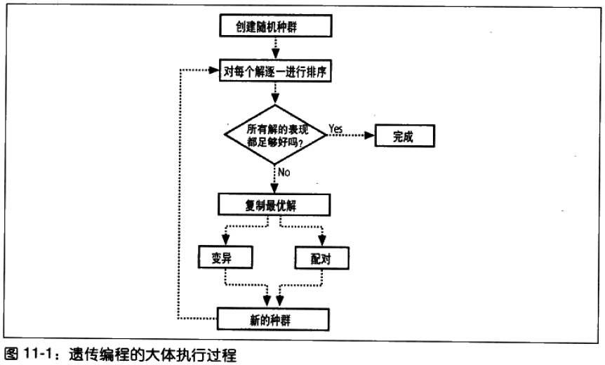
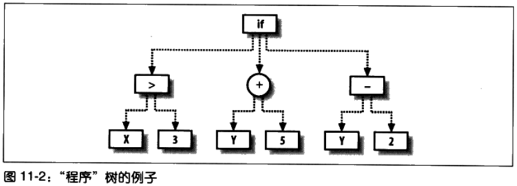
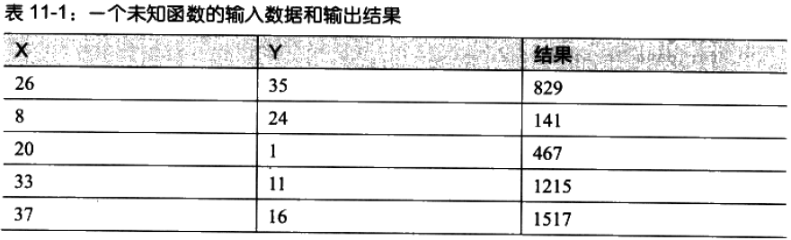
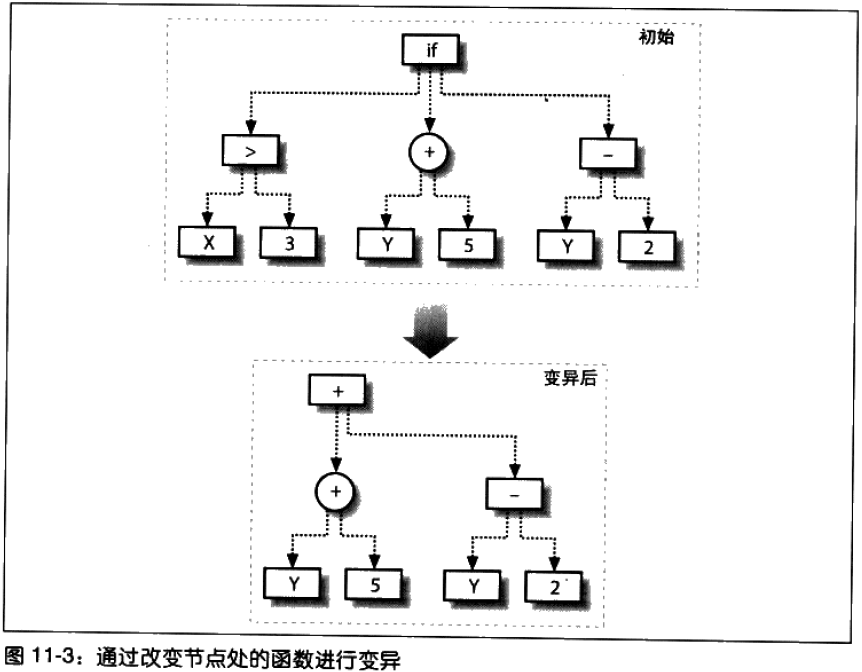
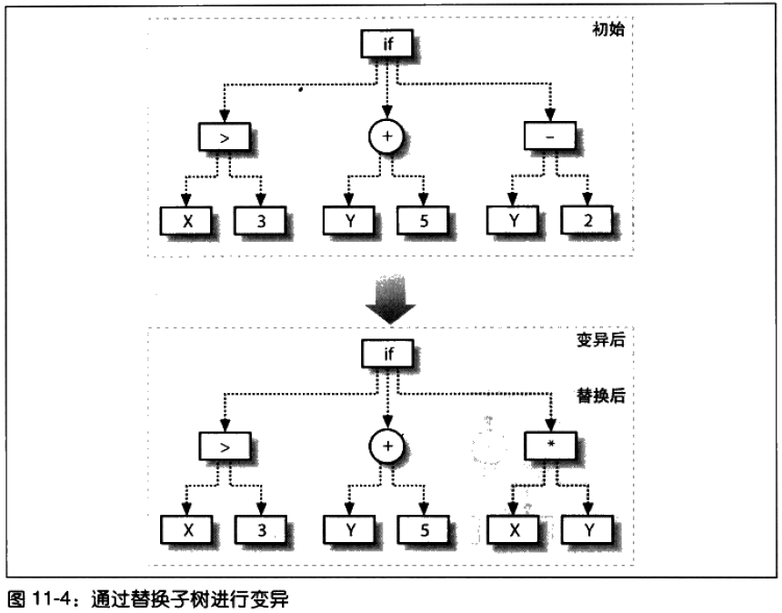
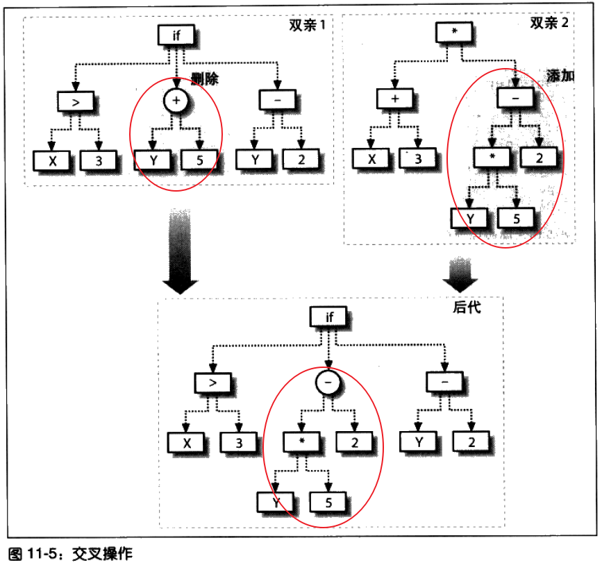
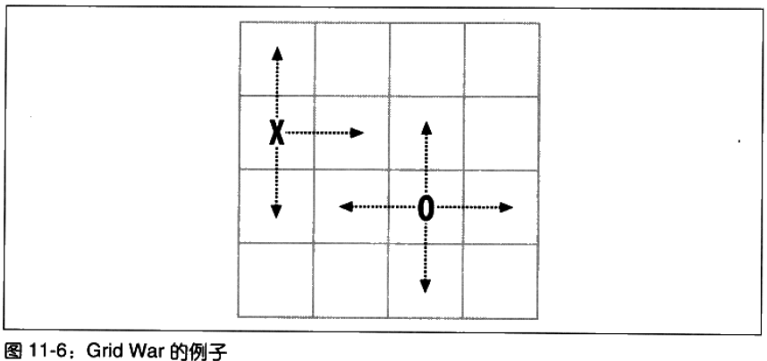

# 智能进化 #

[1.什么是遗传编程](#什么是遗传编程)

[1.1.遗传编程与遗传算法](#遗传编程与遗传算法)

[1.2.遗传编程的成功之处](#遗传编程的成功之处)

[2.将程序以树形方式表示](#将程序以树形方式表示)

[2.1.在Python中表现树](#在python中表现树)

[2.2.树的构造和评估](#树的构造和评估)

[2.3.程序的展现](#程序的展现)

[3.构造初始种群](#构造初始种群)

[4.测试题解](#测试题解)

[4.1.一个简单的数学测试](#一个简单的数学测试)

[4.2.衡量程序的好坏](#衡量程序的好坏)

[5.对程序进行变异](#对程序进行变异)

[6.交叉](#交叉)

[7.构筑环境](#构筑环境)

[7.1.多样性的重要价值](#多样性的重要价值)

[8.一个简单的游戏](#一个简单的游戏)

[8.1.循环赛——进化](#循环赛进化)

[8.2.真人对抗](#真人对抗)

[9.更多可能性](#更多可能性)

[9.1.更多数值型函数](#更多数值型函数)

[9.2.记忆力](#记忆力)

[9.3.不同数据类型](#不同数据类型)

[10.小结](#小结)

在先前的章节中，在面对每一个问题时，都采用了一种最适合与解决该问题的算法。

在某些例子，还需对参数进行调整，或者借助于优化手段来找出一个满意的参数集来。

**目的**：编写一个程序，尝试自动构造出解决某一问题的最佳程序来。因而本质上看，将构造出**一个能构造算法的算法**。

本章将采用一种称为**遗传编程genetic programming**

本章与其他章节不同，不再使用API或公共数据集，同时因为，能够根据与大量人群的交互对自身作出修改的程序，是一种极为有趣且类型迥异的集体智慧。

本章例子：

1. 根据给定的数据集重新构造一个数学函数
2. 在一个简单的棋类游戏中自动生成一个AI玩家。

计算能力computational power才是真正制约遗传编程问题解决能力的**唯一因素**。

## 什么是遗传编程 ##

**遗传编程**是受到生物进化理论的启发而形成的一种机器学习技术。

通常工作方式是：

1. 以一大堆程序（**种群**）开始——这些程序可以随机产生的，也可以是人为设计的hand-designed，并且它们被认为是在某种程度上的一组优解good solutions；
2. 随后，这些程序将会在一个由**用户定义的任务user-defined task**中展开竞争。 此处所谓的任务或许是一种竞赛game，各个程序在竞赛中彼此直接展开竞争，或者也有可能是一种个体测试，其目的是要测出哪个程序的执行效果更好。
3. 待竟争结東之后，会得到一个针对所有程序的评价列表，该列表按程序的表现成绩从最好到最差顺次排列。

接下来，也正是进化得以体现的地方，算法可以采取**两种**不同的方式对表现最好的程序实施复制和修改：

1. 比较简单的一种方式称为**变异**(mutation)，算法会对程序的某些部分以随机的方式稍作修改，希望借此能够产生一个更好的题解来。
2. 另一种修改程序的方式称为**交叉**(crossover)，有时也称为配对(breeding)，其做法是：先将某个最优程序的一部分去掉，然后再选择其他最优程序的某一部分来替代之。

这样的复制和修改过程会产生出许多新的程序来，这些程序基于原来的最优程序，但又不同于它们。

---

在每一个复制和修改的阶段，算法都会借助于一个适当的函数对程序的质量作出**评估**。

因为种群的大小始终是保持不变的，所以许多表现极差的程序都会从种群中被剔除出去，从而为新的程序腾出空间。

新的种群被称为“下一代”，而整个过程则会一直不断地重复下去。因为最优秀的程序一直被保留了下来，而且算法又是在此基础上进行复制和修改的，所以我们有理由相信，每一代的表现都会比前一代更加出色；这在很大程度上有点类似于人类世界中，年轻一代比他们的父辈更聪明。

---

创建新一代的过程直到**终止条件**满足才会结束，具体问题的不同，可能的终止条件也不同。

- 找到了最优解。
- 找到了表现足够好的解。
- 题解在历经数代之后都没有得到任何改善。
- 繁衍的代数达到了规定的限制。

对于某些问题而言，

- 比如确定一个数学函数，令其将一组输入正确地映射到某个输出一要找到最优解是有可能的。但是对于其他向题，
- 比如棋类游戏，也许根本就不存在最优解，这是因为题解的质量依赖于程序的对抗者所采取的策略。

### 遗传编程与遗传算法 ###

**遗传算法genetic algorithms**是一种**优化技术**，它汲取了生物进化中优胜劣汰的思想。

就优化技术而言，不论是何种形式的优化，算法或度量都是事先选择好了的，而我们所要做的工作只是**尝试为其找到最佳参数**。

和优化算法一样，遗传编程也需要一种方法来度量题解的优劣程度；但与优化算法**不同**的是，此处的题解并**不仅仅是一组用于给定算法的参数而已**。

相反，在遗传编程中，连同算法本身及其所有的参数，都是按照优胜劣汰的进化规律( evolutionary pressure)自动设计得到的。

### 遗传编程的成功之处 ###

遺传编程自20世纪80年代以来就一直存在着，但是它的**计算量非常庞大**，而且以那个时候可以获得的计算能力而言，人们是不可能将其用于稍复杂一些的问题的。然而，随着计算机的执行速度越来越快，人们已经逐渐能够将遺传编程应用到复杂问题上了。正因为如此、许多以前的专利发明，借助遺传编程得到了再次挖掘和进一步的改善，而近年来也有不少可以获得专利的新发明，都是借助计算机利用遗传编程设计出来的。

人们已经将遺传编程技术广泛应用于许多领域：

1. NASA的天线设计
2. 光子晶体领域光学领域
3. 量子计算系统，
4. 应用于许多竟技类游戏程序的开发上，比如:国际象棋和西洋双陆棋。 1998年，来自卡耐基梅隆大学的研究者率领一支机器人队伍间入了Robo Cup机器人世界杯赛，并且在众多参赛者中排名居中，这支队伍就是完全利用遗传编桯技术打造的。
5. ...

## 将程序以树形方式表示 ##

为了构造出能够用以测试、变异和配对的程序，我们需要一种方法能够在 Python代码中描述和运行这些程序。这种描述方法自身必须是易于修改的，而且更重要的一点是，它必须保证所描述的是一个实实在在的程序这意味着，**试图将随机生成的字符串作为 Python代码的做法是行不通的**。

为了描述遗传编程中的程序，应用最为普遍的是**树形表示法**。

大多数编程语言，在编译或解释时，首先都会被转换成一棵解析树，这棵树非常类似于此处我们将要用到的树。(Lisp編程语言及其变体，本质上就是一种直接访问解析树的方法)。

树上的节点有可能是**枝节点**，代表了应用于其子节点之上的**某一项操作**，也有可能是**叶节点**，比如一个带常量值的参数。

例如:

1. 图上的圆形节点代表了应用于两个分支(本例中为Y值和5)之上的求和操作。一旦求出了此处的计算值，就会将计算结果赋予上方的节点处，相应地，这一计算过程会一直向下传播。
2. 树上有一个节点的操作为“if"，这表示:如果该节点左侧分支的计算结果为真，则它将返回中间的分支，如果不为真，则返回右侧的分支。

对整棵树进行遍历，你就会发现它相当于下面这个Python函数:

	def func(x,y):
		if x > 3:
			return y + 5
		else:
			return y - 2

构造树还有两点需要考虑的是：

1. 构成这棵树的节点可以是非常复杂的函数，如：
	- 距离度量
	- 高斯分布
2. 通过引用树上位置相对较高的节点，可以用**递归**的方式构造树。
 
采用这样的方式来构造树可以实现循环及其它更为复杂的控制结构。

### 在Python中表现树 ###

	from random import random,randint,choice
	from copy import deepcopy
	from math import log
	
	# 一个封装类，对应于“函数型”节点上的函数。
	class fwrapper:
	  def __init__(self,function,childcount,name):
		# 函数本身
	    self.function=function
		# 函数接受的参数的个数
	    self.childcount=childcount
		# 函数名称
	    self.name=name
	
	# 对应于函数型节点（即带子节点的节点）。以一个fwrapper类对其进行初始化。当evaluate被调用时，会对各个子结点进行求值运算，然后再将函数本身应用于求得结果。
	class node:
	  def __init__(self,fw,children):
	    self.function=fw.function
	    self.name=fw.name
	    self.children=children
	
	  def evaluate(self,inp):    
	    results=[n.evaluate(inp) for n in self.children]
	    return self.function(results)
	  def display(self,indent=0):
	    print (' '*indent)+self.name
	    for c in self.children:
	      c.display(indent+1)
	    
	
	# 这个类对应的节点只返回传递给程序的某个参数。其evaluate方法返回的是由idx指定的参数。
	class paramnode:
	  def __init__(self,idx):
	    self.idx=idx
	
	  def evaluate(self,inp):
	    return inp[self.idx]
	  def display(self,indent=0):
	    print '%sp%d' % (' '*indent,self.idx)
	    
	# 返回常量值的节点。其evaluate方法仅返回的是该类被初始化时所传入的值。
	class constnode:
	  def __init__(self,v):
	    self.v=v
	  def evaluate(self,inp):
	    return self.v
	  def display(self,indent=0):
	    print '%s%d' % (' '*indent,self.v)
	    
利用fwrapper构造一组操作函数

	addw=fwrapper(lambda l:l[0]+l[1],2,'add')
	subw=fwrapper(lambda l:l[0]-l[1],2,'subtract') 
	mulw=fwrapper(lambda l:l[0]*l[1],2,'multiply')
	
	def iffunc(l):
	  if l[0]>0: return l[1]
	  else: return l[2]
	ifw=fwrapper(iffunc,3,'if')
	
	def isgreater(l):
	  if l[0]>l[1]: return 1
	  else: return 0
	gtw=fwrapper(isgreater,2,'isgreater')
	
	flist=[addw,mulw,ifw,gtw,subw]

### 树的构造和评估 ###

根据下图构造出程序树

	def exampletree():
	  return node(ifw,[
	                  node(gtw,[paramnode(0),constnode(3)]),
	                  node(addw,[paramnode(1),constnode(5)]),
	                  node(subw,[paramnode(1),constnode(2)]),
	                  ]
	              )

运行代码

	>>> 
	 RESTART: C:\Users\Administrator.USER-20180302VA\Desktop\Lab\ProgrammingCollectiveIntelligence\C11\gp.py 
	>>> exampletree=exampletree()
	>>> exampletree.evaluate([2,3])
	1
	>>> exampletree.evaluate([5,3])
	8
	>>> exampletree.evaluate([5,3,2])
	8
	>>> exampletree.evaluate([5])
	
	Traceback (most recent call last):
	  File "<pyshell#4>", line 1, in <module>
	    exampletree.evaluate([5])
	  File "C:\Users\Administrator.USER-20180302VA\Desktop\Lab\ProgrammingCollectiveIntelligence\C11\gp.py", line 18, in evaluate
	    results=[n.evaluate(inp) for n in self.children]
	  File "C:\Users\Administrator.USER-20180302VA\Desktop\Lab\ProgrammingCollectiveIntelligence\C11\gp.py", line 18, in evaluate
	    results=[n.evaluate(inp) for n in self.children]
	  File "C:\Users\Administrator.USER-20180302VA\Desktop\Lab\ProgrammingCollectiveIntelligence\C11\gp.py", line 31, in evaluate
	    return inp[self.idx]
	IndexError: list index out of range
	>>> 

### 程序的展现 ###

	>>> exampletree.display()
	if
	 isgreater
	  p0
	  3
	 add
	  p1
	  5
	 subtract
	  p1
	  2
	>>> 

## 构造初始种群 ##

尽管为遗传编程手工构造程序是可行的，但是通常的初始种群都是由一组随机程序构成的。

这样做可以使我们的起点变得更低，因为我们**没有必要去设计一组几乎已经将问题完全解决了的程序**。

而且，这样做还可以在初始种群中引入更加丰富的多样性一一由某位编程人员为了解决特定问题而专门设计的一组程序，彼此间很可能会非常相似，尽管这些程序也许会给出几乎正确的答案，但是最终的理想题解很有可能会截然不同。

---

创建一个随机程序的步骤包括：

1. 创建根结点并为其随机指定一个关联函数，
2. 然后再随机创建尽可能多的子节点;
3. 相应地，这些子节点也可能会有它们自己的随机关联子节点。
 和大多数对树进行操作的函数一样，这一过程很容易以递归的形式进行定义。

	# pc给出了程序树所输入参数的个数
	# fpr给出了新建节点数据函数型节点的概率
	# ppr给出了当新建节点不是函数型节点时，其属于paramnode节点的概率
	# maxdepth 最大深度，防止分支不断地生长
	def makerandomtree(pc,maxdepth=4,fpr=0.5,ppr=0.6):
	  if random()<fpr and maxdepth>0:
		# 随机选择一个函数列表中的函数
	    f=choice(flist)
	    children=[makerandomtree(pc,maxdepth-1,fpr,ppr) 
	              for i in range(f.childcount)]
	    return node(f,children)
	  elif random()<ppr:
	    return paramnode(randint(0,pc-1))
	  else:
	    return constnode(randint(0,10))

运行代码

	>>> random1=makerandomtree(2)
	>>> random1.evaluate([7,1])
	14
	>>> random1.evaluate([2,4])
	4
	>>> random2=makerandomtree(2)
	>>> random2.evaluate([5,3])
	0
	>>> random2.evaluate([5,20])
	0
	>>> 

如果一个程序的所有叶节点都是常量，则该程序实际上根本不会接受任何形式的输入参数，因此无论传给它什么样的输入，其结果都一样。

呈现树

	>>> random1.display()
	multiply
	 p0
	 if
	  if
	   isgreater
	    p0
	    p1
	   p0
	   p1
	  2
	  p0
	>>> random2.display()
	isgreater
	 1
	 4
	>>> 

## 测试题解 ##

我们寻找测试题解正确与否的方法，若题解不正确，还可以确知它与正确答案的差距。

### 一个简单的数学测试 ###

尝试重新构造一个简单的数学函数。

的确存在一些函数可以将X与Y映射到上述输出结果一栏，但是没有人告诉我们这个函数到底是什么。

有时，我们需要的仅仅是一个公式而已。

	def hiddenfunction(x,y):
	    return x**2+2*y+3*x+5

构造一个数据集。借助得到的数据集，可以开始对生成的程序进行测试。

	def buildhiddenset():
	  rows=[]
	  for i in range(200):
	    x=randint(0,40)
	    y=randint(0,40)
	    rows.append([x,y,hiddenfunction(x,y)])
	  return rows

运行代码

	>>> hiddenset=buildhiddenset()
	>>> 

我们要真正测试的，是遗传编程是否能够在不知情的前提下重新构造出这一函数来。

### 衡量程序的好坏 ###

	# 看这个程序与代表正确的数据集之间的接近程度
	def scorefunction(tree,s):
	  dif=0
	  for data in s:
	    v=tree.evaluate([data[0],data[1]])
	    dif+=abs(v-data[2])
	  return dif

运行代码

	>>> scorefunction(random1,hiddenset)
	128870
	>>> scorefunction(random2,hiddenset)
	137150
	>>> 

随机函数程序得到值与正确值的差值的绝对值累加得到的值越小，题解表现越好。累加值为0则表示该程序得到的每一项结果都是正确的。

## 对程序进行变异 ##

当表现最好的程序被选定之后，它们就会被复制并修改以进入到下一代。

一个树状程序可以有多种修改方式，如

- 改变节点上的函数，也可以改变节点的分支；

- 利用一棵全新的树来替换某一子树

**变异采用的次数不宜过多**。

例如，不宜对整棵树上的大多数节点都实施变异。相反，可以为任何须要进行修改的节点定义一个相对较小的概率。

从树的根节点开始，如果每次生成的随机数小于该概率值，就以如上所述的某种方式对节点进行变异，否则，就再次对子节点进行调用自身。

为了简单起见，此处给出的代码只实现了第二种变异方式。

	def mutate(t,pc,probchange=0.1):
	  if random()<probchange:
	    return makerandomtree(pc)
	  else:
	    result=deepcopy(t)
	    if hasattr(t,"children"):
	      result.children=[mutate(c,pc,probchange) for c in t.children]
	    return result

运行代码

	>>> muttree=mutate(random1,2)
	>>> muttree.display()
	multiply
	 p0
	 if
	  if
	   isgreater
	    add
	     p1
	     p1
	    p1
	   p0
	   p1
	  2
	  p0
	>>> 

测试程序

	>>> scorefunction(random1,hiddenset)
	128870
	>>> scorefunction(muttree,hiddenset)
	126742
	>>> 

请记住，变异是随机进行的，而且不必非得朝着有利于改善题解的方向进行。

我们只是希望其中的一部分变异能够对最终的结果有所改善。

这种变化过程会一直持续下去，并且在经历过数代之后，终将找到最优解。

## 交叉 ##

另一种修改程序的方法称为交叉或配对。

其做法是:

1. 从众多程序中选出两个表现优异者；
2. 将其组合在一起构造出一个新的程序，通常的组合方式是用一棵树的分支取代另一棵树的分支。

执行交又操作的函数以两棵树作为输入，并同时开始向下遍历。当到达某个随机选定的阈值时，该函数便会返回前一棵树的一份拷贝，树上的某个分支会被后一棵树上的一个分支所取代。通过同时对两棵树的即时遍历，函数会在每棵树上大致位于相同层次的节点处实施交叉操作。

	def crossover(t1,t2,probswap=0.7,top=1):
	  if random()<probswap and not top:
	    return deepcopy(t2) 
	  else:
	    result=deepcopy(t1)
	    if hasattr(t1,'children') and hasattr(t2,'children'):
	      result.children=[crossover(c,choice(t2.children),probswap,0) 
	                       for c in t1.children]
	    return result

运行代码

	>>> random1=makerandomtree(2)
	>>> random1.display()
	multiply
	 subtract
	  p0
	  subtract
	   if
	    10
	    7
	    p1
	   isgreater
	    p1
	    8
	 add
	  p0
	  p0
	>>> random2=makerandomtree(2)
	>>> random2.display()
	multiply
	 5
	 2
	>>> cross=crossover(random1,random2)
	>>> cross.display()
	multiply
	 subtract
	  p0
	  subtract
	   if
	    10
	    7
	    p1
	   isgreater
	    p1
	    8
	 5

---

	>>> scorefunction(random1,hiddenset)
	55446
	>>> scorefunction(random2,hiddenset)
	135150
	>>> scorefunction(cross,hiddenset)
	122630
	>>> 

交换两个分支可能会完全改变程序的行为。导致各个程序最终接近于正确答案的原因可能是五花八门的，因此，将两个程序合并后得到的结果可能会与前两者都載然不同。

同样，此处我们的希望是，某些交又操作会对题解有所改进，并且这些题解会被保留到下一代。

## 构筑环境 ##

开始构筑供程序进化用的竞争环境。

本质上，我们的思路是要生成一组随机程序并择优复制和修改，然后一直重复这一过程指导终止条件满足为止。

	# pc参数的个数
	# popsize种群个数
	# rankfunction对应于一个函数，即将一组程序按从优到劣的顺序进行排列的函数
	# maxgen更新代数
	# mutationrate代表了发生变异的概率，这参数会传给mutate
	# breedingrate代表了发生交叉的概率，这参数会传给crossover
	# pexp表示在构造新的种群时，“选择评价较低的程序”这一概率的递减比率。该值越大，相应的筛选过程就越严格，即只选择评价最高者作为复制对象的概率就越大，这可以保证种群的多样性
	# pnew表示构造新的种群时，“引入一个全新的随机程序”，这可以保证种群的多样性
	def evolve(pc,popsize,rankfunction,maxgen=500,
	           mutationrate=0.1,breedingrate=0.4,pexp=0.7,pnew=0.05):
	  # Returns a random number, tending towards lower numbers. The lower pexp
	  # is, more lower numbers you will get
	  def selectindex():
	    return int(log(random())/log(pexp))
	
	  # Create a random initial population
	  population=[makerandomtree(pc) for i in range(popsize)]
	  for i in range(maxgen):
	    scores=rankfunction(population)
	    print scores[0][0]
	    if scores[0][0]==0: break
	    
	    # The two best always make it
	    newpop=[scores[0][1],scores[1][1]]
	    
	    # Build the next generation
	    while len(newpop)<popsize:
	      if random()>pnew:
								# selectindex()保持多样性
	        newpop.append(mutate(
	                      crossover(scores[selectindex()][1],
	                                 scores[selectindex()][1],
	                                probswap=breedingrate),
	                        pc,probchange=mutationrate))
	      else:
	      # Add a random node to mix things up
	        newpop.append(makerandomtree(pc))
	        
	    population=newpop
	  scores[0][1].display()    
	  return scores[0][1]

上述函数首先创建一个随机种群。然后循环至多 maxgen次，每次循环都会调用rankfunction对程序按表现从优到劣的顺序进行排列。表现最优者会不加修改地自动进入到下一代，有时我们称这样的方法为**精英选拔法elitism**。

至于下一代中的其他程序，则是通过随机选择排名靠前者，再经交又和变异之后得到的。这一过程会一直重复下去，直到某个程序达到了完美的0分值，或者重复次数达到了maxgen次为止。

scorefunction得到的结果对程序进行排序

	# scorefunction是用来衡量程序的好坏
	def getrankfunction(dataset):
	  def rankfunction(population):
	    scores=[(scorefunction(t,dataset),t) for t in population]
	    scores.sort()
	    return scores
	  return rankfunction

运行代码

	>>>rf=getrankfunction(buildhiddenset())
	>>> evolve(2,500,rf,mutationrate=0.2,breedingrate=0.1,pexp=0.7,pnew=0.1)
	13128
	7026
	4407
	4407
	4407
	4347
	4339
	2816
	2612
	2155
	2155
	2101
	2101
	2101
	2101
	2087
	2087
	2087
	2087
	2087
	2087
	2087
	2087
	2087
	2071
	2071
	2036
	2036
	2036
	2031
	2031
	2031
	2031
	2031
	2031
	2031
	2016
	2016
	2016
	2016
	2016
	2016
	2016
	2016
	2016
	2016
	2016
	2011
	1969
	1969
	1969
	1969
	1952
	1952
	1903
	1903
	1903
	1903
	1903
	1903
	1903
	1903
	1903
	1903
	1903
	1903
	1903
	1903
	1903
	1903
	1903
	1903
	1903
	1903
	1903
	1903
	1903
	1903
	1903
	1903
	1903
	1903
	1903
	1903
	1903
	1903
	1903
	1903
	1903
	1903
	1903
	1903
	1903
	1903
	1903
	1903
	1903
	1903
	1903
	1903
	1747
	1747
	1747
	1747
	1747
	1747
	1747
	1747
	1747
	1747
	1747
	1603
	1603
	1603
	1603
	1560
	1560
	1560
	1560
	1560
	1560
	1560
	1560
	1560
	1560
	1560
	1560
	1560
	1560
	1560
	1560
	1560
	1560
	1560
	1516
	1516
	1516
	1471
	1471
	1471
	1455
	1455
	1455
	1455
	1455
	1455
	1455
	1455
	1455
	1455
	1455
	1455
	1000
	1000
	1000
	1000
	1000
	1000
	777
	486
	486
	486
	408
	408
	392
	392
	212
	12
	12
	12
	0
	add
	 add
	  multiply
	   p1
	   1
	  multiply
	   p0
	   p0
	 add
	  multiply
	   subtract
	    add
	     multiply
	      3
	      p0
	     add
	      p1
	      7
	    if
	     p1
	     2
	     add
	      p1
	      2
	   1
	  isgreater
	   p1
	   p1
	<__main__.node instance at 0x00000000046A2DC8>

解析运行结果

	+
		+
			p1*1
			p0*p0
		+
			*
				-
					+
						3*p0
						p1+7
					if p1>0:
						return 2
					else:
						return p1+2
				1
			if p1>p1:
				return 1
			else:
				return 0
	
	
	# ---

	(p1+p0*p0)+((3*p0+p1+7)-(p1>0?2:p1+2))*1+0
	
	(p1+p0^2)+(3*p0+p1+7)-(p1>0?2:p1+2)
	
	2*p1+p0^2+3*p0+7-(p1>0?2:p1+2)
	
	# ---
	
	hiddenset=buildhiddenset()
	
	def newfunc(p0,p1):return 2*p1+p0**2+3*p0+7-(2 if p1>0 else p1+2)
	
	def scorefunction2(func,s):
	  dif=0
	  for data in s:
	    v=func(data[0],data[1])
	    dif+=abs(v-data[2])
	  return dif
	
	>>> scorefunction2(newfunc,hiddenset)
	0

---

算法得出结果稍微加工下得到

	def newfunc(p0,p1):
		return 2*p1+p0**2+3*p0+7-(2 if p1>0 else p1+2)

真实原函数

	def hiddenfunction(x,y):
	    return x**2+2*y+3*x+5

其实算出的题解的`7-(2 if p1>0 else p1+2)`，根据`buildhiddenset()`函数p1的定义域为[0,40)，对应这式子的值域就是{5}，可以说跟真实原函数本质上相同。

虽然能得出结果，却所得结果复杂。

上述例子告诉我们遗传编程的一个**重要特征**：**算法找到的题解也许是完全正确的，亦或是非常不错的，但是由于其构造方式的独特性，通常这些题解远比编程人员手工设计出来的答案复杂得多**。在这样的程序中，时常会发现有大段的内容不做任何工作，或者对应的是形式复杂、但始终都只返回同一结果的公式。

要让程序保持简单是可以的，但是多数情况下这样做会增加我们寻找优解的难度。**解决**这问题的一种更好的方法是：**允许程序不断进化以形成优解，然后再删除并简化树中不必要的部分**。我们可以手工完成这项工作，也可以借助剪枝算法自动进行。

### 多样性的重要价值 ###

evolve函数中有一部分代码会对程序按表现从优到劣的顺序进行排列，因而只选择两到个排在最前列的程序，然后对其进行复制和修改以形成新的种群，这样的做法很具有吸引力。毕竟，**为什么我们要不厌其烦地将表现一般的程序继续保留到下一代呢？**

问题在于，仅仅选择表现优异的少数几个题解很快就会使种群变得**极端同质化**( homogeneous，或称为近亲交配，如果大家更习惯于这样称呼的话)：尽管种群中所包含的题解，表现都非常不错，但是它们彼此间不会有太大的差异，因为在这些题解间进行的交叉操作最终会导致种群内的题解变得越来越相似。我们称这一现象为达到**局部最大化**(local maxima)。对于种群而言，局部最大化是一种不错的状态，但**还称不上是最佳的状态**。在处于这种状态的种群里，任何细小的变化都不会对最终的结果产生多大的改变。

事实证明，将表现极为优异的题解和大量成绩尚可的题解组合在一起，往往能够得到更好的结果。基于这一原因， evolve函数提供了两个额外的参数，允许我们对筛选进程中的多样性进行调整。通过降低 prober的值，我们允许表现较差的题解进入最终的种群之中，**从而将“适者生存( survival of the fittest”的筛选进程调整为“最适合者及最幸运者生存(survival of the fittest and luckiest)”**。通过增加 probnew的值，我们还允许全新的程序被随机地加入到种群中。这两个参数都会有效地增加进化进程中的多样性，同时又不会对进程有过多的扰乱，因为，表现最差的程序最终总是会被剔除掉的。

## 一个简单的游戏 ##

让游戏引入人工智能。

通过彼此竞争以及真人对抗，为表现优异的程序提供更多的进入下一代机会，让程序不断进化。

该游戏叫Grid War。

游戏规则：

- 该游戏有两位玩家参与，每个人轮流在一系列小网格中移动。
- 每位玩家可以选择4个方向中的任何一个进行移动，并且游戏区域是受限的，如果其中一位玩家企图移到边界以外，他就丢掉了这一局。
- 游戏的目标是要在自己这一局中捉住对方，相应的方法是，只要将自己移至对方所在的区域即可。
- 唯一的附加条件是，如果你试图在一行的同一个方向上移动两次，那就自动认输了。

这个游戏虽然非常简单，但是由于它要求玩家彼此相互博弈，**因此会从中了解到更多有关进化在竟争性方面的细节**。

--

首先，创建一个函数，该函数涉及两位玩家，并在双方之间模拟一场游戏。函数将玩家及其对手的所在位置，连同他走的上一步，依次传给毎一个程序，并根据返回的结果决定下一步该如何移动。

用数字0到3来代表移动的方向，即4个可能方向中的一个，不过由于所要处理的随机程序是可以返回任意整数的，所以函数必须对超出值域范围的情况进行处理。

为此，以4为模对结果进行求模运算。此外，我们的随机程序所提供的方案，还有可能会让玩家在一个圆周范围内不停地移动，或者是诸如此类的方案，因此我们将移动的步数限制在50步，超过50就认为是打成了平局。

	def gridgame(p):
	  # Board size
	  max=(3,3)
	  
	  # Remember the last move for each player
	  lastmove=[-1,-1]
	  
	  # Remember the player's locations
	  location=[[randint(0,max[0]),randint(0,max[1])]]
	  
	  # Put the second player a sufficient distance from the first
	  location.append([(location[0][0]+2)%4,(location[0][1]+2)%4])
	  # Maximum of 50 moves before a tie
	  for o in range(50):
	  
	    # For each player
	    for i in range(2):
	      locs=location[i][:]+location[1-i][:]
	      locs.append(lastmove[i])
		  # move为随机值0，1，2，3
	      move=p[i].evaluate(locs)%4
	      
	      # You lose if you move the same direction twice in a row
	      if lastmove[i]==move: return 1-i
	      lastmove[i]=move
	      if move==0: 
	        location[i][0]-=1
	        # Board wraps
	        if location[i][0]<0: location[i][0]=0
	      if move==1: 
	        location[i][0]+=1
	        if location[i][0]>max[0]: location[i][0]=max[0]
	      if move==2: 
	        location[i][1]-=1
	        if location[i][1]<0: location[i][1]=0
	      if move==3: 
	        location[i][1]+=1
	        if location[i][1]>max[1]: location[i][1]=max[1]
	      
	      # If you have captured the other player, you win
	      if location[i]==location[1-i]: return i
	  return -1

运行代码

	>>> p1=makerandomtree(5)
	>>> p2=makerandomtree(5)
	>>> gridgame([p1,p2])
	1
	>>> 

- 0表示玩家1赢
- 1表示玩家2赢
- -1表示平局

### 循环赛——进化 ###

	# 循环赛计分函数
	def tournament(pl):
	  # Count losses
	  losses=[0 for p in pl]
	  
	  # Every player plays every other player
	  for i in range(len(pl)):
	    for j in range(len(pl)):
	      if i==j: continue
	      
	      # Who is the winner?
		  # 上一节有介绍
	      winner=gridgame([pl[i],pl[j]])
	      
	      # Two points for a loss, one point for a tie
	      if winner==0:
	        losses[j]+=2
	      elif winner==1:
	        losses[i]+=2
	      elif winner==-1:
	        losses[i]+=1
	        losses[i]+=1
	        pass
	
	  # Sort and return the results
	  z=zip(losses,pl)
	  z.sort()
	  return z

运行代码

	>>> winner=evolve(5,100,tournament,maxgen=50)
	20
	60
	96
	70
	98
	96
	88
	100
	92
	98
	92
	96
	70
	76
	66
	54
	70
	94
	86
	76
	72
	64
	50
	52
	56
	50
	54
	54
	62
	60
	64
	74
	58
	64
	52
	56
	50
	42
	72
	74
	62
	50
	72
	70
	68
	76
	78
	66
	82
	64
	add
	 p4
	 subtract
	  isgreater
	   p4
	   subtract
	    multiply
	     multiply
	      p4
	      3
	     p0
	    p4
	  2

### 真人对抗 ###

通过进化的得到了一个程序，若该程序在于其他机器人竞争者进行对抗时表现得十分优异，那就可以进行真人对抗。

	class humanplayer:
	  def evaluate(self,board):
	
	    # Get my location and the location of other players
	    me=tuple(board[0:2])
	    others=[tuple(board[x:x+2]) for x in range(2,len(board)-1,2)]
	    
	    # Display the board
	    for i in range(4):
	      for j in range(4):
	        if (i,j)==me:
	          print 'O',
	        elif (i,j) in others:
	          print 'X',
	        else:
	          print '.',
	      print
	      
	    # Show moves, for reference
	    print 'Your last move was %d' % board[len(board)-1]
	    print ' 0'
	    print '2 3'
	    print ' 1'
	    print 'Enter move: ',
	    
	    # Return whatever the user enters
	    move=int(raw_input())
	    return move

运行代码

	>>> gridgame([winner,humanplayer()])
	. . O .
	. . . .
	X . . .
	. . . .
	Your last move was -1
	 0
	2 3
	 1
	Enter move:  3
	. . . O
	X . . .
	. . . .
	. . . .
	Your last move was 3
	 0
	2 3
	 1
	Enter move:  1
	. . . .
	X . . O
	. . . .
	. . . .
	Your last move was 1
	 0
	2 3
	 1
	Enter move:  1
	0
	>>> 

>PS. X可以原地不同的吗？

## 更多可能性 ##

下面的几个小节列出几种方法，借助这些方法可以将简单的遗传编程模型**扩展**到各个不同的应用领域。

### 更多数值型函数 ###

面对更复杂的问题，增加可供选用的函数，以帮助我们成功构造出程序树。

- 三角函数，比如正弦、余弦和正切函数
- 其他数学函数，比如乘方、平方根和绝对值
- 统计分布，比如高斯分布。
- 距离度量，比如欧儿里德距离和 tanimoto距离。
- 一个包含3个参数的函数，如果第一个参数介于第二个和第三个之间，则返回1。
- 一个包含3个参数的函数，如果前两个参数的差小于第三个，则返回1。

正如所期望的，这些函数算是较为复杂的，利用这些函数解决具体问题时，往往须要对其进行裁减。

在解决信号处理领城中的问题时，三角函数也许是必要的，不过在本章我们门所构建的游戏中，三角函数的用处就不大了。

### 记忆力 ###

本章中构造的程序几乎完全是“反应式”的( reactive)，它们只会根据输入来给出结果。尽管这种做法对于解决数学函数的问题是有效的，但是它却使我们的程序在执行时缺少了**长期策略**( longer-term strategy)。在前面的“追逐”游戏( chasing game)中，我们会将上步操作传递给程序，因而大多数情况下，程序会明白，它们不可以在一行里朝相同方向移动两次——但**这仅仅是程序的一种输出而已，并非它们自己做出的决策**。

如果一个程序要发展出更为**长期的策略**，那么就须要有一种方法，能够将下一回合中需要用到的信息保存起来。

实现这一功能的一种简单办法是：**建立一种新类型的节点，用以将信息存入预先定义好的内存槽(slot)内，或从槽中取出**。一个用于存入信息的节点(storenode)，包含一个子节点和一个指向记忆槽的索引，它会从子节点中取出结果，并存入内存槽中，然后再将结果一同传递给其父节点。一个用于取回信息的节点( recall node)，不包含任何子节点，并且它只返回位于相应槽中的结果值。如果一个存入节点位于树的根部，则树上的任何一个部位，只要具有相应的取回节点，就可以获取到最终的结果值。

除了独享内存(individual memory)外，我们还可以设置**共享内存**，以供所有程序读写之用。共享内存除了有一组可供所有程序读写的内存槽外，与独享内存并没有多大的区别。共享内存为更高级别的协作与竞争创造了条件。

### 不同数据类型 ###

本章所讨论的框架是完全针对于接受整型参数并返回整型结果的程序的。因为**浮点数**的操作和整型是类似的，所以我们只要稍作修改就可以将其用于浮点数。为此，我们只须修改ma kerandomt ree，以随机的浮点值而非整型值来生成常量节点。

假如要让程序能够处理其他类型的数据，则还须**做更大范围**的修改，大部分修改都是针对节点上的函数进行的。对基础框架进行修改之后，可以令其支持如下类型的数据：

- 字符串 字符串的相关操作包括连接( concatenate)、分割(spit)、索引( indexing)和求子串(substrings)。
- 列表 列表操作与字符串操作差不多。
- 字典 字典的相关操作包括替换和添加。
- 对象 任何一个自定义对象都可以用于一棵树的输入，树上节点处的函数就对应于该对象的方法调用。

从上述这些例子中可以得出一个很重要的结论：我们时常会要求树上的节点处理不止一种类型的返回值。比如，一个求子串的操作就需要一个字符串和两个整数作为输入，这意味着：子节点中必须有一个返回字符串，而另两个则分别返回整数。

针对上述情况，一种最为简单的做法是：随机地生成树上的节点，对节点施以变异和配对，并剔除那些数据类型不匹配的节点。但是这在计算上可能是一种浪费，何况我们已经掌握了为树的构造增加限制条件的方法一在前面处理整型值的树中，每个节点处的函数都知道自己需要多少子节点：同样，我们可以如法炮制，对子节点的类型及其返回类型加以限制。例如，我们可以按照如下方式重新定义 wrapper类，此处的 params是一个字符申列表，它为每个参数指定了所使用的数据类型：

	class fwrapper:
	  def __init__(self,function,params,name):
		self.function=function
		self.childcount=param
		self.name=name
		
同时，或许还希望将flist设置为一个带返回值类型的字典。例如：

	#flist={'str':[substringw,concatw],'int':[indexw]}
	flist=[addw,mulw,ifw,gtw,subw]

然后修改makerandomtree开始部分进行修改：

	def makerandomtree(pc,datatype,maxdepth=4,fpr=0.5,ppr=0.6):
	  if random()<fpr and maxdepth>0:
		f=choice(flist[datatype])
		children=[makerandomtree(pc,type,maxdepth-1,fpr,ppr) 
				  for type in f.params]
		return node(f,children)
		...

同样， crossover函数也可能须要进行相应的修改，以确保实施交换的节点具有相同的返回类型。

有关如何将遗传編程从一个简单模型扩展到更为复杂的情形，本节从概念上为我们提供了些思路，同时我们也鼓励大家进一步对其加以完善，并尝试将自动生成的程序用于更为复杂的问题。

尽管程序的生成过程可能会耗费相当长的时间，但是一旦找到了一个表现优异的程序，我们就可以对其反复地加以利用。

## 小结 ##

本质上看，遗传编程将构造出**一个能构造算法的算法**。

